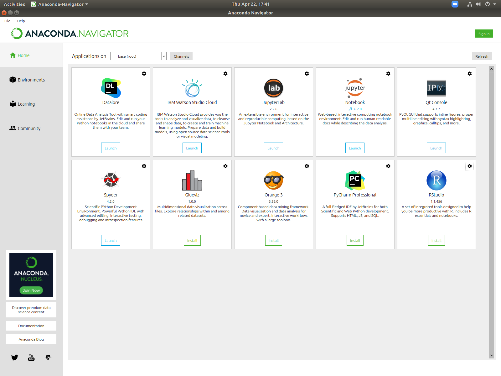

\mainmatter

# (PART) Introducing the Basics {-} 

```{r setup, include =FALSE}
#reticulate::use_condaenv("base", required=TRUE)
library(reticulate)
```

# Introduction {#intro}

Now that you have both R and Python installed, we can get started by taking a tour of our two different **integrated development environments environments** (IDEs)\index{integrated development environment (IDE)} RStudio\index{integrated development environment (IDE)!RStudio} and Spyder\index{integrated development environment (IDE)!Spyder}. 

In addition, I will also discuss a few topics superficially, so that we can get our feet wet:

- printing, 
- creating variables, and
- calling functions.

## Hello World in R


Go ahead and open up RStudio. It should look something like this

```{r rstudio, fig.cap='RStudio', out.width='80%', fig.align='center', echo=F}
knitr::include_graphics("pics/rstudio.png")
```

I changed my "Editor Theme" from the default to "Cobalt" because it's easier on my eyes. If you are opening RStudio for the first time, you probably see a lot more white. You can play around with the theme, if you wish, after going to `Tools -> Global Options -> Appearance`.

The **console**\index{console!console in RStudio}, which is located by default on the lower left panel, is the place that all of your code gets run. For short one-liners, you can type code directly into the console. Try typing the following code in there. Here we are making use of the `print()` function.

::: {.rmd-details data-latex=""}
In R, functions are "first-class objects," which means can refer to the name of a function without asking it to do anything. However, when we *do* want to use it, we put parentheses after the name. This is called **calling** the function or **invoking** the function. If a function call takes any **arguments** (aka inputs), then the programmer supplies them between the two parentheses. A function may **return** values to be subsequently used, or it may just produce a "side-effect" such as printing some text, displaying a chart, or read/writing information to an external data source.
:::

```{r, collapse = TRUE}
print('hello R world')
```

During the semester, we will write more complicated code. Complicated code is usually written incrementally and stored in a text file called a **script**\index{script}. Click `File -> New File -> R Script` to create a new script. It should appear at the top left of the RStudio window (see Figure \@ref(fig:rstudio) ) . After that, copy and paste the following code into your script window\index{script!scripts in R}.

```{r, eval=FALSE}
print('hello world')
print("this program")
print('is not incredibly interesting')
print('but it would be a pain')
print('to type it all directly into the console')
myName <- "Taylor"
print(myName)
```

This script will run five print statements, and then create a variable called `myName`. The print statements are of no use to the computer and will not affect how the program runs. They just display messages to the human running the code.

The variable created on the last line is more important because it is used by the computer, and so it can affect how the program runs. The operator `<-` is the [**assignment operator**](https://stat.ethz.ch/R-manual/R-devel/library/base/html/assignOps.html)\index{assigntment operator!assignment operator in R}. It takes the character constant `"Taylor"`, which is on the right, and stores it under the name `myName`. If we added lines to this program, we could refer to the variable `myName` in subsequent calculations.

Save this file wherever you want on your hard drive. Call it `awesomeScript.R`. Personally, I saved it to my desktop.

After we have a saved script, we can run it by sending all the lines of code over to the console. One way to do that is by clicking the `Source` button at the top right of the script window (see Figure \@ref(fig:rstudio) ). Another way is that we can use R's `source()` function^[A third way is to tell R to run `awesomeScript.R` from the command line, but unfortunately, this will not be discussed in this text. ]. We can run the following code in the console.

```{r, eval=FALSE}
# Anything coming after the pound/hash-tag symbol
# is a comment to the human programmer.
# These lines are ignored by R
setwd("/home/taylor/Desktop/")
source("awesomeScript.R")
```

The first line changes the [working directory](https://stat.ethz.ch/R-manual/R-devel/library/base/html/getwd.html)\index{working directory!working directory in R} to `Desktop/`. The **working directory** is the first place your program looks for files\index{working directory}. You, dear reader, should change this line by replacing `Desktop/` to whichever folder you chose to save `awesomeScript.R` in. If you would like to find out what your working directory is currently set to, you can use `getwd()`.

::: {.rmd-details data-latex=""}
Every computer has a different folder/directory structure--that is why it is highly recommended you refer to file locations as seldom as possible in your scripts. This makes your code more *portable.* When you send your file to someone else (e.g. your instructor or your boss), she will have to remove or change every mention of any directory. This is because those directories (probably) won't exist on her machine.
:::


The second line calls `source()`. This function finds the script file and executes all the commands found in that file sequentially.

::: {.rmd-details data-latex=""}
Deleting all saved variables, and then `source()`ing your script can be a very good debugging strategy. You can remove all saved variables by running `rm(list=ls())`. Don't worry--the variables will come back as soon as you `source()` your entire script again!
:::

<!---
---------------------------------------------------------------------------
-->


## Hello World in Python

First, start by opening *Anaconda Navigator*. It should look something like this:

```{r anaconda-navigator, fig.cap='Anaconda Navigator', out.width='80%',fig.align='center', echo=F}

```

Recall that we will exclusively assume the use of *Spyder* in this textbook. Open that up now. It should look something like this:

```{r spyder, fig.cap='Spyder', out.width='80%', fig.align='center', echo=F}
knitr::include_graphics("pics/spyder_screenshot.png")
```

It looks a lot like RStudio, right? The script window \index{script!script in Python} is still on the left hand side, but it takes up the whole height of the window this time. However, you will notice that the console window\index{console!console in Spyder} has moved. It's over on the bottom right now.

Again, you might notice a lot more white when you open this for the first time. Just like last time, I changed my color scheme. You can change yours by going to `Tools -> Preferences` and then exploring the options available under the `Appearances` tab.

Try typing the following line of code into the console.

```{python, collapse = TRUE}
# this looks like R code but it's Python code!
print("hello Python world")
```

Already we have many similarities between our two languages. Both R and Python have a `print()` function, and they both use the same symbol to start a comment: `#`. Finally, they both define character/string constants with quotation marks In both languages, you can use either single or double quotes.

We will also show below that both languages share the same three ways to run scripts. Nice!

Let's try writing our first Python script. R scripts end in `.r` or `.R`, while Python scripts end in `.py`. Call this file `awesomeScript.py`.

```{python, eval=FALSE}
# save this as awesomeScript.py
print('hello world')
print("this program")
print('is pretty similar to the last program')
print('it is not incredibly interesting, either')
my_name = "Taylor"
print(my_name)
```

Notice that the assignment operator is different in Python\index{assigntment operator!assignment operator in Python}. It's an `=`^[You can use this symbol in R, too, but it is less common.].

Just like RStudio, Spyder has a button that runs the entire script from start to finish. It's the green triangle button (see Figure \@ref(fig:spyder) ).

You can also write code to run `awesomeScript.py`. There are a few ways to do this, but here's the easiest.

```{python, eval=FALSE}
import os
os.chdir('/home/taylor/Desktop')
runfile("awesomeScript.py")
```

This is also pretty similar to the R code from before. `os.chdir()` sets our working directory\index{working directory!working directory in Python} to the `Desktop`. Then `runfile()` runs all of the lines in our program, sequentially, from start to finish^[Python, like R, allows you to run scripts from the command line, but this will not be discussed in this text.].

The first line is new, though. We did not mention anything like this in R, yet. We will talk more about `import`ing modules in section \@ref(loading-packages-in-python). Suffice it to say that we imported the `os` module to make the `chdir()` function available to us.


## Getting Help


### Reading Documentation

Programming is not about memorization. Nobody can memorize, for example, every function and all of its arguments. So what do programmers do when they get stuck? The primary way is to find and read the documentation.

Getting help in R is easy. If you want to know more about a function, type into the console the name of the function with a leading question mark. For example, `?print` or `?setwd`. You can also use `help()` and `help.search()` to find out more about functions (e.g. `help(print)`). Sometimes you will need to put quotation marks around the name of the function (e.g. `?":"`).

This will not open a separate web browser window, which is very convenient. If you are using RStudio, you have some extra benefits. Everything will look very pretty, and you can search through the text by typing phrases into the search bar in the "Help" window.

In Python, the question mark comes *after* the name of the function^[If you did not install `Anaconda`, then this may not work for you because this is an IPython (https://ipython.org) feature.] (e.g. `print?`), and you can use `help(print)` just as in R.

In Spyder, if you want the documentation to appear in the Help window (it looks prettier), then you can type the name of the function, and then `Ctrl-i` (`Cmd-i` on a mac keyboard).

### Understanding File Paths

File paths look different on different operating systems. Mac and Linux machines tend to have forward slashes (i.e. `/`), while Windows machines tend to use backslashes (i.e. `\`).

Depending on what kind of operating system is running your code, you will need to change the file paths. It is important for everyone writing R and Python code to understand how things work on both types of machines--just because you're writing code on a Windows machine doesn't mean that it won't be run on a Mac, or vice versa.

The directory repeatedly mentioned in the code above was `/home/taylor/Desktop`. This is a directory on my machine which is running Ubuntu Linux. The leading forward slash is the *root directory*. Inside that is the directory `home/`, and inside that is `taylor/`, and inside that is `Desktop/`. If you are running MacOS, these file paths will look very similar. The folder `home/` will most likely be replaced with `Users/`.

On Windows, things are a bit different. For one, a full path starts with a drive (e.g. `C:`). Second, there are backslashes (not forward slashes) to separate directory names (e.g `C:\Users\taylor\Desktop`).

Unfortunately, backslashes are a special character in both R and Python (read section \@ref(an-introduction-to-regular-expressions) to find out more about this). Whenever you type a `\`, it will change the meaning of whatever comes after it. In other words, `\` is known as an **escape character**.\index{escape character}

::: {.rmd-details data-latex=""}
In both R and Python, the backslash character is used to start an "escape" sequence. You can see some examples in R by clicking [here](https://stat.ethz.ch/R-manual/R-devel/library/base/html/Quotes.html), and some examples in Python by clicking [here](https://docs.python.org/3/reference/lexical_analysis.html). In Python it may also be used to [allow long lines of code to take up more than one line in a text file.](https://docs.python.org/3/reference/lexical_analysis.html#explicit-line-joining)
:::

The recommended way of handling this is to just use forward slashes instead. For example, if you are running Windows, `C:/Users/taylor/Desktop/myScript.R` will work in R, and `C:/Users/taylor/Desktop/myScript.py` will work in Python.

You may also use "raw string constants" (e.g. `r'C:\Users\taylor\my_file.txt'` ). "Raw" means that `\` will be treated as a literal character instead of an escape character\index{escape character}. Alternatively, you can "escape" the backslashes by replacing each single backslash with a double backslash. Please read section \@ref(an-introduction-to-regular-expressions) for more details about these choices.


