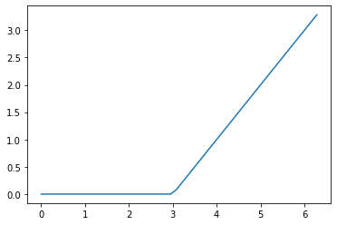

--- 
title: 'An Introduction to R and Python For Data Analysis: A Side By Side Approach'
author: "Taylor R. Brown"
site: bookdown::bookdown_site
output:
  html_document:
    toc: true
    toc_depth: 2
    toc_float: true
documentclass: krantz
classoption: krantz2
lot: yes
lof: yes
fontsize: 12pt
monofont: "Source Code Pro"
monofontoptions: "Scale=0.7"
bibliography:
- book.bib
- packages.bib
biblio-style: apalike
link-citations: yes
github-repo: tbrown122387/r_and_python_book
---

# Welcome {-}

## Teaching a Course With This Textbook {-}

You will notice that some of the exercise questions are unusually specific. For example, they will ask the student to assign the answer in a certain form to a variable with a very specific name. This is because they are written with automatic grading in mind. 

All of the exercises in this text have been very generously "battle tested" by the Fall 2021 STAT 5430 class at the University of Virginia. 


## License(s) {-}

<a rel="license" href="http://creativecommons.org/licenses/by-nc-sa/4.0/"></a><br />The textbook is licensed under a <a rel="license" href="http://creativecommons.org/licenses/by-nc-sa/4.0/">Creative Commons Attribution-NonCommercial-ShareAlike 4.0 International License</a>. The code used to generate the text is licensed under a Creative Commons Zero v1.0 Universal license.


<!--chapter:end:index.Rmd-->

# Preface {-}

## About this book {-}

This book is written to be used in a computing class that teaches both R and Python to graduate students in a statistics or data science department. This book is written for students that do not necessarily possess any previous familiarity with writing code. 

 * If you are using them for analyzing data, R and Python do a lot of the same things in pretty similar ways, so it does not always make sense to either a.) teach one language after the other, or b.) choose one over the other. The side-by-side approach helps to teach/learn more, save time, and reinforce shared concepts and key differences. 

 * This text does not describe statistical modeling techniques in detail, but many exercises will ask students to implement them. These exercises will not assume mathematical familiarity. The objective is to test programming ability, and an added benefit is that the work might be useful later in their careers. 

 * This book is written for aspiring data scientists, not necessarily aspiring software developers. Why do I draw the distinction? When discussing different types, for example, I do not discuss data structures in any depth. Rather, I discuss examples of applications where different types would be most useful. 

 * Generally speaking, chapters should be read in order, but occasionally skipping ahead can be beneficial. Later chapters are more may assume some familiarity with previous chapters. Also, within a chapter's section, sometimes a discussion for a particular topic in Python, say, might follow a discussion about the same topic in R. In this case, the later section will often assume that the previous section has been read first. 

## Conventions {-}

Sometimes R and Python code look very similar, or even identical. This is why I usually separate R and Python code into separate sections. However, sometimes I do not, so whenever it is necessary to prevent confusion, I will remind you what language is being used in comments (more about comments in \@ref(hello-world-in-python) ). 

```{python, collapse = TRUE}
# in python
print('hello world')
```


```{r, collapse = TRUE}
# in R
print('hello world')
```


```{r include=FALSE}
# automatically create a bib database for R packages
knitr::write_bib(c(
  .packages(), 'bookdown', 'knitr', 'rmarkdown'
), 'packages.bib')
```


## Installing the Required Software {-}

To get started, you must install both R and Python. The installation process depends on what kind of machine you have (e.g. what type of operating system your machine is running, is your processor $32$ or $64$ bit, etc.).

Below, I suggest running R with RStudio, and Python with Anaconda, and I provide some helpful links. I suggest downloading these two bundles separately; however, I should note that the recommendation below is not the only installation method. For example: 
  - one can run R and Python without downloading RStudio or Anaconda,
  - one can install RStudio with Anaconda,
  - one can run Python from within Rstudio,
  - one can run Python from within Rstudio that is managed by Anaconda, etc., and
  - options and procedures are very likely to change over time. 
  
Instructors can prefer alternative strategies, if they wish. If they do, they should verify that Python's version is `>=3.6`, and R's is `>=4.0.0`. If so, all the code in this book should run. 

### Installing R (and RStudio) {-}

It is recommended that you install R and *RStudio Desktop*. *RStudio Desktop* is a graphical user interface with many tools that making writing R easier and more fun.

Install R from the Comprehensive R Archive Network (CRAN). You can access instructions for your specific machine by clicking [here.](https://cran.r-project.org/) 

You can get RStudio Desktop directly from the [company's website](https://www.rstudio.com/products/rstudio/download/#download).

### Installing Python by Installing Anaconda {-} 

It is recommended that you install *Anaconda*, which is a package manager, environment manager, and Python distribution with many third party open source packages. It provides a graphical user interface for us, too, just as RStudio does. You can access instructions for your specific machine and OS by clicking [here](https://docs.anaconda.com/anaconda/install/#).


<!--chapter:end:preface.Rmd-->

\mainmatter

# (PART) Introducing the Basics {-} 

```{r setup, include =FALSE}
#reticulate::use_condaenv("base", required=TRUE)
library(reticulate)
```

# Introduction {#intro}

Now that you have both R and Python installed, we can get started by taking a tour of our two different **integrated development environments environments** (IDEs)\index{integrated development environment (IDE)} RStudio\index{integrated development environment (IDE)!RStudio} and Spyder\index{integrated development environment (IDE)!Spyder}. 

In addition, I will also discuss a few topics superficially, so that we can get our feet wet:

- printing, 
- creating variables, and
- calling functions.

## Hello World in R


Go ahead and open up RStudio. It should look something like this

```{r rstudio, fig.cap='RStudio', out.width='80%', fig.align='center', echo=F}
knitr::include_graphics("pics/rstudio.png")
```

I changed my "Editor Theme" from the default to "Cobalt" because it's easier on my eyes. If you are opening RStudio for the first time, you probably see a lot more white. You can play around with the theme, if you wish, after going to `Tools -> Global Options -> Appearance`.

The **console**\index{console!console in RStudio}, which is located by default on the lower left panel, is the place that all of your code gets run. For short one-liners, you can type code directly into the console. Try typing the following code in there. Here we are making use of the `print()` function.

::: {.rmd-details data-latex=""}
In R, functions are "first-class objects," which means can refer to the name of a function without asking it to do anything. However, when we *do* want to use it, we put parentheses after the name. This is called **calling** the function or **invoking** the function. If a function call takes any **arguments** (aka inputs), then the programmer supplies them between the two parentheses. A function may **return** values to be subsequently used, or it may just produce a "side-effect" such as printing some text, displaying a chart, or read/writing information to an external data source.
:::

```{r, collapse = TRUE}
print('hello R world')
```

During the semester, we will write more complicated code. Complicated code is usually written incrementally and stored in a text file called a **script**\index{script}. Click `File -> New File -> R Script` to create a new script. It should appear at the top left of the RStudio window (see Figure \@ref(fig:rstudio) ) . After that, copy and paste the following code into your script window\index{script!scripts in R}.

```{r, eval=FALSE}
print('hello world')
print("this program")
print('is not incredibly interesting')
print('but it would be a pain')
print('to type it all directly into the console')
myName <- "Taylor"
print(myName)
```

This script will run five print statements, and then create a variable called `myName`. The print statements are of no use to the computer and will not affect how the program runs. They just display messages to the human running the code.

The variable created on the last line is more important because it is used by the computer, and so it can affect how the program runs. The operator `<-` is the [**assignment operator**](https://stat.ethz.ch/R-manual/R-devel/library/base/html/assignOps.html)\index{assigntment operator!assignment operator in R}. It takes the character constant `"Taylor"`, which is on the right, and stores it under the name `myName`. If we added lines to this program, we could refer to the variable `myName` in subsequent calculations.

Save this file wherever you want on your hard drive. Call it `awesomeScript.R`. Personally, I saved it to my desktop.

After we have a saved script, we can run it by sending all the lines of code over to the console. One way to do that is by clicking the `Source` button at the top right of the script window (see Figure \@ref(fig:rstudio) ). Another way is that we can use R's `source()` function^[A third way is to tell R to run `awesomeScript.R` from the command line, but unfortunately, this will not be discussed in this text. ]. We can run the following code in the console.

```{r, eval=FALSE}
# Anything coming after the pound/hash-tag symbol
# is a comment to the human programmer.
# These lines are ignored by R
setwd("/home/taylor/Desktop/")
source("awesomeScript.R")
```

The first line changes the [working directory](https://stat.ethz.ch/R-manual/R-devel/library/base/html/getwd.html)\index{working directory!working directory in R} to `Desktop/`. The **working directory** is the first place your program looks for files\index{working directory}. You, dear reader, should change this line by replacing `Desktop/` to whichever folder you chose to save `awesomeScript.R` in. If you would like to find out what your working directory is currently set to, you can use `getwd()`.

::: {.rmd-details data-latex=""}
Every computer has a different folder/directory structure--that is why it is highly recommended you refer to file locations as seldom as possible in your scripts. This makes your code more *portable.* When you send your file to someone else (e.g. your instructor or your boss), she will have to remove or change every mention of any directory. This is because those directories (probably) won't exist on her machine.
:::


The second line calls `source()`. This function finds the script file and executes all the commands found in that file sequentially.

::: {.rmd-details data-latex=""}
Deleting all saved variables, and then `source()`ing your script can be a very good debugging strategy. You can remove all saved variables by running `rm(list=ls())`. Don't worry--the variables will come back as soon as you `source()` your entire script again!
:::

<!---
---------------------------------------------------------------------------
-->


## Hello World in Python

First, start by opening *Anaconda Navigator*. It should look something like this:

```{r anaconda-navigator, fig.cap='Anaconda Navigator', out.width='80%',fig.align='center', echo=F}
knitr::include_graphics("pics/anaconda_navigator.png")
```

Recall that we will exclusively assume the use of *Spyder* in this textbook. Open that up now. It should look something like this:

```{r spyder, fig.cap='Spyder', out.width='80%', fig.align='center', echo=F}
knitr::include_graphics("pics/spyder_screenshot.png")
```

It looks a lot like RStudio, right? The script window \index{script!script in Python} is still on the left hand side, but it takes up the whole height of the window this time. However, you will notice that the console window\index{console!console in Spyder} has moved. It's over on the bottom right now.

Again, you might notice a lot more white when you open this for the first time. Just like last time, I changed my color scheme. You can change yours by going to `Tools -> Preferences` and then exploring the options available under the `Appearances` tab.

Try typing the following line of code into the console.

```{python, collapse = TRUE}
# this looks like R code but it's Python code!
print("hello Python world")
```

Already we have many similarities between our two languages. Both R and Python have a `print()` function, and they both use the same symbol to start a comment: `#`. Finally, they both define character/string constants with quotation marks In both languages, you can use either single or double quotes.

We will also show below that both languages share the same three ways to run scripts. Nice!

Let's try writing our first Python script. R scripts end in `.r` or `.R`, while Python scripts end in `.py`. Call this file `awesomeScript.py`.

```{python, eval=FALSE}
# save this as awesomeScript.py
print('hello world')
print("this program")
print('is pretty similar to the last program')
print('it is not incredibly interesting, either')
my_name = "Taylor"
print(my_name)
```

Notice that the assignment operator is different in Python\index{assigntment operator!assignment operator in Python}. It's an `=`^[You can use this symbol in R, too, but it is less common.].

Just like RStudio, Spyder has a button that runs the entire script from start to finish. It's the green triangle button (see Figure \@ref(fig:spyder) ).

You can also write code to run `awesomeScript.py`. There are a few ways to do this, but here's the easiest.

```{python, eval=FALSE}
import os
os.chdir('/home/taylor/Desktop')
runfile("awesomeScript.py")
```

This is also pretty similar to the R code from before. `os.chdir()` sets our working directory\index{working directory!working directory in Python} to the `Desktop`. Then `runfile()` runs all of the lines in our program, sequentially, from start to finish^[Python, like R, allows you to run scripts from the command line, but this will not be discussed in this text.].

The first line is new, though. We did not mention anything like this in R, yet. We will talk more about `import`ing modules in section \@ref(loading-packages-in-python). Suffice it to say that we imported the `os` module to make the `chdir()` function available to us.


## Getting Help


### Reading Documentation

Programming is not about memorization. Nobody can memorize, for example, every function and all of its arguments. So what do programmers do when they get stuck? The primary way is to find and read the documentation.

Getting help in R is easy. If you want to know more about a function, type into the console the name of the function with a leading question mark. For example, `?print` or `?setwd`. You can also use `help()` and `help.search()` to find out more about functions (e.g. `help(print)`). Sometimes you will need to put quotation marks around the name of the function (e.g. `?":"`).

This will not open a separate web browser window, which is very convenient. If you are using RStudio, you have some extra benefits. Everything will look very pretty, and you can search through the text by typing phrases into the search bar in the "Help" window.

In Python, the question mark comes *after* the name of the function^[If you did not install `Anaconda`, then this may not work for you because this is an IPython (https://ipython.org) feature.] (e.g. `print?`), and you can use `help(print)` just as in R.

In Spyder, if you want the documentation to appear in the Help window (it looks prettier), then you can type the name of the function, and then `Ctrl-i` (`Cmd-i` on a mac keyboard).

### Understanding File Paths

File paths look different on different operating systems. Mac and Linux machines tend to have forward slashes (i.e. `/`), while Windows machines tend to use backslashes (i.e. `\`).

Depending on what kind of operating system is running your code, you will need to change the file paths. It is important for everyone writing R and Python code to understand how things work on both types of machines--just because you're writing code on a Windows machine doesn't mean that it won't be run on a Mac, or vice versa.

The directory repeatedly mentioned in the code above was `/home/taylor/Desktop`. This is a directory on my machine which is running Ubuntu Linux. The leading forward slash is the *root directory*. Inside that is the directory `home/`, and inside that is `taylor/`, and inside that is `Desktop/`. If you are running MacOS, these file paths will look very similar. The folder `home/` will most likely be replaced with `Users/`.

On Windows, things are a bit different. For one, a full path starts with a drive (e.g. `C:`). Second, there are backslashes (not forward slashes) to separate directory names (e.g `C:\Users\taylor\Desktop`).

Unfortunately, backslashes are a special character in both R and Python (read section \@ref(an-introduction-to-regular-expressions) to find out more about this). Whenever you type a `\`, it will change the meaning of whatever comes after it. In other words, `\` is known as an **escape character**.\index{escape character}

::: {.rmd-details data-latex=""}
In both R and Python, the backslash character is used to start an "escape" sequence. You can see some examples in R by clicking [here](https://stat.ethz.ch/R-manual/R-devel/library/base/html/Quotes.html), and some examples in Python by clicking [here](https://docs.python.org/3/reference/lexical_analysis.html). In Python it may also be used to [allow long lines of code to take up more than one line in a text file.](https://docs.python.org/3/reference/lexical_analysis.html#explicit-line-joining)
:::

The recommended way of handling this is to just use forward slashes instead. For example, if you are running Windows, `C:/Users/taylor/Desktop/myScript.R` will work in R, and `C:/Users/taylor/Desktop/myScript.py` will work in Python.

You may also use "raw string constants" (e.g. `r'C:\Users\taylor\my_file.txt'` ). "Raw" means that `\` will be treated as a literal character instead of an escape character\index{escape character}. Alternatively, you can "escape" the backslashes by replacing each single backslash with a double backslash. Please read section \@ref(an-introduction-to-regular-expressions) for more details about these choices.


<!--chapter:end:01-intro.Rmd-->

# Basic Types

In every programming language, data is stored in different ways. Writing a program that manipulates data requires understanding all of the choices. That is why we must be concerned with the different **types** of data in our R and Python programs. Different types are suitable for different purposes.

There are similarities between Python's and R's type systems. However, there are may  differences as well. Be prepared for these differences. There are many more of them in this chapter than there were in the previous chapter!

If you're ever unsure what type a variable has, use `type()` (in Python) or `typeof()` (in R) to query it. 

Storing an individual piece of information is simple in both languages. However, while Python has scalar types, R does not draw as strong of a distinction between scalar and compound types.

## Basic Types In Python

In Python, the simplest types we frequently use are `str` (short for string), `int` (short for integer), `float` (short for floating point) and `bool` (short for Boolean). This list is not exhaustive, but these are a good collection to start thinking about. For a complete list of built-in types in Python, click [here](https://docs.python.org/3/library/stdtypes.html).

```{python, collapse = TRUE}
print(type('a'), type(1), type(1.3))
```

Strings are useful for processing text data such as names of people/places/things and messages such as texts, tweets and emails [@python_cookbook]. If you are dealing with numbers, you need floating points if you have a number that might have a fractional part after its decimal; otherwise you'll need an integer. Booleans are useful for situations where you need to record whether something is true or false. They are also important to understand for control-flow in section \@ref(control-flow).

In the next section we will discuss the Numpy library. This library has a [broader collection](https://numpy.org/doc/stable/user/basics.types.html) of basic types that allows for finer control over any script you write. 


### Type Conversions in Python

We will often have to convert between types in a Python program. This is called **type conversion**, and it can be either implicitly or explicitly done. 

For example, `int`s are often implicitly converted to `float`s, so that arithmetic operations work. 
```{python, collapse = TRUE}
my_int = 1
my_float = 3.2
my_sum = my_int + my_float
print("my_int's type", type(my_int))
print("my_float's type", type(my_float))
print(my_sum)
print("my_sum's type", type(my_sum))
```

You might be disappointed if you always count on this behavior, though. For example, try the following piece of code on your machine. You will receive the following error: `TypeError: unsupported operand type(s) for +: 'float' and 'str'`.

```{python, error = TRUE, collapse=TRUE, eval = FALSE}
3.2 + "3.2"
```
Explicit conversions occur when we as programmers explicitly ask Python to perform a conversion. We will do this with the functions such as `int()`, `str()`, `float()`, and `bool()`. 

```{python, collapse = TRUE}
my_date = "5/2/2021"
month_day_year = my_date.split('/')
my_year = int(month_day_year[-1]) 
print('my_year is', my_year, 'and its type is', type(my_year))
```


## Basic Types In R

In R, the names of basic types are only slightly different. They are `logical` (instead of `bool`), `integer` (instead of `int`), `double` or `numeric` (instead of `float`)^["double" is short for "double precision floating point." In other programming languages, the programmer might choose how many decimal points of precision he or she wants.], `character` (instead of `str`), `complex` (for calculations involving imaginary numbers), and `raw` (useful for working with bytes).

```{R, collapse = TRUE}
# cat() is kind of like print()
cat(typeof('a'), typeof(1), typeof(1.3))
```

In this case R automatically upgraded `1` to a double. If you wanted to force it to be an integer, you can add a capital "L" to the end of the number.

```{R, collapse = TRUE}
# cat() is kind of like print()
cat(typeof('a'), typeof(1L), typeof(1.3))
```


### Type Conversions in R

You can explicitly and implicitly convert types in R just as you did in Python. Implicit conversion looks like this.

```{R, collapse = TRUE}
myInt = 1
myDouble = 3.2
mySum = myInt + myDouble
print(paste0("my_int's type is ", typeof(myInt)))
print(paste0("my_float's type is ", typeof(myDouble)))
print(mySum)
print(paste0("my_sum's type is ", typeof(mySum)))
```

Explicit conversion can be achieved with functions such as `as.integer`, `as.logical`, `as.double`, etc.

```{R, collapse = TRUE}
print(typeof(1))
print(typeof(as.logical(1)))
```


### R's Simplification

The basic types of R are a little different than the basic types of Python. On the one hand, Python has basic types for individual elements, and it uses separate types as containers for storing many elements. On the other, R uses the same type to store a single element as it does to store many elements. Strictly speaking, R does not have a scalar type. 

Technically, all of the examples we just did in R are using length one **vectors**--`logical` `integer` `double`, `character`, `complex`, and `raw` are the possible **modes** of a vector\index{vectors in R}. `vector`s will be discussed further section \@ref(r-vectors-versus-numpy-arrays-and-pandas-series).

Think about which option you prefer. What are the benefits of using separate types for scalars and collections? What are the benefits of using the same type?


## Exercises

### R Questions

1. Which R base type is ideal for each piece of data? Assign your answers to a `character` `vector` of length four called `questionOne`. 

    + An individual's IP address
    + whether or not an individual attended a study
    + the number of seeds found in a plant
    + the amount of time it takes for a car to race around a track
  
2. Floating points are weird. What gets printed is not the same as what is stored! In R, you can control how many digits get printed by using the `options` function. 

    + Assign `a` to `2/3`
    + `print` `a`, and copy/paste what you see into the variable `aPrint`. Make sure it is a `character`.
    + Take a look at the documentation for `options`. Assign the value of `options()$digits` to `numDigitsStart`
    + Change the number of digits to `22`
    + Again, `print`, `a` and copy/paste what you see into the variable `aPrintv2`. Make sure it is a `character`.
    + Assign the output of `options()$digits` to `numDigitsEnd`
    
3. Floating points are weird. What gets stored might not be what you want. ["The only numbers that can be represented exactly in R’s numeric type are integers and fractions whose denominator is a power of 2."](https://cran.r-project.org/doc/FAQ/R-FAQ.html#Why-doesn_0027t-R-think-these-numbers-are-equal_003f) As a consequence, you should never test strict equality (i.e. using `==`) between two floating points. 

    + Assign the squre root of 2 to `mySqrt`
    + Print the square of this variable
    + Test (using `==`) that this variable is equal to `2`. Assign the result of this test to `isTwoRecoverable`
    + Test for near equality (using `all.equal`) that this variable is "equal" to `2`. Assign the result of this test to `closeEnough`. Make sure to read the documentation for this function because the return type can be tricky!
    

### Python Questions

1. Which Python type is ideal for each piece of data? Assign your answers to a `list` of `str`ings called `question_one`. 

    + An individual's IP address
    + whether or not an individual attended a study
    + the number of seeds found in a plant
    + the amount of time it takes for a car to race around a track

2. Floating points are weird. What gets printed is not the same as what is stored! In Python, you need to edit a class's `__str__` method if you want to control how many digits get printed for a user-defined type/class, but we won't do that. Instead, we'll use [`str.format()`](https://docs.python.org/3/library/stdtypes.html#str.format) to return a string directly (instead of copy/paste-ing it). 

    + Assign `a` to `2/3`
    + `print` `a`, and copy/paste what you see into the variable `a_print`
    + Create a `str` that displays 22 digits of 2/3. Call it `a_printv2`
    + `print` the above string

3. Floating points are weird. What gets stored might not be what you want. The Python documentation has an excellent discussion of how storage behavior can be surprising. Click [here](https://docs.python.org/3/tutorial/floatingpoint.html) to read it.

    + Assign the squre root of 2 to `my_sqrt`
    + `print` the square of this variable
    + Test (using `==`) that this variable is equal to `2`. Assign the result of this test to `is_two_recoverable`
    + Test for near equality (using `np.isclose`) that this variable is "equal" to `2`. Assign the result of this test to `close_enough`. 

<!--chapter:end:02-basic_types.Rmd-->

# R `vector`s versus Numpy `array`s and Pandas' `Series` 

This section is for describing the data types that let us store collections of elements that all **share the same type**. Data is very commonly stored in this fashion, so this section is quite important. Once we have one of these collection objects in a program, we will be interested in learning how to extract and modify different elements in the collection, as well as how to use the entire collection in an efficient calculation.

## Overview of R

In the previous section, I mentioned that R does not have scalar types--it just has [**vectors**](https://cran.r-project.org/doc/manuals/r-release/R-lang.html#Vector-objects
). So, whether you want to store one number (or `logical`, or `character`, or ...), or many numbers, you will need a `vector`.\index{vectors in R} 


::: {.rmd-caution data-latex=""}
For many, the word "vector" evokes an impression that these objects are designed to be used for performing matrix arithmetic (e.g. inner products, transposes, etc.). You can perform these operations on `vector`s, but in my opinion, this preconception can be misleading, and I recommend avoiding it. Most of the things you can do with `vector`s in R have little to do with linear algebra!
:::


How do we create one of these? There are many ways. One common way is to read in elements from an external data set. Another way is to generate `vector`s from code.

```{R, collapse = TRUE}
1:10         # consecutive integers
seq(1,10,2)  # arbitrary sequences
rep(2,5)     # repeating numbers
# combine elements without relying on a pattern
c("5/2/2021", "5/3/2021", "5/4/2021") 
# generate Gaussian random variables
rnorm(5)                             
```

`c()` is short for "combine". `seq()` and `rep()` are short for "sequence" and "replicate", respectively. `rnorm()` samples normal (or Gaussian) random variables. There is plenty more to learn about these functions, so I encourage you to take a look at their documentation.

::: {.rmd-details data-latex=""}
I should mention that functions such as `rnorm()` don't create truly random numbers, just *pseudorandom* ones. Pseudorandom numbers are nearly indecipherable from truly random ones, but the way the computer generates them is actually deterministic. 

First, a *seed*, or starting number is chosen. Then, the *pseudorandom number generator (PRNG)* maps that number to another number. The sequence of all the numbers appears to be random, but is actually deterministic. 

Sometimes you will be interested in setting the seed on your own because it is a cheap way of sharing and communicating data with others. If two people use the same starting seed, and the same PRNG, then they should simulate the same data. This can be important if you want to help other people reproduce the results of code you share. Most of the time, though, I don't set the seed, and I don't think about the distinction between random and pseudorandom numbers.
:::

## Overview of Python

If you want to store many elements of the same type (and size) in Python, you will probably need a Numpy `array`. Numpy is a highly-regarded third party library [@harris2020array] for Python. Its `array` objects store elements of the same type, just as R's `vector`s do.\index{Numpy array (Python)}

There are five ways to create numpy arrays ([source](https://numpy.org/doc/stable/user/basics.creation.html)). Here are some examples that complement the examples from above.

```{python, collapse = TRUE}
import numpy as np   
np.array([1,2,3])
np.arange(1,12,2)
np.random.normal(size=3)
```

Another option for storing a homogeneous collection of elements in Python is a [`Series` object](https://pandas.pydata.org/pandas-docs/stable/reference/api/pandas.Series.html#pandas-series) from the \index{Pandas} library. The benefit of these is that they play nicely with Pandas' data frames (more information about Pandas' data frames can be found in \@ref(data-frames-in-python)), and that they have more flexibility with accessing elements by name ( see [here](https://jakevdp.github.io/PythonDataScienceHandbook/03.01-introducing-pandas-objects.html#Series-as-generalized-NumPy-array) for more information ).

```{python, collapse = TRUE}
import pandas as pd
first = pd.Series([2, 4, 6])
second = pd.Series([2, 4, 6], index = ['a','b','c'])
print(first[0])
print(second['c'])
```


## Vectorization in R

An operation in R is **vectorized**\index{vectorization} if it applies to all of the elements of a `vector` at once. An operator that is not vectorized can only be applied to individual elements. In that case, the programmer would need to write more code to instruct the function to be applied to all of the elements of a vector. You should prefer writing vectorized code because it is usually easier to read. Moreover, many of these vectorized functions are written in compiled code, so they can often be much faster. 

Arithmetic (e.g. `+`, `-`, `*`, `/`, `^`, `%%`, `%/%`, etc.) and logical (e.g. `!`, `|`, `&`, `>`, `>=`, `<`, `<=`, `==`, etc.) operators are commonly applied to one or two vectors. Arithmetic is usually performed *element-by-element*. Numeric vectors are converted to logical vectors if they need to be. Be careful of operator precedence if you seek to minimize your use of parentheses. 

Note that there are an extraordinary amount of named functions (e.g. `sum()`, `length()`, `cumsum()`, etc.) that operate on entire `vector`s, as well. Here are some examples. 

```{r, collapse = TRUE}
(1:3) * (1:3)        
(1:3) == rev(1:3)    
sin( (2*pi/3)*(1:4)) 
```

In the last example, there is **recycling**\index{recycling!|see{broadcasting}} happening. `(2*pi/3)` is taking three length-one vectors and producing another length-one vector. The resulting length-one vector is multiplied by a length four vector `1:4`. The single element in the length one vector gets *recycled* so that its value is multiplied by every element of `1:4`. 
This makes sense most of the time, but sometimes recycling can be tricky. Notice that the following code does not produce an error--just a warning: `longer object length is not a multiple of shorter object length`. Try running it on your machine to confirm this. 

```{r, collapse = TRUE, eval = FALSE}
(1:3) * (1:4)
```

## Vectorization in Python

The Python's Numpy library makes extensive use of vectorization as well. Vectorization in Numpy is accomplished with [**universal functions**](https://numpy.org/doc/stable/reference/ufuncs.html), or "ufuncs" for short\index{vectorization!universal functions|see{ufuncs}}. Some ufuncs can be invoked using the same syntax as in R (e.g. `+`). You can also refer to function by its name (e.g. `np.sum()` instead of `+`). Mixing and matching is allowed, too.

Ufuncs are called *unary* if they take in one array, and *binary* if they take in two. At the moment, there are [fewer than $100$ available](https://numpy.org/doc/stable/reference/ufuncs.html#available-ufuncs), all performing either mathematical operations, boolean-emitting comparisons, or bit-twiddling operations. For an exhaustive list of Numpy's universal functions, [click here.](https://numpy.org/doc/stable/reference/ufuncs.html#available-ufuncs) Here are some code examples.


```{python, collapse=TRUE}
np.arange(1,4)*np.arange(1,4)
np.zeros(5) > np.arange(-3,2)
np.exp( -.5 * np.linspace(-3, 3, 10)**2) / np.sqrt( 2 * np.pi)
```

Instead of calling it "recycling", Numpy calls reusing elements of a shorter array in a binary operation [**broadcasting**](https://numpy.org/devdocs/user/theory.broadcasting.html)\index{broadcasting|see{recycling}}. It's the same idea as in R, but in general, Python is stricter and disallows more scenarios. For example, try running the following code on your machine. You should receive an error: `ValueError: operands could not be broadcast together with shapes (2,) (3,) `.

```{python, collapse=TRUE, error = TRUE, eval = FALSE}
np.arange(1,3)*np.arange(1,4)
```


If you are working with string arrays, Numpy has a [`np.char` module with many useful functions](https://numpy.org/doc/stable/reference/routines.char.html#module-numpy.char). 

```{python, collapse=TRUE, error = TRUE}
a = np.array(['a','b','c'])
np.char.upper(a)
```


Then there are the `Series` objects from Pandas. Ufuncs continue to work in the same way on `Series` objects, and they [respect common index values](https://jakevdp.github.io/PythonDataScienceHandbook/03.03-operations-in-pandas.html).

```{python, collapse = TRUE}
s1 = pd.Series(np.repeat(100,3))
s2 = pd.Series(np.repeat(10,3))
s1 + s2
```

If you feel more comfortable, and you want to coerce these `Series` objects to Numpy arrays before working with them, you can do that. For example, the following works. 

```{python, collapse = TRUE}
s = pd.Series(np.linspace(-1,1,5))
np.exp(s.to_numpy())
```

In addition, `Series` objects possess many extra [attributes and methods](https://pandas.pydata.org/pandas-docs/stable/reference/api/pandas.Series.html#pandas-series). 

```{python, collapse = TRUE}
ints = pd.Series(np.arange(10))
ints.abs()
ints.mean()
ints.floordiv(2)
```

`Series` objects that have [text data](https://pandas.pydata.org/pandas-docs/stable/user_guide/text.html#working-with-text-data) are a little bit different. For one, you have to access the `.str` attribute of the `Series` before calling any [vectorized methods](https://jakevdp.github.io/PythonDataScienceHandbook/03.10-working-with-strings.html). Here are some examples. 

```{python}
s = pd.Series(['a','b','c','33'])
s.dtype
s.str.isdigit()
s.str.replace('a', 'z')
```

String operations can be a big game changer, and we discuss text processing strategies in more detail in section \@ref(an-introduction-to-regular-expressions).

## Indexing Vectors in R

It is very common to want to extract or modify a subset of elements in a vector. There are a few ways to do this. All of the ways I discuss will involve the square bracket operator (i.e. `[]`). Feel free to retrieve the documentation by typing `?'['`.

```{R, collapse = TRUE}
allElements <- 1:6
allElements[seq(2,6,2)] # extract evens
allElements[-seq(2,6,2)] <- 99 # replace all odds with 99
allElements[allElements > 2] # get nums bigger than 2
```

To access the first element, we use the index `1`. To access the second, we use `2`, and so on. Also, the `-` sign tells R to remove elements. Both of these functionalities are *very different* from Python, as we will see shortly.

We can use names to access elements elements, too, but only if the elements are named.

```{R, collapse = TRUE}
sillyVec <- c("favorite"=1, "least favorite" = 2)
sillyVec['favorite']
```


## Indexing Numpy arrays

[Indexing Numpy arrays](https://numpy.org/doc/stable/user/basics.indexing.html) is very similar to indexing vectors in R. You use the square brackets, and you can do it with logical arrays or index arrays. There are some important differences, though. 

For one, indexing is 0-based in Python. The `0`th element is the first element of an array. Another key difference is that the `-` isn't used to remove elements like it is in R, but rather to count backwards. Third, using one or two `:` inside square brackets is more flexible in Python. This is syntactic sugar for using the `slice()` function, which is similar to R's `seq()` function. 

```{python, collapse=TRUE}
one_through_ten = np.arange(1, 11)
one_through_ten[np.array([2,3])]
one_through_ten[1:10:2] # evens
one_through_ten[::-1] # reversed
one_through_ten[-2] = 99 # second to last
one_through_ten
one_through_ten[one_through_ten > 3] # bigger than three
```

## Indexing Pandas' Series

At a minimum, there is little that is new that you *need* to learn to go from Numpy arrays to Pandas' Series objects. They still have the `[]` operator, and [many methods are shared across these two types](https://pandas.pydata.org/docs/reference/api/pandas.Series.html). The following is almost equivalent to the code above, and the only apparent difference is that the results are printed a little differently.

```{python, collapse=TRUE}
import pandas as pd
one_through_ten = pd.Series(np.arange(1, 11))
one_through_ten[np.array([2,3])]
one_through_ten[1:10:2] # evens
one_through_ten[::-1] # reversed
one_through_ten[-2] = 99 # second to last
one_through_ten
one_through_ten[one_through_ten > 3] # bigger than three
one_through_ten.sum()
```

However, [Pandas' Series have `.loc` and `.iloc` methods](https://pandas.pydata.org/pandas-docs/stable/user_guide/indexing.html#different-choices-for-indexing). We won't talk much about these two methods now, but they will become very important when we start to discuss Pandas' data frames in section \@ref(data-frames-in-python).

```{python, collapse=TRUE}
one_through_ten.iloc[2]
one_through_ten.loc[2]
```

## Some Gotchas


### Shallow versus Deep Copies

In R, assignment usually produces a **deep copy.** In the code below, we create `b` from `a`. If we modify `b`, these changes don't affect `a`. This takes up more memory, but our program is easier to follow as we don't have to keep track of connections between objects. 

```{r, collapse = TRUE}
# in R
a <- c(1,2,3)
b <- a
b[1] <- 999
a # still the same!
```

With Numpy arrays in Python, ["shallow copies" can be created by simple assignment, or by explicitly constructing a **view**](https://numpy.org/devdocs/user/quickstart.html#copies-and-views). In the code below, `a`, `b`, `c`, and `d` all share the same data. If you modify one, you change all the others. This can make the program more confusing, but on the other hand, it can also improve computational efficiency. 

```{python, collapse = TRUE}
# in python
a = np.array([1,2,3])
b = a # b is an alias
c = a.view() # c is a view
d = a[:]
b[0] = 999
a # two names for the same object in memory
b
c
d
```

It's the same story with Pandas' Series objects. You're usually making a "shallow" copy.

```{python, collapse = TRUE}
# in python
import pandas as pd
s1 = pd.Series(np.array([100.0,200.0,300.0]))
s2 = s1
s3 = s1.view()
s4 = s1[:]
s1[0] = 999
s1
s2
s3
s4
```


If you want a "deep copy" in Python, you usually want a function or method called `copy()`. Use `np.copy` or [`np.ndarray.copy`](https://numpy.org/doc/stable/reference/generated/numpy.ndarray.copy.html#numpy-ndarray-copy) when you have a Numpy array.

```{python, collapse = TRUE}
# in python
a = np.array([1,2,3])
b = np.copy(a)
c = a.copy()
b[0] = 999
a 
b
c
```


Use [`pandas.Series.copy`](https://pandas.pydata.org/docs/reference/api/pandas.Series.copy.html#pandas-series-copy) with Pandas' Series objects. Make sure not to set the `deep` argument to `False`. Otherwise you'll get a shallow copy.

```{python, collapse = TRUE}
# in python
s1 = pd.Series(np.array([1,2,3]))
s2 = s1.copy()
s3 = s1.copy(deep=False)
s1[0] = 999
s1
s2
s3
```

 
### How R and Python Handle Missing Values

R has `NULL`,  `NaN`, and `NA`. Python has `None` and `np.nan`. If your eyes are glazing over already and you're thinking "they all look like the same"--they are not. 

R's `NULL` and Python's `None` are similar. Both represent "nothingness." This is *not* the same as `0`, or an empty string, or `FALSE`/`False`. This is commonly used to detect if a user fails to pass in an argument to a function, or if a function fails to "return" (more information on functions can be found in section \@ref(functions)) anything meaningful. 

In R, for example, if a function fails to return anything, then it actually returns a `NULL`. [A `NULL` object has its own type.](https://cran.r-project.org/doc/manuals/r-release/R-lang.html#NULL-object)

```{r, collapse = TRUE, warning=TRUE}
NULL == FALSE
NULL == NULL
# create a function that doesn't return anything
# more information on this later
doNothingFunc <- function(a){} 
thing <- doNothingFunc() # call our new function
is.null(thing)
typeof(NULL)
```

In Python, we have the following.

```{python, collapse = TRUE}
None == False
None == None
# create a function that doesn't return anything
# more information on this later
def do_nothing_func():
    pass
thing = do_nothing_func()
if thing is None:
    print("thing is None!")
type(None)
```

"NaN" stands for "not a number." `NaN` is an object of type `double` in R, and `np.nan` is of type `float` in Python. It can come in handy when you (deliberately or accidentally) perform undefined calculations such as $0/0$ or $\infty / -\infty$.

```{r, collapse = TRUE}
# in R
0/0
Inf/Inf
is.na(0/0)
```
```{python, collapse = TRUE, error = TRUE}
# in Python
# 0/0 
# the above yields a ZeroDivisionError
import numpy as np
np.inf/np.inf
np.isnan(np.nan)
```

"NA" is short for "not available." Missing data is a fact of life in data science. Observations are often missing in data sets, introduced after joining/merging data sets together (more on this in section \@ref(merging-or-joining-data-sets)), or arise from calculations involving underflow and overflow. There are many techniques designed to estimate quantities in the presence of missing data. When you code them up, you'll need to make sure you deal with `NA`s properly. 

```{r, collapse = TRUE}
# in R
babyData <- c(0,-1,9,NA,21)
NA == TRUE 
is.na(babyData)
typeof(NA)
```


Unfortunately, Python's support of an `NA`-like object is more limited. There is no `NA` object in base Python. And often `NaN`s will appear in place of an `NA`. There are a few useful tools, though. The Numpy library offers ["masked arrays"](https://numpy.org/devdocs/reference/maskedarray.html), for instance. 

Also, as of version `1.0.0`, the [pandas library](https://pandas.pydata.org/docs/user_guide/index.html#user-guide) has an experimental `pd.NA` object. However, they [warn](https://pandas.pydata.org/pandas-docs/dev/user_guide/missing_data.html#missing-data-na) that "the behaviour of `pd.NA` can still change without warning." 

```{python, collapse = TRUE}
import numpy as np
import numpy.ma as ma
baby_data = ma.array([0,-1,9,-9999, 21]) # -9999 "stands for" missing
baby_data[3] = ma.masked
np.average(baby_data)
```


::: {.rmd-caution data-latex=""}
Be careful of using extreme values to stand in for what should be an `NA`. Be aware that some data providers will follow this strategy. I recommend that you avoid it yourself. Failing to represent a missing value correctly would lead to extremely wrong calculations!
::: 


## An Introduction to Regular Expressions

We have already talked a little about how to work with text data in this book. Regarding Python, section \@ref(vectorization-in-python) mentioned that Pandas `Series` objects have a [`.str` accessor attribute](https://pandas.pydata.org/pandas-docs/version/1.3/user_guide/text.html#string-methods) that has plenty of special methods that will work on string data. The same tools can be used whether or not these `Series` objects are contained in a Pandas `DataFrame`. 

Regarding R, `character` `vector`s were first mentioned in section \@ref(overview-of-r). There are many functions that operate on these, too, regardless of whether they are held in a `data.frame`. The functions might be a little harder to find because they aren't methods, so pressing `<Tab>` and using your GUI's autocomplete feature doesn't reveal them as easily.

Suppose you're interested in replacing lowercase letters with uppercase ones, removing certain characters from text, or counting the number of times a certain expression appears. Up until now, as long as you can find a function or method that performs the task, you were doing just fine. If you need to do something with text data, there's probably a function for it. 

Notice what all of these tasks have in common--they all require the ability to find patterns. When your patterns are easy to describe (e.g. find all lowercase "a"s), then all is well. What can make matters more complicated, however, is when the patterns are more difficult to describe (e.g. find all valid email addresses). That is why this section is primarily concerned with discussing **regular expressions,** which are a tool that help you describe the patterns in text [@rfords] [@pythonregexprs].


### Literal Characters versus Metacharacters

Every character in a regular expression is interpreted in one of two ways. Either it is interpreted as a 

  1. literal character, or as a 
  2. metacharacter.
  
If it is a literal character, then the character is the *literal* pattern. For example, in the regular expression "e", the character "e" has a literal interpretation. If you seek to capitalize all instances of "e" in the following phrase, you can do it pretty easily. As long as you know which function performs find-and-replace, you're good. The pattern is trivial to specify. 

On the other hand, if I asked you to remove `$`s from price or salary data, you might have a little more difficulty. This is because `$` is a *metacharacter* in regular expressions, and so it has a special meaning.^[The dollar sign is useful if you only want to find certain patterns that finish a line. It takes the characters preceding it, and says, only look for that pattern if it comes at the end of a string.] In the examples below, if `$` is interpreted as a regular expression, the pattern will not be found at all, despite the prevalence of *literal* dollar signs. 

There are a few functions in R that perform find-and-replace, but in this case, I use `gsub()`. In Pandas, I can use [`.str.replace()`](https://pandas.pydata.org/docs/reference/api/pandas.Series.str.replace.html), to do this. Here are the examples that find patterns that are described by literal characters. 

```{r, collapse = TRUE}
# in R
gsub(pattern = "e", replacement = "E", 
     x = "I don't need a regex for this!")
```

```{python, collapse = TRUE}
# in Python
import pandas as pd
s = pd.Series(["I don't need a regex for this!"])
s.str.replace(pat="e",repl="E")
```

On the other hand, here are a few examples that remove dollar signs. We generally have two options to recognize symbols that happen to be metacharacters.\index{escape character} 

  1. We can *escape* the dollar sign. That means you need to put a backslash (i.e. `\`) before the dollar sign. The backslash is a metacharacter looks at the character coming after it, and it either removes the special meaning from a metacharacter, or adds special meaning to a literal character. 
  2. Alternatively, we can tell the function to ignore regular expressions. `gsub()` can take `fixed=TRUE`, and `.str.replace()` can take `regex=False`. 
  

```{python, collapse = TRUE}
# in Python
pd.Series(["$100, $200"]).str.replace(pat="$",repl="",regex=False)
pd.Series(["$100, $200"]).str.replace(pat="\$",repl="")
```

```{r, collapse = TRUE}
# in R
gsub(pattern = "$", replacement = "", x = c("$100, $200"), fixed=TRUE)
stringr::str_remove_all(c("$100, $200"), pattern = "\\$")
```

  
### The Trouble With Backslashes: Escape Sequences

You might have noticed above and gotten confused--sometimes in Python and in R, we need *two* backslashes instead of *one*. This is because backslashes have another purpose that can complicate our using them to escape metacharacters. They also help us write untypeable characters, also known as **escape sequences**\index{escape sequence}. We need to be able to do this even if we aren't using regular expressions.

For instance, consider the way we type the "newline" character. Even though it is understood by the computer as one character, it takes us two keystrokes to write it with our keyboard. `\` is one character, and `n` is another, but together they are one!

```{r, collapse = TRUE}
nchar('\n') #in R
```

```{python, collapse = TRUE}
len('\n') #in Python
```

`str`s in Python and `character` `vectors` in R will look for these combinations by default. When we specify regular expressions with strings, the backslashes will be used first for this purpose. Their regular expression purpose is a second priority. 

The reason we used `\\$` in the above example is to escape\index{escape character} the second backslash. `\$` is not a special character, but Python and R will handle it differently. Python will not recognize it, and it won't complain that it didn't. On the other hand, R will throw an error that it can't recognize it. 

```{python, collapse = TRUE}
len('\$') # in Python, not special
```

```{r, error = TRUE, collapse = TRUE}
nchar('\$') # R gets confused
```

There is another way to deal with this issue--**raw strings!** Raw strings make life easier because they do not interpret backslashes as the beginning of escape sequences. You can make them in R and Python by putting an "r" in front of the quotation marks. However, it is slightly more complicated in R because you need a delimiter pair inside the quotation marks--for more information type `?Quotes` in your R console.

```{python, collapse = TRUE}
len(r'\n') # in Python 
```

```{r, error = TRUE, collapse = TRUE}
nchar(r'{\$}') # in R
```


### More Examples of Using Regular Expressions

Regular expressions that match many different types of characters are often very useful--these are called **character classes.** For example, `.` represents any character except a newline, `\d` represents any digit, and `\s` represents any whitespace character. You can sometimes capitalize the letters in the regular expression to get the opposite pattern. 


```{r, collapse=TRUE}
# anonymize phone numbers in R
gsub(pattern = r"{\d}", replacement = "X", x = "(202)555-0191")
```

```{python, collapse=TRUE}
# remove everything that isn't a number in Python
pd.Series(["$100"]).str.replace(pat="\D",repl="")
```

Many character classes feature an opening and closing square brackets. For instance, `[1-5]` matches any digit between $1$ and $5$ (inclusive), `[aeiouy]` matches any lowercase vowel, and `[\^\-]` matches either `^` or `-` (we had to escape these two metacharacters because we are only interested in the literal pattern).

```{r, collapse=TRUE}
# remove vowels in R
gsub(pattern = "[aeiouy]", replacement = "", 
     x = "Can you still read this?")
```
Concatenating two patterns, one after another, forms a more specific pattern to be matched. 

```{python, collapse=TRUE}
# convert date formats in Python
s = pd.Series(["2021-10-23","2021:10:23"])
s.str.replace(pat="[:\-]",repl="/")
```

If you would like one pattern or another to appear, you can use the **alternation operator** `|`. 

```{python, collapse=TRUE}
# one or the other in Python
pd.Series(["this","that"]).str.contains(pat="this|that")
```

In addition to concatenation, alternation, and grouping, there are more general ways to *quantify* how many times the desired pattern will appear. `?` means zero or one time, `*` means zero or more, `+` will mean one or more, and there are a variety of ways to be even more specific with curly braces (e.g. `{3,17}` means anywhere from three to seventeen times).

```{r, collapse=TRUE}
# detect double o's in R
grepl(pattern = "o{2}", x = c("look","book","box", "hellooo"))
```

```{python, collapse=TRUE}
# detects phone number formats in Python
s = pd.Series(["(202)555-0191","202-555-0191"])
s.str.contains(pat=r"\(\d{3}\)\d{3}-\d{4}")
```

Notice in the double "o" example, the word with three matched. To describe that not being desirable requires the ability to *look ahead* of the match, to the next character, and evaluate that. You can look ahead, or behind, and make assertions about what patterns are required or disallowed. 

| Lookaround Regex |	Meaning |
|-----------|-------------------|
`(?=pattern)`	| Positive looking ahead for `pattern`
`(?!pattern)`	| Negative looking ahead for `pattern`
`(?<=pattern)`	| Positive looking behind for `pattern`
`(?<!pattern)`	| Negative looking behind for `pattern`

After `oo` we specify `(?!o)` to disallow a third, trailing `o`.

```{python, collapse=TRUE}
# exactly two "o"s in Python?
s = pd.Series(["look","book","box", "hellooo"])
s.str.contains(pat="oo(?!o)")
```

However, this does not successfully remove `"hellooo"` because it will match on the *last* two "o"s of the word. To prevent this, we can prepend a `(?<!o)`, which disallows a leading "o", as well. In R, we also have to specify `perl=TRUE` to use Perl-compatible regular expressions. 

```{r, collapse=TRUE}
# exactly two "o"s in R
grep(pattern = "(?<!o)oo(?!o)", 
     x = c("look","book","box", "hellooo"), perl = TRUE)
```
We also mention *anchoring.* If you only want to find a pattern at the beginning of text, use `^`. If you only want to find a pattern at the end of text, use `$`. Below we use [`.str.extract()`](https://pandas.pydata.org/docs/reference/api/pandas.Series.str.extract.html), whose documentation makes reference to *capture groups.* Capture groups are just regular expressions grouped inside parentheses (e.g. `(this)`).

```{python, collapse=TRUE}
# extract emails with Pandas
s = pd.Series(["my email is fake@aol.com", "fake2@aol.com is hidden"])
s.str.extract(r".( [a-z]+@[a-z]+\.com$)")
```


## Exercises

### R Questions


1. Let's flip some coins! Generate a thousand flips of a fair coin. Use `rbinom`, and let heads be coded as `1` and tails coded as `0`. 

    + Assign the thousand raw coin flips to a variable `flips`. Make sure the elements are integers, and make sure you flip a "fair" coin ($p=.5$).
    + Create a length `1000` `logical` `vector` called `isHeads`. Whenever you get a heads, make sure the corresponding element is `TRUE` and `FALSE` otherwise.
    + Create a variable called `numHeads` by tallying up the number of heads. 
    + Calculate the percent of time that the number changes in `flips`. Assign your number to `acceptanceRate`. Try to write only one line of code to do this.

2. Compute the elements of the tenth order Taylor approximation to $\exp(3)$ and store them in `taylorElems`. Do not sum them. Use only one expression, and do not use any loop. The approximation is,  
$$
1 + 3 + 3^2/2! + 3^3/3! + \cdots 3^{10}/10!
$$
You want to store each of those eleven numbers separately in a `numeric` `vector`.

3. Do the following.

    + Create a vector called `nums` that contains all consecutive integers from $-100$ to $100$. 
    + Create a `logical` `vector`  that has the same length as the above, and contains `TRUE` whenever an element of the above is even, and `FALSE` otherwise. Call it `myLogicals`.
    + Assign the total number of `TRUE`s to `totalEven`.
    + Create a `vector` called `evens` of all even numbers from the above `vector`.
    + Create a `vector` called `reverse` that holds the reversed elements of `nums`.

4. Let's say we wanted to calculate the following sum $\sum_{i=1}^N x_i$. If $N$ is large, or most of the $x_i$s are large, then we might bump up against the largest allowable number. This is the problem of *overflow*. The biggest integer and biggest floating point can be recovered by typing `.Machine$integer.max` and `.Machine$double.xmax`, respectively.

    + Assign `sumThese` to `exp(rep(1000,10))`. Are they finite? Can you sum them? If everything is all good, assign `TRUE` to `allGood`.
    + Theoretically, is the logarithm of the sum less than `.Machine$double.xmax`? Assign `TRUE` or `FALSE` to `noOverflowIssue`
    + Assign the *naive* log-sum of these to `naiveLogSum`. Is the naive log sum finite?
    + Compute `betterSum`, one that doesn't overflow, using the *log-sum-exp* trick. 
    
    $$
    \log\left( \sum_{i=1}^{10} x_i \right) = \log\left( \sum_{i=1}^{10} \exp[ \log(x_i) - m] \right) + m = 
    $$
    $m$ is usually chosen to be $\max_i \log x_i$. This is the same formula as above, which is nice. You can use the same code to combat both overflow and underflow.
    + If you're writing code, and you have a bunch of very large numbers, is it better to store those numbers, or store the logarithm of those numbers? Assign your answer to `whichBetter`. Use either the phrase `"logs"` or `"nologs"`.


5. Say you have a `vector` of prices of some financial asset:

```{R, collapse = TRUE}
prices <- c(100.10, 95.98, 100.01, 99.87)
```
  
  a. Use the natural logarithm and convert this vector into a vector of *log returns*. Call the variable `logReturns`. If $p_t$ is the price at time $t$, the log return ending at time $t$ is 
\begin{equation} 
r_t = \log \left( \frac{p_t}{p_{t-1}} \right) = \log p_t - \log p_{t-1}
\end{equation}

  b. Do the same for *arithmetic returns*. These are regular percent changes if you scale by $100$. Call the variable `arithReturns`. The mathematical formula you need is 
\begin{equation} 
a_t = \left( \frac{p_t - p_{t-1} }{p_{t-1}} \right) \times 100 
\end{equation}


6. Consider the **mixture density** $f(y) = \int f(y \mid x) f(x) dx$ where  

\begin{equation} 
Y \mid X = x \sim \text{Normal}(0, x^2)
\end{equation}
and

\begin{equation} 
X \sim \text{half-Cauchy}(0, 1).
\end{equation}
This distribution is a special case of a prior distribution that is used in Bayesian statistics [@horseshoe]. Note that the second parameter of the Normal distribution is its variance, not its standard deviation. 

Suppose further that you are interested in calculating the probability that one of these random variables ends up being too far from the median: 

\begin{equation} 
\mathbb{P}[|Y| > 1] = \int_{y : |y| > 1} f(y)dy = \int_{y : |y| > 1} \int_{-\infty}^\infty  f(y \mid x) f(x) dx dy.
\end{equation}

The following steps will demonstrate how you can use the **Monte-Carlo** [@monte-carlo-stat-methods] method to approximate this probability.

  a. Simulate $X_1, \ldots, X_{5000}$ from a $\text{half-Cauchy}(0, 1)$ and call these samples `xSamps`. Hint: you can simulate from a $t$ distribution with one degree of freedom to sample from a Cauchy. Once you have regular Cauchy samples, take the absolute value of each one.
  
  b. Simulate $Y_1 \mid X_1, \ldots, Y_{5000} \mid X_{5000}$ and call the samples `ySamps`. 
  
  c. Calculate the approximate probability using `ySamps` and call it `approxProbDev1`.
  
  d. Why is simply "ignoring" `xSamps` (i.e. not using it in the averaging part of the computation), the samples you condition on, "equivalent" to "integrating out $x$"? Store a string response as a length $1$ character vector called `integratingOutResp`.
  
  e. Calculate another **Rao-Blackwellized** Monte Carlo estimate of $\mathbb{P}[|Y| > 1]$ from `xSamps`. Call it `approxProbDev2`. Hint: $\mathbb{P}[|Y| > 1] = \mathbb{E}[\mathbb{P}(|Y| > 1 \mid X) ]$. Calculate $\mathbb{P}(|Y| > 1 \mid X=x)$ with pencil and paper, notice it is a function in $x$, apply that function to each of `xSamps`, and average all of it together.
  
  f. Are you able to calculate an exact solution to $\mathbb{P}[|Y| > 1]$?


7. Store the ordered uppercase letters of the alphabet in a length $26$ `character` `vector` called `myUpcaseLetters`. Do not hardcode this. Use a function, along with the variable `letters`.
  
  a. Create a new vector called `withReplacements` that's the same as the previous `vector`, but replace all vowels with `"---"`. Again, do not hardcode this. Find a function that searches for patterns and performs a replacement whenever that pattern is found.
  
  b. Create a length $26$ logical vector that is `TRUE` whenever an element of `letters` is a consonant, and `FALSE` everywhere else. Call it `consonant`.


### Python Questions

1. Let's flip some coins (again)! Generate a thousand flips of a fair coin. Use `np.random.binomial`, and let heads be coded as `1` and tails coded as `0`. 

    + Assign the thousand raw coin flips to a variable `flips`. Make sure the elements are integers, and make sure you flip a "fair" coin ($p=.5$).
    + Create a length `1000` `list` of `bool`s called `is_heads`. Whenever you get a heads, make sure the corresponding element is `True` and `False` otherwise.
    + Create a variable called `num_heads` by tallying up the number of heads. 
    +  Calculate the percent of time that the number changes in `flips`. Assign your number to `acceptance_rate`. Try to write only one line of code to do this.


2. Create a Numpy `array` containing the numbers $1/2, 1/4, 1/8, \ldots, 1/1024$ Make sure to call it `my_array`.

3. Do the following.

    + Create a `np.array` called `nums` that contains one hundred equally-spaced numbers starting from $-100$ and going to $100$ (inclusive).
    + Create a `bool` `np.array`  that has the same length as the above, and contains `TRUE` whenever an element of the above is less than ten units away from $0$, and `FALSE` otherwise. Call it `my_logicals`.
    + Assign the total number of `True`s to `total_close`.
    + Create a `np.array` called `evens` of all even numbers from the above `np.array` (even numbers are necessarily integers).
    + Create a `np.array` called `reverse` that holds the reversed elements of `nums`.

4. Let's say we wanted to calculate the following sum $\sum_{i=1}^N x_i$. We run into problems when this sum is close to $0$, too. This is the problem of *underflow*. The smallest positive floating point can be recovered by typing `np.nextafter(np.float64(0),np.float64(1))`.

    + Assign `sum_these` to the length ten array $(e^{-1000}, \ldots, e^{-1000})$. Use ` np.exp(np.repeat(-1000,10))`. Are the elements nonzero? Can you sum them? Is the sum correct? If everything is all good, assign `True` to `all_good`.
    + Theoretically, for which range of positive numbers is the logarithm of the number farther from $0$ than the number itself? Assign the lower bound to `lower_bound`, and the upper bound to `upper_bound`. Hint: `lower_bound` is $0$ because we're only looking at positive numbers, and because the logarithm is $-\infty$.
    + Assign the *naive* log-sum of `sum_these` to `naive_log_sum`. Is the naive log sum finite on your computer? Should it be?
    + Compute `better_sum`, one that doesn't underflow, using the *log-sum-exp* trick. This one should be bounded away from $-\infty$.
    
    $$
    \log\left( \sum_{i=1}^{10} x_i \right) = \log\left( \sum_{i=1}^{10} \exp[ \log(x_i) - m] \right) + m = 
    $$
    $m$ is usually chosen to be $\max_i \log x_i$
    + If you're writing code, and you have a bunch of very small positive numbers (e.g. probabilities, densities, etc.), is it better to store those small numbers, or store the logarithm of those numbers? Assign your answer to `which_better`. Use either the phrase `"logs"` or `"nologs"`.

5. Use `pd.read_csv` to correctly read in `"2013-10_Citi_Bike_trip_data_20K.csv"` as a data frame called `my_df`. Make sure to read `autograding_tips.html`.
  
    + Extract the `"starttime"` column into a separate `Series` called `s_times`.
  
    + Extract date strings of those elements into a `Series` called `date_strings`.
  
    + Extract time strings of those elements into a `Series` called `time_strings`.

6. We will make use of the **Monte Carlo** method below. It is a technique to approximate expectations and probabilities. If $n$ is a large number, and $X_1, \ldots, X_n$ is a random sample drawn from the distribution of interest, then 
\begin{equation} 
\mathbb{P}(X > 6) \approx \frac{1}{n}\sum_{i=1}^n \mathbf{1}(X_i > 6).
\end{equation}
If you haven't seen an **indicator function** before, it is defined as 

\begin{equation} 
\mathbf{1}(X_i > 6)
=
\begin{cases}
1 & X_i > 6 \\
0 & X_i \le 6
\end{cases}.
\end{equation}

If you wanted to visualize it, $\mathbf{1}(x > 6)$ looks like this. 


```{r, echo=FALSE, out.width="50%", collapse = TRUE, fig.cap = "An Indicator Function", fig.align='center'}
leX <- seq(6-5,6+5, .01)
plot(leX, leX > 6, type = "l", xlab = "x", ylab = "1(x>6)")
```

So, the sum in this expression is just a count of the number of elements that are greater than $6$. 


    + Evaluate exactly the probability that a normal random variable with mean $5$ and standard deviation $6$ is greater than $6$. Assign it to the variable `exact_exceedance_prob` in Python.
  
    + Simulate $1e3$ times from a standard normal distribution (mean 0 and variance 1). Call the samples `stand_norm_samps`.
  
    + Calculate a Monte Carlo estimate of $\mathbb{P}(X > 6)$ from these samples. Call it `approx_exceedance_prob1`.
  
    + Simulate $1e3$ times from a normal distribution with mean $5$ and standard deviation $6$. Call the samples `norm_samps`. Don't use the old samples in any way.

    + Calculate a Monte Carlo estimate of $\mathbb{P}(X > 6)$ from these new `norm_samps`. Call it `approx_exceedance_prob2`.


7. Alternatively, we can approximate expectations using the same technique as above. If $\mathbb{E}[g(X)]$ exists, $n$ is a large number, and $W_1, \ldots, W_n$ is a random sample drawn from the distribution of interest, then

\begin{equation} 
\mathbb{E}[g(W)] \approx \frac{1}{n}\sum_{i=1}^n g(W_i).
\end{equation}

Here's a new distribution. It is a **mixture distribution**, specifically a **finite mixture of normal distributions**: $f(y) =  f(y \mid X=1)P(X=1) + f(y \mid X=0)P(X=0)$ where  

\begin{equation} 
Y \mid X=0 \sim \text{Normal}(0, 2) \\
Y \mid X=1 \sim \text{Normal}(10, 2)
\end{equation}
and

\begin{equation} 
X \sim \text{Bernoulli}(.5).
\end{equation}

Both $f(y \mid X=0)$ and $f(y \mid X=1)$ are bell-curved, and $f(y)$ looks like this

```{r,  echo=FALSE, out.width="50%", fig.align = 'center', fig.cap = "The Marginal Density of Y"}
leX <- seq(5-20,5+20, .1)
plot(leX, .5*dnorm(leX, 0, sqrt(2)) + .5*dnorm(leX, 10, sqrt(2)), type = "l", xlab = "x", ylab = "f(y)")
```


  a. Evaluate exactly $\mathbb{E}[Y] = \mathbb{E}[ \mathbb{E}(Y \mid X) ]$. Assign it to the variable `exact_mean` in Python.
  
  b. Simulate $1e3$ times from the Bernoulli distribution. Call the samples `bernoulli_flips`

  c. Simulate $Y_1 \mid X_1, \ldots, Y_{1000} \mid X_{1000}$ and call the samples `cond_norm_samps`. 
  
  d. Calculate a Monte Carlo estimate of $\mathbb{E}[Y]$ from `cond_norm_samps`. Call it `approx_ave_1`. Why is simply "ignoring" `bernoulli_flips`, the samples you condition on, "equivalent" to "integrating them out?" 
  
  e. Calculate a **Rao-Blackwellized** Monte Carlo estimate of $\mathbb{E}[Y]$ from `bernoulli_flips`. Call it `approx_ave_2`. Hint: $\mathbb{E}[Y] = \mathbb{E}[\mathbb{E}(Y \mid X) ]$. Calculate $\mathbb{E}(Y \mid X_i)$ exactly, and evaluate that function on each $X_i$ sample, and then average them together. Rao-Blackwellization is a variance-reduction technique that allows you come up with lower-variance estimates given a fixed computational budget.
  
  


<!--chapter:end:03-vectors_and_arrays.Rmd-->

# Numpy `ndarray`s Versus R's `matrix` and `array` Types

Sometimes you want a collection of elements that are *all the same type*, but you want to store them in a two- or three-dimensional structure. For instance, say you need to use matrix multiplication for some linear regression software you're writing, or that you need to use tensors for a computer vision project you're working on. 

## Numpy `ndarray`s In Python

In Python, you could still use arrays for these kinds of tasks. You will be pleased to learn that the Numpy `array`s we discussed earlier are a special case of [Numpy's N-dimensional arrays](https://numpy.org/doc/stable/reference/arrays.ndarray.html)\index{Numpy array (Python)}. Each array will come with an enormous amount of [methods](https://numpy.org/doc/stable/reference/arrays.ndarray.html#array-methods) and [attributes](https://numpy.org/doc/stable/reference/arrays.ndarray.html#array-attributes) (more on object-oriented program in chapter \@ref(an-introduction-to-object-oriented-programming)) attached to it. A few are demonstrated below. 

```{python, collapse = TRUE}
import numpy as np
a = np.array([[1,2],[3,4]], np.float)
a
a.shape
a.ndim
a.dtype
a.max()
a.resize((1,4)) # modification is **in place**
a
```


Matrix and elementwise multiplication is often useful, too. 

```{python, collapse = TRUE}
b = np.ones(4).reshape((4,1)) 
np.dot(b,a) # matrix mult.
b @ a # infix matrix mult. from PEP 465
a * np.arange(4) # elementwise mult.
```
I should mention that there is also a `matrix` type in Numpy; however, this is not described in this text because it is preferable to work with Numpy `array`s [@ml_with_python_cookbook]. 

::: {.rmd-details data-latex=""}
In both R and Python, there are `matrix` types and `array` types. In R, it is more common to work with `matrix`s than `array`s, and the opposite is true in Python!
::: 


## The `matrix` and `array` classes in R

In Python, adding a dimension to your "container" is simple. You keep using Numpy arrays, and you just change the `.shape` attribute (perhaps with a call to `.reshape()` or something similar). In R, there is a stronger distinction between 1-,2-, and 3-dimensional containers. Each has its own class. 2-dimensional containers that store objects of the same type are of the `matrix` class\index{matrix in R}. Containers with 3 or more dimensions are of the `array` class^[Technically, the distinction between all of these containers is more subtle. An `array` in R can have one, two or more dimensions, and it is just a vector which is stored with additional dimension attributes. Moreover, a 2-dimensional array is the same as a `matrix`.].\index{array in R} In this section, I will provide a quick introduction to using these two classes. For more information, see chapter 3 of [@matloff_r_book]. 


::: {.rmd-caution data-latex=""}
Just like `vector`s, `matrix` objects do not necessarily have to be used to perform matrix arithmetic. Yes, they require all the elements are of the same type, but it doesn't really make sense to "multiply" `matrix` objects that hold onto `character`s.
:::


I usually create `matrix` objects with the `matrix()` function or the `as.matrix()` function. `matrix()` is to be preferred in my opinion. The first argument is explicitly a `vector` of all the flattened data that you want in your `matrix`. On the other hand, `as.matrix()` is more flexible; it takes in a variety of R objects (e.g. `data.frame`s), and tries to figure out what to do with them on a case-by-case basis. In other words, `as.matrix()` is a *generic function*. More information about generic functions is provided in \@ref(using-s3-objects).

Some other things to remember with `matrix()`: `byrow=` is `FALSE` by default, and you will also need to specify either `ncol=` and/or `nrow=` if you want anything that isn't a 1-column `matrix`.

```{r, collapse = TRUE}
A <- matrix(1:4)
A
matrix(1:4, ncol = 2)
matrix(1:4, ncol = 2, byrow = T)
as.matrix(
  data.frame(
    firstCol = c(1,2,3),
    secondCol = c("a","b","c"))) # coerces numbers to characters!
dim(A)
nrow(A)
ncol(A)
```

`array()` is used to create `array` objects. This type is used less than the `matrix` type, but this doesn't mean you should avoid learning about it. This is mostly a reflection of what kind of data sets people prefer to work with, and the fact that matrix algebra is generally better understood than tensor algebra. You won't be able to avoid 3-d data sets (3-dimensions, not a 3-column `matrix`) forever, though, particularly if you're working in an area such as neuroimaging or computer vision.

```{r, collapse = TRUE}
myArray <- array(rep(1:3, each = 4), dim = c(2,2,3))
myArray
```

You can matrix-multiply `matrix` objects together with the `%*%` operator. If you're working on this, then the transpose operator (i.e. `t()`) comes in handy, too. You can still use element-wise (Hadamard) multiplication. This is defined with the more familiar multiplication operator `*`.

```{r, collapse = TRUE}
# calculate a quadratic form y'Qy
y <- matrix(c(1,2,3))
Q <- diag(1, 3) # diag() gets and sets diagonal matrices
t(y) %*% Q %*% y
```
Sometimes you need to access or modify individual elements of a `matrix` object. You can use the familiar `[` and `[<-` operators to do this. Here is a setting example. You don't need to worry about coercion to different types here.

```{r, collapse = TRUE}
Qcopy <- Q
Qcopy[1,1] <- 3
Qcopy[2,2] <- 4
Qcopy
```

Here are some extraction examples. Notice that, if it can, `[` will coerce a `matrix` to `vector`. If you wish to avoid this, you can specify `drop=FALSE`.

```{r, collapse = TRUE}
Q
Q[1,1]
Q[2,]
Q[2,,drop=FALSE]
class(Q)
class(Q[2,])
class(Q[2,,drop=FALSE])  
row(Q) > 1
Q[row(Q) > 1] # column-wise ordering
```
There are other functions that operate on one or more `matrix` objects in more interesting ways, but much of this will be covered in future sections. For instance, we will describe how `apply()` works with `matrix`s in section \@ref(an-introduction-to-functional-programming), and we will discuss combining `matrix` objects in different ways in section \@ref(reshaping-and-combining-data-sets).


## Exercises

### R Questions

1. Consider the following data set. Let $N = 20$ be the number of rows. For $i=1,\ldots,N$, define $\mathbf{x}_i \in \mathbb{R}^4$ as the data in row $i$.

```{r}
d <- matrix(c(
  -1.1585476,  0.06059602, -1.854421163,  1.62855626,
  0.5619835,  0.74857327, -0.830973409,  0.38432716,
  -1.6949202,  1.24726626,  0.068601035, -0.32505127,
  2.8260260, -0.68567999, -0.109012111, -0.59738648,
  -0.3128249, -0.21192009, -0.317923437, -1.60813901,
  0.3830597,  0.68000706,  0.787044622,  0.13872087,
  -0.2381630,  1.02531172, -0.606091651,  1.80442260,
  1.5429671, -0.05174198, -1.950780046, -0.87716787,
  -0.5927925, -0.40566883, -0.309193162,  1.25575250,
  -0.8970403, -0.10111751,  1.555160257, -0.54434356,
  2.4060504, -0.08199934, -0.472715155,  0.25254794,
  -1.0145770, -0.83132666, -0.009597552, -1.71378699,
  -0.3590219,  0.84127504,  0.062052945, -1.00587841,
  -0.1335952, -0.02769315, -0.102229046, -1.08526057,
  0.1641571, -0.08308289, -0.711009361,  0.06809487,
  2.2450975,  0.32619749,  1.280665384,  1.75090469,
  1.2147885,  0.10720830, -2.018215962,  0.34602861,
  0.7309219, -0.60083707, -1.007344145, -1.77345958,
  0.1791807, -0.49500051,  0.402840566,  0.60532646,
  1.0454594,  1.09878293,  2.784986486, -0.22579848), ncol = 4)
```

For the following problems, make sure to only use the transpose function `t()`, matrix multiplication (i.e. `%*%`), and scalar multiplication/division. You may use other functions in interactive mode to check your work, but please do not use them in your submission.

  a. Calculate the sample mean $\bar{\mathbf{x}} = \frac{1}{N} \sum_{i=1}^N \mathbf{x}_i$. Check your work with `colMeans()`, **but don't use that function in your submitted code.** Assign it to the variable `xbar`. Make sure it is a $4 \times 1$ `matrix` object.
  
  b. Calculate the $4 \times 4$ sample covariance of the following data. Call the variable `mySampCov`, and make sure it is also a `matrix` object. 
  
  A formula for the sample covariance is 
\begin{equation} 
\frac{1}{N-1} \sum_{i=1}^N (\mathbf{x}_i - \bar{\mathbf{x}})(\mathbf{x}_i - \bar{\mathbf{x}})^\intercal
\end{equation}
**You can check your work with `cov()`, but don't use it in your submitted code.**


2. Create a `matrix` called `P` that has one hundred rows, one hundred columns, all of its elements nonnegative, $1/10$ on every diagonal element, and all rows summing to one. This matrix is called **stochastic** and it describes how a Markov chain moves randomly through time. 

3. Create a `matrix` called `X` that has one thousand rows, four columns, has every element set to either $0$ or $1$, has its first column set to all $1$s, has the second column set to $1$ in the second $250$ elements and $0$ elsewhere, has the third column set to $1$ in the third $250$ spots and $0$ elsewhere, and has the fourth column set to $1$ in the last $250$ spots and $0$ elsewhere. In other words, it looks something like
  
\begin{equation} 
  \begin{bmatrix}
  \mathbf{1}_{250}  & \mathbf{0}_{250} & \mathbf{0}_{250} & \mathbf{0}_{250} \\
  \mathbf{1}_{250}  & \mathbf{1}_{250} & \mathbf{0}_{250} & \mathbf{0}_{250} \\
  \mathbf{1}_{250}  & \mathbf{0}_{250} & \mathbf{1}_{250} & \mathbf{0}_{250} \\
  \mathbf{1}_{250}  & \mathbf{0}_{250} & \mathbf{0}_{250} & \mathbf{1}_{250} \\
  \end{bmatrix}
\end{equation}
where $\mathbf{1}_{250}$ and $\mathbf{0}_{250}$ are length $250$ column vectors with all of their elements set to $1$ or $0$, respectively.

  a. Compute the **projection (or hat) matrix** $\mathbf{H} := \mathbf{X}\left(\mathbf{X}^\intercal \mathbf{X}\right)^{-1} \mathbf{X}^\intercal$. Make it a `matrix` and call it `H`. 
  
  b. An **exchangeable** covariance matrix for a random vector is a covariance matrix that has all the same variances, and all the same covariances. In other words, it has two unique elements: the diagonal elements should be the same, and the off-diagonals should be the same. In R, generate ten $100 \times 100$ **exchangeable** covariance matrices, each with $2$ as the variance, and have the possible covariances take values in the collection $0,.01,.02, ..., .09.$  Store these ten covariance matrices in a three-dimensional array. The first index should be each matrix's row index, the second should be the column index of each matrix, and the third index should be the "layer" or "slice" indicating which of the $10$ matrices you have. Name this array `myCovMats`
  
  c. In R, generate one hundred $10 \times 10$ **exchangeable** covariance matrices, each with $2$ as the variance, and have the possible covariances take values in the collection $0,0.0009090909, ..., 0.0890909091, .09.$  Store these $100$ covariance matrices in a three-dimensional array. The first index should be each matrix's row index, the second should be the column index of each matrix, and the third index should be the "layer" or "slice" indicating which of the $100$ matrices you have. Name this array `myCovMats2`


### Python Questions


1. Let $\mathbf{X}$ be an $n \times 1$ random vector. It has a multivariate normal distribution with mean vector $\mathbf{m}$ and positive definite covariance matrix $\mathbf{C}$ if its probability density function can be written as 

\begin{equation} 
f(\mathbf{x}; \mathbf{m}, \mathbf{C}) = (2\pi)^{-n/2}\text{det}\left( \mathbf{C} \right)^{-1/2}\exp\left[- \frac{1}{2} (\mathbf{x}- \mathbf{m})^\intercal \mathbf{C}^{-1} (\mathbf{x}- \mathbf{m}) \right]
\end{equation}


Evaluating this density should be done with care. There is no one function that is optimal for all situations. Here are a couple quick things to consider. 

  + Inverting very large matrices with either [`np.linalg.solve`](https://numpy.org/doc/stable/reference/generated/numpy.linalg.solve.html) or [`np.linalg.inv`](https://numpy.org/doc/stable/reference/generated/numpy.linalg.inv.html) becomes very slow if the covariance matrix is high-dimensional. If you have special assumptions about the structure of the covariance matrix, use it! Also, it's a good idea to be aware of what happens when you try to invert noninvertible matrices. For instance, can you rely on errors to be thrown, or will it return a bogus answer?
  
  + Recall from the last lab that exponentiating numbers close to $-\infty$ risks numerical underflow. It's better to prefer evaluating log densities (base $e$, the natural logarithm). There are also [special functions that evaluate log determinants](https://numpy.org/doc/stable/reference/generated/numpy.linalg.slogdet.html) that are less likely to underflow/overflow, too!  
  
Complete the following problems. **Do not use pre-made functions such as [`scipy.stats.norm`](https://docs.scipy.org/doc/scipy/reference/generated/scipy.stats.norm.html) and [`scipy.stats.multivariate_normal`](https://docs.scipy.org/doc/scipy/reference/generated/scipy.stats.multivariate_normal.html) in your submission, but you may use them to check your work. Use only "standard" functions and Numpy n-dimensional arrays.** Use the following definitions for $\mathbf{x}$ and $\mathbf{m}$:

```{python}
import numpy as np
x = np.array([1.1, .9, 1.0]).reshape((3,1))
m = np.ones(3).reshape((3,1))
```
  
  a. Let $\mathbf{C} =  \begin{bmatrix} 10 & 0 & 0 \\ 0 & 10 & 0 \\ 0 & 0 & 10 \end{bmatrix}$. Evaluate and assign the log density to a `float`-like called `log_dens1`. Can you do this without defining a numpy array for $\mathbf{C}$?
  
  b. Let $\mathbf{C} =  \begin{bmatrix} 10 & 0 & 0 \\ 0 & 11 & 0 \\ 0 & 0 & 12 \end{bmatrix}$. Evaluate and assign the log density to a `float`-like called `log_dens2`. Can you do this without defining a numpy array for $\mathbf{C}$?
  
  c. Let $\mathbf{C} =  \begin{bmatrix} 10 & -.9 & -.9 \\ -.9 & 11 & -.9 \\ -.9 & -.9 & 12 \end{bmatrix}$. Evaluate and assign the log density to a `float`-like called `log_dens3`. Can you do this without defining a numpy array for $\mathbf{C}$?
  

2. Consider this [wine data set](https://archive.ics.uci.edu/ml/datasets/Wine+Quality) from [@wine_data] hosted by [@uci_data]. Read it in with the following code. Note that you might need to use `os.chdir()` first.

```{python, eval = FALSE}
import pandas as pd
d = pd.read_csv("winequality-red.csv", sep = ";")
d.head()
```

  a. Create the **design matrix** (denoted mathematically by $\mathbf{X}$) by removing the `"quality"` column, and subtracting the column mean from each element. Call the variable `X`, and make sure that it is a Numpy `ndarray`, not a Pandas `DataFrame`. 
  
  b. Compute the **spectral decomposition** of $\mathbf{X}^\intercal \mathbf{X}$. In other words, find "special" matrices^[Do not worry too much about the properties of these matrices for this problem] $\mathbf{V}$ and $\boldsymbol{\Lambda}$ such that $\mathbf{X}^\intercal \mathbf{X} = \mathbf{V} \boldsymbol{\Lambda} \mathbf{V}^\intercal$. Note that the *eigenvectors* are stored as columns in a matrix $\mathbf{V} := \begin{bmatrix} \mathbf{V}_1 & \cdots & \mathbf{V}_{11}\end{bmatrix}$, and the scalar *eigenvalues* are stored as diagonal elements $\boldsymbol{\Lambda} = \text{diag}(\lambda_1, \ldots, \lambda_{11})$. Store the eigenvectors in an `ndarray` called `eig_vecs`, and store the eigenvalues in a Numpy `array` called `eig_vals`. Hint: use [`np.linalg.eig()`](https://numpy.org/doc/stable/reference/generated/numpy.linalg.eig.html). Also, if you're rusty with your linear algebra, don't worry too much about refreshing your memory about what eigenvectors and eigenvalues are. 

  c. Compute the **singular value decomposition** of $\mathbf{X}$. In other words, find "special"^[Again, do not worry too much about the properties of these matrices for this problem.] matrices $\mathbf{U}$, $\mathbf{\Sigma}$, and $\mathbf{V}$ such that $\mathbf{X} = \mathbf{U} \mathbf{\Sigma} \mathbf{V}^\intercal$. Use [`np.linalg.svd`](https://numpy.org/doc/stable/reference/generated/numpy.linalg.svd.html), and don't worry too much about the mathematical details. These two decompositions are related. If you do it correctly, the two $\mathbf{V}$ matrices should be the same, and the elements of $\boldsymbol{\Sigma}$ should be the square roots of the elements of $\boldsymbol{\Lambda}$. Store the eigenvectors as columns in an `ndarray` called `eig_vecs_v2`, and store the singular values (diagonal elements of $\boldsymbol{\Sigma}$) in a Numpy `array` called `sing_vals`. 
  
  d. Compute the **first principal component** vector, and call it `first_pc_v1`. The mathematical formula is $\mathbf{X} \mathbf{U}_1$ where $\mathbf{U}_1$ is the eigenvector associated with the largest eigenvalue $\lambda_1$. This can be thought of as, in a sense, the most informative predictor that you can create by averaging together all other predictors. 

  

<!--chapter:end:04-arrays_and_matrices.Rmd-->

# R's `list`s Versus Python's `list`s and `dict`s

When you need to store elements in a container, but you can't guarantee that these elements all have the same type, or you can't guarantee that they all have the same size, then you need a `list` in R. In Python, you might need a `list` or `dict` (short for dictionary) [@Lutz13]. 


## `list`s In R

`list`s are one of the most flexible data types in R. You can access individual elements in many different ways, each element can be of different size, and each element can be of a different type. 

```{r, collapse = TRUE}
myList <- list(c(1,2,3), "May 5th, 2021", c(TRUE, TRUE, FALSE))
myList[1] # length-1 list; first element is length 3 vector
myList[[1]] # length-3 vector
```

If you want to extract an element, you need to decide between using single square brackets or double square brackets. The former returns a `list`, while the second returns the type of the individual element.

You can also name the elements of a list. This can lead to more readable code. To see why, examine the example below that makes use of spme data about cars [@sas_cars]. The `lm()` function estimates a linear regression model. It returns a `list` with plenty of components. 

```{r, collapse = TRUE}
dataSet <- read.csv("data/cars.csv")
results <- lm(log(Horsepower) ~ Type, data = dataSet)
length(results)
# names(results) # try this <-
results$contrasts
results['rank']
```

::: {.rmd-caution data-latex=""}
`results` is a `list` (because `is.list(results)` returns `TRUE`), but to be more specific, it is an S3 object of class `lm`. If you do not know what this means, do not worry! S3 classes are discussed more in a later chapter. Why is this important? For one, I mention it so that you aren't confused if you type `class(results)` and see `lm` instead of `list`. Second, the fact that the authors  of `lm()` wrote code that returns `result` as a "fancy list" suggests that they are encouraging another way to access elements of the `results`: to use specialized functions! For example, you can use `residuals(results)`, `coefficients(results)`, and `fitted.values(results)`. These functions do not work for all lists in R, but when they do work (for `lm` and `glm` objects only), you can be sure you are writing the kind of code that is encouraged by the authors of `lm()`.
:::


## `list`s In Python

[Python `list`s](https://docs.python.org/3/library/stdtypes.html#lists) are very flexible, too. There are fewer choices for accessing and modifying elements of lists in Python--you'll most likely end up using the square bracket operator. Elements can be different sizes and types, just like they were with R's lists. 

Unlike in R, however, you cannot name elements of lists. If you want a container that allows you to access elements by name, look into Python [dictionaries](https://docs.python.org/3/library/stdtypes.html#mapping-types-dict) (see section \@ref(dictionaries-in-python)) or Pandas' `Series` objects (see section \@ref(overview-of-python)).

From the example below, you can see that we've been introduced to lists already. We have been constructing Numpy arrays from them.

```{python, collapse = TRUE}
import numpy as np
another_list = [np.array([1,2,3]), "May 5th, 2021", True, [42,42]]
another_list[2]
another_list[2] = 100
another_list
```

Python lists have [methods attached to them](https://docs.python.org/3/tutorial/datastructures.html#more-on-lists), which can come in handy.

```{python, collapse = TRUE}
another_list
another_list.append('new element')
another_list
```


Creating lists can be done as above, with the square bracket operators. They can also be created with the `list()` function, and by creating a *list comprehension*. List comprehensions are discussed more in \@ref(loops). 


```{python, collapse = TRUE}
my_list = list(('a','b','c')) # converting a tuple to a list
your_list = [i**2 for i in range(3)] # list comprehension
my_list
your_list
```

The code above makes reference to a type that is not extensively discussed in this text: [`tuple`s](https://docs.python.org/3.3/library/stdtypes.html?highlight=tuple#tuple).\index{tuples in Python} 

## Dictionaries In Python

[**Dictionaries**](https://docs.python.org/3/tutorial/datastructures.html#dictionaries) in Python provide a container of key-value pairs. The keys are *unique*, and they must be *immutable*. `string`s are the most common key type, but `int`s can be used as well. 

Here is an example of creating a `dict` with curly braces (i.e. `{}`). This `dict` stores the current price of a few popular cryptocurrencies. Accessing an individual element's value using its key is done with the square bracket operator (i.e. `[]`), and deleting elements is done with the `del` keyword.

```{python, collapse = TRUE}
crypto_prices = {'BTC': 38657.14, 'ETH': 2386.54, 'DOGE': .308122}
crypto_prices['DOGE'] # get the current price of Dogecoin
del crypto_prices['BTC'] # remove the current price of Bitcoin
crypto_prices.keys()
crypto_prices.values()
```

You can also create `dict`s using **dictionary comprehensions**. Just like list comprehensions, these are discussed more in \@ref(loops).

```{python, collapse= TRUE}
incr_cryptos = {key:val*1.1 for (key,val) in crypto_prices.items()}
incr_cryptos
```


Personally, I don't use dictionaries as much as lists. If I have a dictionary, I usually convert it to a Pandas data frame (more information on those in \@ref(data-frames-in-python)).

```{python, collapse= TRUE}
import pandas as pd
a_dict = { 'col1': [1,2,3], 'col2' : ['a','b','c']}
df_from_dict = pd.DataFrame(a_dict)
df_from_dict
```


## Exercises

### R Questions

  1. Consider the data sets `"adult.data"`, `"car.data"`, `"hungarian.data"`, `"iris.data"`, `"long-beach-va.data"` and `"switzerland.data"` [@misc_heart_disease_45], [@misc_iris_53], [@misc_adult_2] and [@misc_car_evaluation_19] hosted by [@uci_data]. Read all of these in and store them all as a `list` of `data.frame`s. Call the list `listDfs`. 
  
  2. Here are two lists in R:

```{R, collapse = TRUE}
l1 <- list(first="a", second=1)
l2 <- list(first=c(1,2,3), second = "statistics")
```


  a. Make a new `list` that is these two lists above "squished together." It has to be length $4$, and each element is one of the elements of `l1` and `l2`. Call this list `l3`. Make sure to delete all the "tags" or "names" of these four elements.

  b. Extract the third element of `l3` as a length one `list` and assign it to the name `l4`.
  
  c. Extract the third element of `l3` as a `vector` and assign it to the name `v1`.

### Python Questions

  1. Read in `car.data` with `pd.read_csv()`, and use a `DataFrame` method to convert that to a `dict`. Store your answer as `car_dict`.
  
  
  2. Here are two `dict`s in Python:

```{python, collapse = TRUE}
d1 = { "first" : "a", "second" : 1}
d2 = { "first" : [1,2,3], "second" : "statistics"}
```
  
  a. Make a new `list` that is these two `dict`s above "squished together" (why can't it be another `dict`?) It has to be length $4$, and each value is one of the values of $d1$ and $d2$. Call this list `my_list`.

  b. Use a list comprehension to create a list called `special_list` of all numbers starting from zero, up to (and including) one million, but don't include numbers that are divisible by any prime number less than seven.
  
  c. Assign the average of all elements in the above list to the variable `special_ave`.
    
    

<!--chapter:end:05-lists_and_dictionaries.Rmd-->

# Functions

This text has already covered how to *use* functions that come to us pre-made. At least we have discussed how to use them in a one-off way--just write the name of the function, write some parentheses after that name, and then plug in any requisite arguments by writing them in a comma-separated way between those two parentheses. This is how it works in both R and Python. 

In this section we take a look at how to *define* our own functions. This will not only help us to understand pre-made functions, but it will also be useful if we need some extra functionality that isn't already provided to us. 

Writing our own functions is also useful for "packaging up" computations. The utility of this will become apparent very soon. Consider the task of estimating a regression model. If you have a function that performs all of the required calculations, then

  * you can estimate models without having to think about lower-level details or write any code yourself, and
  * you can re-use this function every time you fit any model on any data set for any project.


## Defining R Functions

To create a function in R, we need another function called `function()`. We give the output of `function()` a name in the same way we give names to any other variable in R, by using the assignment operator `<-` \index{assigntment operator!assignment operator in R}. Here's an example of a toy function called `addOne()`. Here `myInput` is a placeholder that refers to whatever the user of the function ends up plugging in. 

```{r, collapse = TRUE}
addOne <- function(myInput){  # define the function
  myOutput <- myInput + 1
  return(myOutput)
}
addOne(41) # call/invoke/use the function 
```

Below the definition, the function is called with an input of `41`. When this happens, the following sequence of events occurs

- The value `41` is assigned to `myInput`
- `myOutput` is given the value `42`
- `myOutput`, which is `42`, is returned from the function
- the temporary variables `myInput` and `myOutput` are destroyed. 

We get the desired answer, and all the unnecessary intermediate variables are cleaned up and thrown away after they are no longer needed. 


::: {.rmd-caution data-latex=""}
If you are interested in writing a function, I recommend that you first write the logic outside of a function. This initial code will be easier to debug because your temporary variables will not be destroyed after the final result has been obtained. Once you are happy with the working code, you can copy and paste the logic into a function definition, and replace permanent variables with function inputs like `myInput` above. 
:::


## Defining Python Functions

To create a function in Python, we use the `def` statement (instead of the `function()` function in R). The desired name of the function comes next. After that, the formal parameters come, comma-separated inside parentheses, just like in R. 

Defining a function in Python is a little more concise. There is no assignment operator like there is in R, there are no curly braces, and `return` isn't a function like it is in R, so there is no need to use parentheses after it. There is one syntactic addition, though--we need a colon (`:`) at the end of the first line of the definition. 

Here is an example of a toy function called `add_one()`.

```{python, collapse = TRUE}
def add_one(my_input):  # define the function
    my_output = my_input + 1
    return my_output
add_one(41) # call/invoke/use the function 
```

Below the definition, the function is called with an input of `41`. When this happens, the following sequence of events occurs

- The value `41` is assigned to `my_input`
- `my_output` is given the value `42`
- `my_output`, which is `42`, is returned from the function
- the temporary variables `my_input` and `my_output` are destroyed. 

We get the desired answer, and all the unnecessary intermediate variables are cleaned up and thrown away after they are no longer needed. 

## More Details On R's User-Defined Functions

Technically, in R, functions are [defined as three things bundled together](https://cran.r-project.org/doc/manuals/r-release/R-lang.html#Function-objects): 

 1. a **formal argument list** (also known as *formals*), 
 2. a **body**, and 
 3. a **parent environment**.

The *formal argument list* is exactly what it sounds like. It is the list of arguments a function takes. You can access a function's formal argument list using the `formals()` function. Note that it is not the *actual* arguments a user will plug in--that isn't knowable at the time the function is created in the first place.

Here is another function that takes a parameter called `whichNumber` that comes with a **default argument** of `1`. If the caller of the function does not specify what she wants to add to `myInput`, `addNumber()` will use `1` as the default. This default value shows up in the output of `formals(addNumber)`.

```{r, collapse = TRUE}
addNumber <- function(myInput, whichNumber = 1){  
  myOutput <- myInput + whichNumber
  return(myOutput)
}
addNumber(3) # no second argument being provided by the user here
formals(addNumber)
```

The function's *body* is also exactly what it sounds like. It is the work that a function performs. You can access a function's body using the the `body()` function. 

```{r, collapse = TRUE}
addNumber <- function(myInput, whichNumber = 1){  
  myOutput <- myInput + whichNumber
  return(myOutput)
}
body(addNumber)
```

Every function you create also has a *parent environment*^[Primitive functions are functions that contain no R code and are internally implemented in C. These are the only type of function in R that don't have a parent environment.]. You can get/set this using the `environment()` function. Environments help a function know which variables it is allowed to use and how to use them. The parent environment of a function is where the function was *created*, and it contains variables outside of the body that the function can also use. The rules of which variables a function can use are called *scoping*. When you create functions in R, you are primarily using **lexical scoping**. This is discussed in more detail in section \@ref(function-scope-in-r).

::: {.rmd-details data-latex=""}
There is a lot more information about environments that isn't provided in this text. For instance, a user-defined function also has [binding, execution, and calling environments associated with it](http://adv-r.had.co.nz/Environments.html#function-envs), and environments are used in creating package namespaces, which are important when two packages each have a function with the same name.
:::


## More details on Python's user-defined functions


Roughly, Python functions have the same things R functions have. They have a **formal parameter list**, a body, and there are [namespaces](https://docs.python.org/3/tutorial/classes.html#python-scopes-and-namespaces) created that help organize which variables the function can access, as well as which pieces of code can call this new function. A namespace is just a "mapping from names to objects." 

These three concepts are analogous to those in R. The names are just a bit different sometimes, and it isn't organized in the same way. To access these bits of information, you need to access the *special attributes* of a function. User-defined functions in Python have a lot of pieces of information attached to them. If you'd like to see all of them, you can visit [this page of documentation](https://docs.python.org/3/reference/datamodel.html#objects-values-and-types).


<!-- Below is a table, taken straight from [the documentation](https://docs.python.org/3/reference/datamodel.html#objects-values-and-types), of all each user-defined function's .  -->

<!-- | Attribute |	Meaning | -->
<!-- |-----------|-------------------| -->
<!-- `__doc__`	| The function’s documentation string, or `None` if unavailable; not inherited by subclasses. -->
<!-- `__name__`	| The function’s name.	 -->
<!-- `__qualname__`	| The function’s qualified name.	 -->
<!-- `__module__` |	The name of the module the function was defined in, or None if unavailable. -->
<!-- `__defaults__`	| A tuple containing default argument values for those arguments that have defaults, or None if no arguments have a default value. -->
<!-- `__code__` |	The code object representing the compiled function body. -->
<!-- `__globals__`	| A reference to the dictionary that holds the function’s global variables — the global namespace of the module in which the function was defined. -->
<!-- `__dict__` |	The namespace supporting arbitrary function attributes. -->
<!-- `__closure__` | `None` or a tuple of cells that contain bindings for the function’s free variables. See below for information on the `cell_contents` attribute. -->
<!-- `__annotations__` | A dict containing annotations of parameters. The keys of the dict are the parameter names, and 'return' for the return annotation, if provided. -->
<!-- `__kwdefaults__` | A dict containing defaults for keyword-only parameters. -->


So, for instance, let's try to find the  *formal parameter list* of a user-defined function below. This is, again, the collection of inputs a function takes. Just like in R, this is not the *actual* arguments a user will plug in--that isn't knowable at the time the function is created.^[You might have noticed that Python uses two different words to prevent confusion. Unlike R, Python uses the word "parameter" (instead of "argument") to refer to the inputs a function takes, and "arguments" to the specific values a user plugs in.] Here we have another function called `add_number()` that takes a parameter `which_number` that is accompanied by a default argument of `1`. 

```{python, collapse = TRUE}
def add_number(my_input, which_number = 1): # define a function
    my_output = my_input + which_number
    return my_output
add_number(3) # no second argument being provided by the user here
add_number.__code__.co_varnames # note this also contains *my_output*
add_number.__defaults__
```

The `__code__` attribute has much more to offer. To see a list of names of all its contents, you can use `dir(add_number.__code__)`.

::: {.rmd-details data-latex=""}
Don't worry if the notation `add_number.__code__` looks strange. The dot (`.`) operator will become more clear in the future chapter on *object-oriented programming*. For now, just think of `__code__` as being an object *belonging to* `add_number`. Objects that belong to other objects are called **attributes** in Python. The dot operator helps us access attributes *inside* other objects. It also helps us access objects belonging to modules that we `import` into our scripts.
:::


## Function Scope in R

R uses **lexical scoping**. This means, in R, 

  1. functions can use *local* variables that are defined inside themselves,  
  2. functions can use *global* variables defined in the environment where the function itself was *defined* in, and
  3. functions *cannot* necessarily use *global* variables defined in the environment where the function was *called* in, and
  4. functions will prefer *local* variables to *global* variables if there is a name clash. 
  
The first characteristic is obvious. The second and third are import to distinguish between. Consider the following code below. `sillyFunction()` can access `a` because `sillyFunction()` and `a` are defined in the same place. 

```{r, collapse = TRUE}
a <- 3
sillyFunction <- function(){
  return(a + 20) 
}
environment(sillyFunction) # the env. it was defined in contains a
sillyFunction()
```

On the other hand, the following example will not work because `a` and `anotherSillyFunc()` are not defined in the same place. Calling the function is not the same as defining a function.

```{r, collapse = TRUE}
anotherSillyFunc <- function(){
  return(a + 20) 
}
highLevelFunc <- function(){
  a <- 99
  # this isn't the global environment anotherSillyFunc() was defined in
  cat("environment inside highLevelFunc(): ", environment())
  anotherSillyFunc()
}
```

Finally, here is a demonstration of a function preferring one `a` over another. When `sillyFunction()` attempts to access `a`, it first looks in its own body, and so the innermost one gets used. On the other hand, `print(a)` shows `3`, the global variable.

```{r, collapse = TRUE}
a <- 3
sillyFunction <- function(){
  a <- 20
  return(a + 20) 
}
sillyFunction()
print(a)
```

The same concept applies if you create functions within functions. The inner function `innerFunc()` looks "inside-out" for variables, but only in the place it was defined. 

Below we call `outerFunc()`, which then calls `innerFunc()`. `innerFunc()` can refer to the variable `b`, because it lies in the same environment in which `innerFunc()` was created. Interestingly, `innerFunc()` can also refer to the variable `a`, because that variable was captured by `outerFunc()`, which provides access to `innerFunc()`. 

```{r, collapse = TRUE}
a <- "outside both"
outerFunc <- function(){
  b <- "inside one"
  innerFunc <- function(){
    print(a) 
    print(b)
  }
  return(innerFunc())
}
outerFunc()
```


Here's another interesting example. If we ask `outerFunc()` to return the function `innerFunc()` (not the return object of `innerFunct()`...functions are objects, too!), then we might be surprised to see that `innerFunc()` can still successfully refer to `b`, even though it doesn't exist inside the *calling environment.* But don't be surprised! What matters is what was available when the function was *created*. 


```{r, collapse = TRUE}
outerFuncV2 <- function(){
  b <- "inside one"
  innerFunc <- function(){
    print(b)
  }
  return(innerFunc) # note the missing inner parentheses!
}
myFunc <- outerFuncV2() # get a new function
ls(environment(myFunc)) # list all data attached to this function
myFunc()
```

We use this property all the time when we create functions that return other functions. This is discussed in more detail in chapter \@ref(an-introduction-to-functional-programming). In the above example, `outerFuncV2()`, the function that returned another function, is called a *function factory*. 


::: {.rmd-details data-latex=""}
Sometimes people will refer to R's functions as **closures** to emphasize that they are capturing variables from the parent environment in which they were created, to emphasize the data that they are bundled with. 
:::


## Function Scope in Python

Python uses **lexical scoping** just like R. This means, in Python, 

  1. functions can use *local* variables that are defined inside themselves,  
  2. functions have an order of preference for which variable to prefer in the case of a name clash, and 
  3. functions can sometimes use variables defined outside itself, but that ability depends on where the function and variable were *defined*, not where the function was *called*.

Regarding characteristics (2) and (3), there is a famous acronym that describes the rules Python follows when finding and choosing variables: **LEGB**.

- L: Local, 
- E: Enclosing, 
- G: Global, and 
- B: Built-in.

A Python function will search for a variable in these namespaces in this order.^[Functions aren't the only thing that get their own namespace. [Classes do, too](https://docs.python.org/3/tutorial/classes.html#a-first-look-at-classes). More information on classes is provided in Chapter \@ref(an-introduction-to-object-oriented-programming)]. 

"*Local*" refers to variables that are defined inside of the function's block. The function below uses the local `a` over the global one. 

```{python, collapse = TRUE}
a = 3
def silly_function():
    a = 22 # local a
    print("local variables are ", locals())
    return a + 20
silly_function()
silly_function.__code__.co_nlocals # number of local variables
silly_function.__code__.co_varnames # names of local variables
```

"*Enclosing*" refers to variables that were defined in the enclosing namespace, but not the global namespace. These variables are sometimes called **free variables.** In the example below, there is no local `a` variable for `inner_func()`, but there is a global one, and one in the enclosing namespace. `inner_func()` chooses the one in the enclosing namespace. Moreover, `inner_func()` has its own copy of `a` to use, even after `a` was initially destroyed upon the completion of the call to `outer_func()`. 

```{python, collapse = TRUE}
a = "outside both"
def outer_func():
    a = "inside one"
    def inner_func():
        print(a)
    return inner_func
my_new_func = outer_func()
my_new_func()
my_new_func.__code__.co_freevars
```

"*Global*" scope contains variables defined in the module-level namespace. If the code in the below example was the entirety of your script, then `a` would be a global variable.

```{python, collapse = TRUE}
a = "outside both"
def outer_func():
    b = "inside one"
    def inner_func():
        print(a) 
    inner_func()
outer_func()
```


Just like in R, Python functions **cannot** necessarily find variables where the function was *called*. For example, here is some code that mimics the above R example. Both `a` and `b` are accessible from within `inner_func()`. That is due to LEGB.

However, if we start using `outer_func()` inside another function, *calling* it in another function, when it was *defined* somewhere else, well then it doesn't have access to variables in the call site. You might be surprised at how the following code functions. Does this print the right string: `"this is the a I want to use now!"` No!


```{python}
a = "outside both"
def outer_func():
    b = "inside one"
    def inner_func():
        print(a) 
        print(b)
    return inner_func() 
def third_func():
    a = "this is the a I want to use now!"
    outer_func()
third_func() 
```


If you feel like you understand lexical scoping, great! You should be ready to take on chapter \@ref(an-introduction-to-functional-programming), then. If not, keep playing around with examples. Without understanding the scoping rules R and Python share, writing your own functions will persistently feel more difficult than it really is. 


## Modifying a Function's Arguments

Can/should we modify a function's argument? The flexibility to do this sounds empowering; however, not doing it is recommended because it makes programs easier to reason about. 

### Passing By Value In R

In R, it is *difficult* for a function to modify one of its argument.^[There are some exceptions to this, but it's generally true.] Consider the following code.

```{r, collapse=TRUE}
a <- 1
f <- function(arg){
  arg <- 2 # modifying a temporary variable, not a
  return(arg)
}
print(f(a))
print(a)
```

The function `f` has an argument called `arg`. When `f(a)` is performed, changes are made to a *copy* of `a`. When a function constructs a copy of all input variables inside its body, this is called **pass-by-value** semantics. This copy is a temporary intermediate value that only serves as a starting point for the function to produce a return value of `2`.

`arg` could have been called `a`, and the same behavior will take place. However, giving these two things different names is helpful to remind you and others that R copies its arguments.

It is still possible to modify `a`, but I don't recommend doing this either. I will discuss this more in subsection \@ref(modifying-a-functions-arguments).


### Passing By Assignment In Python

The story is more complicated in Python. Python functions have **pass-by-assignment** semantics. This is something that is very unique to Python. What this means is that your ability to modify the arguments of a function depends on 

- what the type of the argument is, and
- what you're trying to do to it. 

We will go throw some examples first, and then explain why this works the way it does. Here is some code that is analogous to the example above. 

```{python, collapse=TRUE}
a = 1
def f(arg):
    arg = 2
    return arg
print(f(a))
print(a)
```

In this case, `a` is not modified. That is because `a` is an `int`. `int`s are **immutable** in Python, which means that their [value](https://docs.python.org/3/reference/datamodel.html#objects-values-and-types) cannot be changed after they are created, either inside or outside of the function's scope. However, consider the case when `a` is a `list`, which is a **mutable** type. A mutable type is one that can have its value changed after its created. 

```{python, collapse=TRUE}
a = [999]
def f(arg):
    arg[0] = 2
    return arg

print(f(a))
print(a) # not [999] anymore!
```

In this case `a` *is* modified. Changing the value of the argument *inside* the function effects changes to that variable outside of the function. 

Ready to be confused? Here is a tricky third example. What happens if we take in a list, but try to do something else with it. 

```{python, collapse=TRUE}
a = [999]
def f(arg):
    arg = [2]
    return arg

print(f(a))
print(a) # didn't change this time :(
```

That time `a` did not permanently change in the global scope. Why does this happen? I thought `list`s were mutable!

The reason behind all of this doesn't even have anything to do with functions, per se. Rather, it has to do with how Python manages, [objects, values, and types](https://docs.python.org/3/reference/datamodel.html#objects-values-and-types). It also has to do with what happens during [assignment](https://docs.python.org/3/reference/executionmodel.html#naming-and-binding).

Let's revisit the above code, but bring everything out of a function. Python is pass-by-assignment, so all we have to do is understand how assignment works. Starting with the immutable `int` example, we have the following.

```{python, collapse=TRUE}
# old code: 
# a = 1
# def f(arg):
#     arg = 2
#     return arg
a = 1    # still done in global scope
arg = a  # arg is a name that is bound to the object a refers to
arg = 2  # arg is a name that is bound to the object 2
print(arg is a)
print(id(a), id(arg)) # different!`
print(a)
```

::: {.rmd-details data-latex=""}
The [`id()`](https://docs.python.org/3/library/functions.html#id) function returns the **identity** of an object, which is kind of like its memory address. Identities of objects are unique and constant. If two variables, `a` and `b` say, have the same identity, `a is b` will evaluate to `True`. Otherwise, it will evaluate to `False`.
:::

In the first line, the *name* `a` is bound to the *object* `1`. In the second line, the name `arg` is bound to the *object* that is referred to by the *name* `a`. After the second line finishes, `arg` and `a` are two names for the same object (a fact that you can confirm by inserting `arg is a` immediately after this line). 

In the third line, `arg` is bound to `2`. The variable `arg` can be changed, but only by re-binding it with a separate object. Re-binding `arg` does not change the value referred to by `a` because `a` still refers to `1`, an object separate from `2`. There is no reason to re-bind `a` because it wasn't mentioned at all in the third line. 

If we go back to the first function example, it's basically the same idea. The only difference, however, is that `arg` is in its own scope. Let's look at a simplified version of our second code chunk that uses a mutable list.

```{python, collapse=TRUE}
a = [999]
# old code:
# def f(arg):
#     arg[0] = 2
#     return arg
arg = a
arg[0] = 2
print(arg)
print(a)
print(arg is a)
```

In this example, when we run `arg = a`, the name `arg` is bound to the same object that is bound to `a`. This much is the same. The only difference here, though, is that because lists are mutable, changing the first element of `arg` is done "in place", and all variables can access the mutated object.

Why did the third example produce unexpected results? The difference is in the line `arg = [2]`. This rebinds the name `arg` to a different variable. `list`s are still mutable, but this has nothing to do with re-binding--re-binding a name works no matter what type of object you're binding it to. In this case we are re-binding `arg` to a completely different list.  


## Accessing and Modifying Captured Variables

In the last section, we were talking about variables that were passed in as function arguments. Here we are talking about variables that are **captured**. They are not passed in as variables, but they are still used inside a function. In general, even though it is possible to access and modify non-local captured variables in both languages, it is not a good idea. 

### Accessing Captured Variables in R

As Hadley Wickham writes in [his book](https://adv-r.hadley.nz/functions.html#dynamic-lookup), "[l]exical scoping determines where, but not when to look for values." R has **dynamic lookup**, meaning code inside a function will only try to access a referred-to variable when the function is *running*, not when it is defined.

Consider the R code below. The `dataReadyForModeling()` function is created in the global environment, and the global environment contains a Boolean variable called `dataAreClean`. 

```{r, collapse=TRUE}
# R
dataAreClean <- TRUE
dataReadyForModeling <- function(){
  return(dataAreClean)
}
dataAreClean <- FALSE
# readyToDoSecondPart() # what happens if we call it now?
```


Now imagine sharing some code with a collaborator. Imagine, further, that your collaborator is the subject-matter expert, and knows little about R programming. Suppose that he changes `dataAreClean`, a global variable in the script, after he is done . Shouldn't this induce a relatively trivial change to the overall program? 

Let's explore this hypothetical further. Consider what could happen if any of the following (very typical) conditions are true:

- you or your collaborators aren't sure what `dataReadyForModeling()` will return because you don't understand dynamic lookup, or 
- it's difficult to visually keep track of all assignments to `dataAreClean` (e.g. your script is quite long or it changes often), or
- you are not running code sequentially (e.g. you are repeatedly testing chunks at a time instead of clearing out your memory and `source()`ing from scratch, over and over again).

In each of these situations, understanding of the program would be compromised. However, if you follow the above principle of never referring to non-local variables in function code, all members of the group could do their own work separately, minimizing the dependence on one another. 

Another reason violating this could be troublesome is if you define a function that refers to a nonexistent variable. *Defining* the function will never throw an error because R will assume that variable is defined in the global environment. *Calling* the function might throw an error, unless you accidentally defined the variable, or if you forgot to delete a variable whose name you no longer want to use. Defining `myFunc()` with the code below will not throw an error, even if you think it should!


```{r, collapse = TRUE}
# R
myFunc <- function(){
  return(varigbleNameWithTypo) #varigble?
}
```

### Accessing Captured Variables in Python

It is the same exact situation in Python. Consider `everything_is_safe()`, a function that is analogous to `dataReadyForModeling()`.

```{python, collapse=TRUE}
# python
missile_launch_codes_set = True
def everything_is_safe():
    return not missile_launch_codes_set

missile_launch_codes_set = False
everything_is_safe()
```

We can also define `my_func()`, which is analogous to `myFunc()`. Defining this function doesn't throw an error either.

```{python, collapse = TRUE}
# python
def my_func():
    return varigble_name_with_typo
```

So stay away from referring to variables outside the body of your function! 


### Modifying Captured Variables In R

Now what if we want to be extra bad, and in addition to *accessing* global variables, we *modify* them, too?

```{r, collapse=TRUE}
a <- 1
makeATwo <- function(arg){
  arg <- 2
  a <<- arg
}
print(makeATwo(a))
print(a)
```

In the program above, `makeATwo()` copies `a` into `arg`. It then assigns `2` to that copy. **Then it takes that `2` and writes it to the global `a` variable in the parent environment.** It does this using R's super assignment operator `<<-`\index{assigntment operator!super assignment operator in R}. Regardless of the inputs passed in to this function, it will always assign exactly `2` to `a`, no matter what. 

This is problematic because you are pre-occupying your mind with one function: `makeATwo()`. Whenever you write code that depends on `a` (or on things that depend on `a`, or on things that depended on things that depend on `a`, or ...), you'll have to repeatedly interrupt your train of thought to *try* and remember if what you're doing is going to be okay with the current and future `makeATwo()` call sites. 

### Modifying Captured Variables In Python


There is something in Python that is similar to R's super assignment operator (`<<-`). It is the `global` keyword. This keyword will let you modify global variables from inside a function. 

::: {.rmd-details data-latex=""}
The upside to the `global` keyword is that it makes hunting for **side effects** relatively easy (A function's side effects are changes it makes to non-local variables). Yes, this keyword should be used sparingly, even more sparingly than merely referring to global variables, but if you are ever debugging, and you want to hunt down places where variables are surprisingly being changed, you can hit `Ctrl-F` and search for the phrase "global."
:::

```{python, collapse = TRUE}
a = 1
def increment_a():
    global a
    a += 1
[increment_a() for _ in range(10)]
print(a)
```


## Exercises

### R Questions

1. 

Suppose you have a matrix $\mathbf{X} \in \mathbb{R}^{n \times p}$ and a column vector $\mathbf{y} \in \mathbb{R}^{n}$. To estimate the linear regression model 
\begin{equation} 
\mathbf{y} = \mathbf{X}\boldsymbol{\beta} + \epsilon,
\end{equation}
where $\boldsymbol{\beta} \in \mathbb{R}^p$ is a column vector of errors, you can use calculus instead of numerical optimization. The formula for the least squares estimate of $\boldsymbol{\beta}$ is 
\begin{equation} 
\hat{\boldsymbol{\beta}} = (\mathbf{X}^\intercal \mathbf{X})^{-1} \mathbf{X}^\intercal \mathbf{y}.
\end{equation}

Once this $p$-dimensional vector is found, you can also obtain the *predicted (or fitted) values*

\begin{equation} 
\hat{\mathbf{y}} := \mathbf{X}\hat{\boldsymbol{\beta}},
\end{equation}
and the *residuals (or errors)*

\begin{equation} 
\mathbf{y} - \hat{\mathbf{y}}
\end{equation}

Write a function called `getLinModEstimates()` that takes in two arguments in the following order:
  a. the `vector` of response data $\mathbf{y}$
  b. the `matrix` of predictors $\mathbf{X}$.

Have it return a named `list` with three outputs inside:
  
  a. the coefficient estimates as a `vector`, 
  b. a `vector` of fitted values, and
  c. a `vector` of residuals. 

  The three elements of the returned list should have the names `coefficients`, `fitVals`, and `residuals`.


2. 

Write a function called `monteCarlo` that

  - takes as an input a function `sim(n)` that simulates `n` scalar variables,   
  - takes as an input a function that evaluates $f(x)$ on each random variable sample and that ideally takes in all of the random variables as a `vector`, and
  - returns a function that takes one integer-valued argument (`num_sims`) and outputs a length one `vector`. 

  Assume `sim(n)` only has one argument: `n`, which is the number of simulations desired. `sim(n)`'s output should be a length `n` `vector`. 

  The output of this returned function should be a Monte Carlo estimate of the expectation: $\mathbb{E}[f(X)] \approx \frac{1}{n}\sum_{i=1}^n f(X^i)$.
  

3. 

Write a function called `myDFT()` that computes the **Discrete Fourier Transform** of a `vector` and returns another `vector`. Feel free to check your work against `spec.pgram()`, `fft()`, or `astsa::mvspec()`, but do not include calls to those functions in your submission. Also, you should be aware that different functions transform and scale the answer differently, so be sure to read the documentation of any function you use to test against.

Given data $x_1,x_2,\ldots,x_n$, $i = \sqrt{-1}$, and the **Fourier/fundamental frequencies** $\omega_j= j/n$ for $j=0,1,\ldots,n-1$, we define the discrete Fourier transform (DFT) as:

\begin{equation} \label{eq:DFT}
d(\omega_j)= n^{-1/2} \sum_{t=1}^n x_t e^{-2 \pi i \omega_j t}
\end{equation}


### Python Questions

1. 

Estimating statistical models often involves some form of optimization, and often times, optimization is performed numerically. One of the most famous optimization algorithms is **Newton's method**. 

Suppose you have a function $f(x)$ that takes a scalar-valued input and returns a scalar as well. Also, suppose you have the function's derivative $f'(x)$, its second derivative $f''(x)$,  and a starting point guess for what the minimizing input of $f(x)$ is: $x_0$.

The algorithm repeatedly applies the following recursion:

\begin{equation} 
x_{n+1} = x_{n} - \frac{f'(x_n)}{f''(x_{n})}.
\end{equation}
Under appropriate regularity conditions for $f$, after many iterations of the above recursion, when $\tilde{n}$ is very large, $x_{\tilde{n}}$ will be nearly the same as $x_{\tilde{n}-1}$, and $x_{\tilde{n}}$ is pretty close to  $\text{argmin}_x f(x)$. In other words, $x_{\tilde{n}}$ is the minimizer of $f$, and a root of $f'$.


  - Write a function called `f` that takes a `float` `x` and returns $(x-42)^2 - 33$. 
  - Write a function called `f_prime` that takes a `float` and returns the derivative of the above.
  - Write a function called `f_dub_prime` that takes a `float` and returns an evaluation of the second derivative of $f$.
  - Theoretically, what is the minimizer of $f$? Assign your answer to the variable `best_x`.
  - Write a function called `minimize()` that takes three arguments, and performs **ten iterations** of Newton's algorithm, after which it returns $x_{10}$. Don't be afraid of copy/pasting ten or so lines of code. We haven't learned loops yet, so that's fine. The ordered arguments are:
    * the function that evaluates the derivative of the function you're interested in,
    * the function that evaluates the second derivative of your objective function,
    * an initial guess of the minimizer.
  - Test your function by plugging in the above functions, and use a starting point of $10$. Assign the output to a variable called `x_ten`. 
  
  
2.

Write a function called `smw_inverse(A,U,C,V)` that returns the inverse of a matrix using the **Sherman-Morrison-Woodbury formula** [@woodbury]. Have it take the arguments $A$, $U$, $C$, and $V$ in that order and as Numpy `ndarray`s. Assume that `A` is a diagonal matrix.

\begin{equation} 
(A + UCV)^{-1} = A^{-1} - A^{-1}U(C^{-1} + VA^{-1}U)^{-1}V A^{-1}
\end{equation}
Despite being difficult to remember, this formula can be quite handy for speeding up matrix inversions when $A$ and $C$ are easier to invert (e.g. if $A$ is diagonal and $C$ is a scalar). The formula often shows up a lot in applications where you multiply matrices together (there are many such examples).

To check your work, pick certain inputs, and make sure your formula corresponds with the naive, left-hand-side approach. 

<!--chapter:end:06-functions.Rmd-->

# Categorical Data 

While statisticians may describe data as being either categorical or numerical, this classification is different than classifying data by its *type* in a program. So, strictly speaking, if you have categorical data, you are not obligated to use any particular type to represent it in your script. 

However, there are types that are specifically designed to be used with categorical data, and so they are especially advantageous to use if you end up with the opportunity. We describe a few of them here in this chapter.

## `factor`s in R

Categorical data in R is often stored in a [`factor`](https://cran.r-project.org/doc/manuals/r-release/R-lang.html#Factors) variable. `factor`s are more special than `vector`s of integers because

  * they have a `levels` attribute, which is comprised of all the possible values that each response could be; 
  * they may or may not be *ordered*, which will also control how they are used in mathematical functions;
  * they might have a `contrasts` attribute, which will control how they are used in statistical modeling functions.

Here is a first example. Say we asked three people what their favorite season was. The data might look something like this.

```{r, collapse = TRUE}
allSeasons <- c("spring", "summer", "autumn", "winter")
responses <- factor(c("autumn", "summer", "summer"), 
                    levels = allSeasons)
levels(responses)
is.factor(responses)
is.ordered(responses)
#contrasts(responses) 
# ^ controls how factor is used in different  functions
```


`factor`s always have levels, which is the collection of all possible unique values each observation can take. 

::: {.rmd-caution data-latex=""}
You should be careful if you are not specifying them directly. What happens when you use the default option and replace the second assignment in the above code with `responses <- factor(c("autumn", "summer", "summer"))`? The documentation of `factor()` will tell you that, by default, `factor()` will just take the unique values found in the data. In this case, nobody prefers winter or spring, and so neither will show up in `levels(responses)`. This may or may not be what you want. 
:::

`factor`s can be ordered or unordered. Ordered `factor`s are for *ordinal* data. Ordinal data is a particular type of categorical data that recognizes the categories have a natural order (e.g. low/ medium/high and not red/green/blue).

As another example, say we asked ten people how much they liked statistical computing, and they could only respond "love it", "it's okay" or "hate it". The data might look something like this.

```{r, collapse = TRUE}
ordFeelOptions <- c("hate it", "it's okay", "love it")
responses <- factor(c("love it", "it's okay", "love it", 
                      "love it", "it's okay", "love it", 
                      "love it", "love it", "it's okay", 
                      "it's okay"), 
                    levels = ordFeelOptions,
                    ordered = TRUE)
levels(responses)
is.factor(responses)
is.ordered(responses)
# contrasts(responses)
```

::: {.rmd-caution data-latex=""}
When creating ordered factors with `factor()`, be mindful that the `levels=` argument is assumed to be ordered when you plug it into `factor()`. In the above example, if you specified `levels = c("love it", "it's okay", "hate it")`, then the factor would assume `love it < it's okay < hate it`, which may or may not be what you want.
:::

Last, `factor`s may or may not have a `contrast` attribute. You can get or set this with the `contrasts()` function. This will influence some of the functions you use on your data that estimate statistical models. 

I will not discuss specifics of contrasts in this text, but the overall motivation is important. In short, the primary reason for using `factor`s is that they are designed to allow control over *how* you model categorical data. To be more specific, changing attributes of a `factor` could control the paremeterization of a model you're estimating. If you're using a particular function for modeling with categorical data, you need to know how it treats factors. On the other hand, if you're writing a function that performs modeling of categorical data, you should know how to treat factors. 

Here are two examples that you might come across in your studies.

  1. Consider using `factor`s as inputs to a function that performs linear regression. With linear regression models, if you have categorical inputs, there are many choices for how to write down a model. In each model, the collection of parameters will mean different things. In R, you might pick the model by creating the `factor` in a specific way. 
  
  2. Suppose you are interested in estimating a classification model. In this case, the *dependent* variable is categorical, not the independent variable. With these types of models, choosing whether or not your `factor` is ordered is critical. These options would estimate completely different models, so choose wisely!

The mathematical details of these examples is outside of the scope of this text. If you have not learned about dummy variables in a regression course, or if you have not considered the difference between multinomial logistic regression and ordinal logistic regression, or if you have but you're just a little rusty, that is totally fine. I only mention these as examples for how the `factor` type can trigger special behavior. 

In addition to creating one with `factor()`, there are two other common ways that you can end up with `factors`:

  1. creating factors from numerical data, and
  2. when reading in an external data file, one of the columns is coerced to a `factor`.
  
Here is an example of (1). We can take non-categorical data, and `cut()` it into something categorical. 

```{r, collapse = TRUE}
stockReturns <- rnorm(6) # not categorical here
typeOfDay <- cut(stockReturns, breaks = c(-Inf, 0, Inf)) 
typeOfDay
levels(typeOfDay)
is.factor(typeOfDay)
is.ordered(typeOfDay)
```

Finally, be mindful of how different functions read in external data sets. When reading in an external file, if a particular function comes across a column that has characters in it, it will need to decide whether to store that column as a character vector, or as a `factor`. For example, `read.csv()` and `read.table()` have a `stringsAsFactors=` argument that you should be mindful of. 


## Two Options for Categorical Data in Pandas 


Pandas provides two options for storing categorical data. They are both very similar to R's `factor`s. You may use either 

  1. a Pandas `Series` with a special `dtype`, or 
  2. a Pandas `Categorical` container.
  
Pandas' `Series` were discussed earlier in sections \@ref(overview-of-python) and \@ref(vectorization-in-python). These were containers that forced every element to share the same `dtype`. Here, we specify `dtype="category"` in `pd.Series()`.

```{python, collapse = TRUE}
import pandas as pd
szn_s = pd.Series(["autumn", "summer", "summer"], dtype = "category") 
szn_s.cat.categories
szn_s.cat.ordered
szn_s.dtype
type(szn_s)
```

The second option is to use Pandas' `Categorical` containers. They are quite similar, so the choice is subtle. Like `Series` containers, they also force all of their elements to share the same shared `dtype`.

```{python, collapse = TRUE}
szn_c = pd.Categorical(["autumn", "summer", "summer"])
szn_c.categories
szn_c.ordered
szn_c.dtype
type(szn_c)
```

You might have noticed that, with the `Categorical` container, methods and data members were not accessed through the `.cat` accessor. It is also more similar to R's `factor`s because you can specify more arguments in the constructor.

```{python, collapse = TRUE}
all_szns = ["spring","summer", "autumn", "winter"]
szn_c2 = pd.Categorical(["autumn", "summer", "summer"], 
                        categories = all_szns, 
                        ordered = False)
```


::: {.rmd-caution data-latex=""}
In Pandas, just like in R, you need to be very careful about what the `categories` (c.f `levels`) are. If you are using ordinal data, they need to be specified in the correct order. If you are using small data sets, be cognizant of whether all the categories show up in the data--otherwise they will not be correctly inferred. 
:::

With Pandas' `Series` it's more difficult to specify a nondefault `dtype`. One option is to change them after the object has been created. 

```{python, collapse = TRUE}
szn_s = szn_s.cat.set_categories(
  ["autumn", "summer","spring","winter"])
szn_s.cat.categories
szn_s = szn_s.cat.remove_categories(['spring','winter'])
szn_s.cat.categories
szn_s = szn_s.cat.add_categories(["fall", "winter"])
szn_s.cat.categories
```

Another option is to create the `dtype` before you create the `Series`, and pass it into `pd.Series()`.

```{python, collapse = TRUE}
cat_type = pd.CategoricalDtype(
  categories=["autumn", "summer", "spring", "winter"],
  ordered=True)
responses = pd.Series(
  ["autumn", "summer", "summer"], 
  dtype = cat_type)
responses
```


Just like in R, you can convert numerical data into categorical. The function even has the same name as in R: [`pd.cut()`](https://pandas.pydata.org/pandas-docs/stable/user_guide/categorical.html#series-creation). Depending on the type of the input, [it will return either a `Series` or a `Categorical`](https://pandas.pydata.org/docs/reference/api/pandas.cut.html).

```{python, collapse = TRUE}
import numpy as np
stock_returns = np.random.normal(size=10) # not categorical 
# array input means Categorical output
type_of_day = pd.cut(stock_returns, 
                      bins = [-np.inf, 0, np.inf], 
                      labels = ['bad day', 'good day']) 
type(type_of_day)
# Series in means Series out
type_of_day2 = pd.cut(pd.Series(stock_returns), 
                      bins = [-np.inf, 0, np.inf], 
                      labels = ['bad day', 'good day']) 
type(type_of_day2)
```


Finally, when reading in data from an external source, choose carefully whether you want character data to be stored as a string type, or as a categorical type. Here we use [`pd.read_csv()`](https://pandas.pydata.org/pandas-docs/stable/reference/api/pandas.read_csv.html) to read in Fisher's Iris data set [@misc_iris_53] hosted by [@uci_data]. More information on Pandas' `DataFrames` can be found in the next chapter. 


```{python, collapse = TRUE}
import numpy as np
# make 5th col categorical
my_data = pd.read_csv("data/iris.csv", header=None, 
                        dtype = {4:"category"}) 
my_data.head(1)
my_data.dtypes
np.unique(my_data[4]).tolist()
```


## Exercises

### R Questions

1.

Read in this chess data set [@misc_chess], hosted by [@uci_data], with the following code. You will probably have to change your working directory, but if you do, make sure to comment out that code before you submit your script to me. 

```{r, collapse=TRUE, eval=FALSE}
d <- read.csv("kr-vs-kp.data", header=FALSE, stringsAsFactors = TRUE)
head(d)
```

  - Are all of the columns `factor`s? Assign `TRUE` or `FALSE` to `allFactors`.
  - Should any of these `factor`s be ordered? Assign `TRUE` or `FALSE` to `ideallyOrdered`. Hint: read the data set description from [https://archive.ics.uci.edu/ml/datasets/Chess+%28King-Rook+vs.+King-Pawn%29](https://archive.ics.uci.edu/ml/datasets/Chess+%28King-Rook+vs.+King-Pawn%29).
  - Are any of these factors currently ordered? Assign `TRUE` or `FALSE` to `currentlyOrdered`.
  - What percent (between $0$ and $100$) of the time is the first column equal to `'f'`? Assign your answer to `percentF`.
  
  
2. 

Suppose you have the following `vector`. Please make sure to include this code in your script. 

```{r, collapse = TRUE}
normSamps <- rnorm(100)
```

  - create a `factor` from `normSamps`. Map each element to `"within 1 sd"` or `"outside 1 sd"` depending on whether the element is within $1$ theoretical standard deviation of $0$ or not. Call the `factor` `withinOrNot`.


### Python Questions

1.

Consider the following simulated letter grade data for two students:

```{python, collapse = TRUE}
import pandas as pd
import numpy as np
poss_grades = ['A+','A','A-','B+','B','B-',
               'C+','C','C-','D+','D','D-',
               'F']
grade_values = {'A+':4.0,'A':4.0,'A-':3.7,'B+':3.3,'B':3.0,'B-':2.7,
                'C+':2.3,'C':2.0,'C-':1.7,'D+':1.3,'D':1.0,'D-':.67,
                'F':0.0}
student1 = np.random.choice(poss_grades, size = 10, replace = True)
student2 = np.random.choice(poss_grades, size = 12, replace = True)
```


  - Convert the two Numpy arrays to one of the Pandas types for categorical data that the textbook discussed. Call these two variables `s1` and `s2`. 
  - These data are categorical. Are they ordinal? Make sure to adjust `s1` and `s2` accordingly.
  - Calculate the two student GPAs. Assign the floating point numbers to variables named `s1_gpa` and `s2_gpa`. Use `grade_values` to convert each letter grade to a number, and then average all the numbers for each student together using equal weights. 
  - Is each category equally-spaced? If yes, then these are said to be *interval data*. Does your answer to this question affect the legitimacy of averaging together any ordinal data? Assign a `str` response to the variable `ave_ord_data_response`. Hint: consider (any) two different data sets that happen to produce the same GPA. Is the equality of these two GPAs misleading?
  - Compute the mode grade for each student. Assign your answers as `str`s to the variables `s1_mode` and `s2_mode`. If there are more than one modes, then assign the one that comes first alphabetically.


2. 
  
Suppose you are creating a *classifier* whose job it is to predict labels. Consider the following `DataFrame` of predicted labels next to their corresponding actual labels. Please make sure to include this code in your script. 

```{python, collapse = TRUE}
import pandas as pd
import numpy as np
d = pd.DataFrame({'predicted label' : [1,2,2,1,2,2,1,2,3,2,2,3], 
                  'actual label': [1,2,3,1,2,3,1,2,3,1,2,3]}, 
                  dtype='category')
d.dtypes[0]
d.dtypes[1]
```
  
  
  - Assign the prediction accuracy, as a percent (between $0$ and $100$), to the variable `perc_acc`.
  - Create a *confusion matrix* to better assess *which* labels your classifier has a difficult time with. This should be a $3 \times 3$ Numpy `ndarray` of percentages. The row will correspond to the predicted label, the column will correspond to the actual label, and number in location $(0,2)$, say, will be the percent of observations where your model predicted label `1` and the actual was a label `3`. Call the variable `confusion`.

<!--chapter:end:07-categorical_data.Rmd-->

# Data Frames

The rectangular array of information (e.g. an Excel spreadsheet ) is what many think of when they hear the word "data." Each column contains elements of a shared data type, and these data types can vary from column to column.\index{data frame} 

There is a type for this in R and Python: a data frame. It might even be the most common way that data is stored in both R and Python programs because many functions that read in data from an external source return objects of this type (e.g. `read.csv()` in R and `pd.read_csv()` in Python). 

R and Python's data frames have a number of things in common:

  1. each column must be the same length as all other columns,
  2. each column's elements will all have the same type, 
  3. elements in any rows can have different types, 
  4. columns and rows can be named in different ways, 
  5. there are many ways to get and set different subsets of data, and
  6. when reading in data, the same sorts of difficulties arise in both languages.


## Data Frames in R


Let's consider as an example Fisher's "Iris" data set [@misc_iris_53] hosted by [@uci_data]. We will read this data set in from a comma separated file (more information on input/output can be found in chapter \@ref(input-and-output)). This file can be downloaded from this link: [https://archive.ics.uci.edu/ml/datasets/iris](https://archive.ics.uci.edu/ml/datasets/iris). 


```{r, collapse=TRUE}
irisData <- read.csv("data/iris.csv", header = F)
head(irisData, 3)
typeof(irisData)
class(irisData) # we'll talk more about classes later
dim(irisData)
nrow(irisData)
ncol(irisData)
```

There are some exceptions, but most data sets can be stored as a `data.frame`.\index{data frame!data frames in R} These kinds of two-dimensional data sets are quite common. Any particular row is often an observation on one experimental unit (e.g. person, place or thing). Looking at a particular column gives you one kind of measurement stored for all observations. 

::: {.rmd-caution data-latex=""}
Do not rely on the default arguments of `read.csv()` or `read.table()`! After you read in a data frame, always check to make sure that 

1. the number of columns is correct because the correct column *separator* was used (c.f. `sep=`),
2. column names were parsed correctly, if there were some in the raw text file,
3. the first row of data wasn't used as a column name sequence, if there weren't column names in the text file, and
4. the last few rows aren't reading in empty spaces
5. character columns are read in correctly (c.f. `stringsAsFactors=`), and
6. special characters signifying missing data were correctly identified (c.f. `na.strings=`).
:::


[A `data.frame` is a special case of a `list`](https://cran.r-project.org/doc/manuals/r-release/R-lang.html#Data-frame-objects). Every element of the list is a column. Columns can be `vector`s or `factor`s, and they can all be of a different type. This is one of the biggest differences between data frames and `matrix`s. They are both two-dimensional, but a `matrix` needs elements to be all the same type. Unlike a general `list`, a `data.frame` requires all of its columns to have the same number of elements. In other words, the `data.frame` is not a "*ragged*" list.


Often times you will need to extract pieces of information from a `data.frame`. This can be done in many ways. If the columns have names, you can use the `$` operator to access a single column. Accessing a single column might be followed up by creating a new vector. You can also use the `[` operator to access multiple columns by name.  

```{r, collapse=TRUE}
colnames(irisData) <- c("sepal.length", "sepal.width", 
                        "petal.length","petal.width", 
                        "species")
firstCol <- irisData$sepal.length
head(firstCol)
firstTwoCols <- irisData[c("sepal.length", "sepal.width")] 
head(firstTwoCols, 3)
```

The `[` operator is also useful for selecting rows and columns by index numbers, or by some logical criteria.

```{r, collapse=TRUE}
topLeft <- irisData[1,1] # first row, first col
topLeft
firstThreeRows <- irisData[1:3,] # rows 1-3, all cols
firstThreeRows
# rows where species column is setosa
setosaOnly <- irisData[irisData$species == "Iris-setosa",] 
setosaOnly[1:3,-1]
```

In the code above, `irisData$species == "Iris-setosa"` creates a logical vector (try it!) using the vectorized `==` operator. The `[` operator selects the rows for which the corresponding element of this logical vector is `TRUE`. 

::: {.rmd-details data-latex=""}
Be careful: depending on how you use the square brackets, you can either get a `data.frame` or a `vector.` As an example, try both `class(irisData[,1])` and `class(irisData[,c(1,2)])`. 
:::


In R, `data.frame`s might have row names. You can get and set this character `vector` with the `rownames()` function. You can access rows by name using the square bracket operator. 

```{r, collapse = TRUE}
head(rownames(irisData))
rownames(irisData) <- as.numeric(rownames(irisData)) + 1000
head(rownames(irisData))
irisData["1002",]
```


Code that modifies data usually looks quite similar to code extracting data. You'll notice a lot of the same symbols (e.g. `$`, `[`, etc.), but the (`<-`) will point in the other direction. 


```{r, collapse = TRUE}
irisData$columnOfOnes <- rep(1, nrow(irisData))
irisData[,1] <- NULL #delete first col
irisData[1:2,1] <- rnorm(n = 2, mean = 999)
irisData[,'sepal.width'] <- rnorm(n = nrow(irisData), mean = -999)
irisData[irisData$species == "Iris-setosa", 'species'] <- "SETOSA!"
head(irisData, 3)
```


## Data Frames in Python


The Pandas library in Python has data frames that are modeled after R's [@pandas_guy].\index{data frame!data frames in Python} 

```{python, collapse=TRUE}
import pandas as pd
iris_data = pd.read_csv("data/iris.csv", header = None)
iris_data.head(3)
iris_data.shape
len(iris_data) # num rows
len(iris_data.columns) # num columns
list(iris_data.dtypes)[:3]
list(iris_data.dtypes)[3:]
```

The structure is very similar to that of R's data frame. It's two dimensional, and you can [access columns and rows by name or number.](https://pandas.pydata.org/pandas-docs/stable/user_guide/indexing.html) Each column is a `Series` object, and each column can have a different `dtype`, which is analogous to R's situation. Again, because the elements need to be the same type along columns only, this is a big difference between 2-d Numpy `ndarray`s and `DataFrame`s (c.f. R's `matrix` versus R's `data.frame`). 

::: {.rmd-caution data-latex=""}
Again, do not rely on the default arguments of `pd.read_csv()`! After you read in a data set, always check that

1. the number of columns is correct because the correct column *separator* was used (c.f. `sep=`),
2. column names were parsed correctly, if there were some in the raw text file,
3. the first row of data wasn't used as a column name sequence, if there weren't column names in the text file (c.f. `header=`), and
4. the last few rows aren't reading in empty spaces
5. character columns are read in correctly (c.f. `dtype=`), and
6. special characters signifying missing data were correctly identified (c.f. `na.values=`).
:::

Square brackets are a little different in Python than they are in R. Just like in R, you can access columns by name with square brackets, and you can also access rows. Unlike R, though, you don't have to specify both rows and columns every time you use the square brackets.

```{python, collapse=TRUE}
iris_data.columns = ["sepal.length", "sepal.width", "petal.length", 
                      "petal.width", "species"]
first_col = iris_data['sepal.length']
first_col.head()
first_two_cols = iris_data[["sepal.length", "sepal.width"]]
first_two_cols.head(3)
```


::: {.rmd-details data-latex=""}
Notice that `iris_data['sepal.length']` returns a `Series` and `iris_data[["sepal.length", "sepal.width"]]` returns a Pandas `DataFrame`. This behavior is similar to what happened in R. For more details, click [here](https://pandas.pydata.org/pandas-docs/stable/user_guide/dsintro.html#indexing-selection).
::: 

You can select columns and rows by number with the [`.iloc` method](https://pandas.pydata.org/docs/reference/api/pandas.DataFrame.iloc.html). `iloc` is (probably) short for "integer location." 

```{python, collapse=TRUE}
# specify rows/cols by number
top_left = iris_data.iloc[0,0]
top_left
first_three_rows_without_last_col = iris_data.iloc[:3,:-1]
first_three_rows_without_last_col
```

Selecting columns by anything besides integer number can be done with the [`.loc()` method](https://pandas.pydata.org/docs/reference/api/pandas.DataFrame.loc.html). You should generally prefer this method to access columns because accessing things by *name* instead of *number* is more readable. Here are some examples. 

```{python, collapse=TRUE}
sepal_w_to_pedal_w = iris_data.loc[:,'sepal.width':'petal.width']
sepal_w_to_pedal_w.head()
setosa_only = iris_data.loc[iris_data['species'] == "Iris-setosa",]
# don't need the redundant column anymore
del setosa_only['species']
setosa_only.head(3)
```

Notice we used a `slice` (i.e. `'sepal.width':'pedal.width'`) to access many columns by only referring to the left-most and the right-most. Unlike slicing with numbers, [the right end is included](https://pandas.pydata.org/pandas-docs/stable/user_guide/indexing.html#slicing-ranges). Also note that this does not work with the regular square bracket operator (i.e. `iris_data['sepal.width':'pedal.width']`). The second example filters out the rows where the `"species"` column elements are equal to `"Iris-setosa"`.

Each `DataFrame` in Pandas comes with an `.index` attribute. This is analogous to a row name in R, but it's much more flexible because the index can take on a variety of types. This can help us highlight the difference between `.loc` and `.iloc`. Recall that `.loc` was *label-based selection.* Labels don't necessarily have to be strings. Consider the following example.

```{python, collapse = TRUE}
iris_data.index
# reverse the index
iris_data = iris_data.set_index(iris_data.index[::-1]) 
iris_data.iloc[-2:,:3] # top is now bottom
iris_data.loc[0] # last row has 0 index
iris_data.iloc[0] # first row with big index 
```

`iris_data.loc[0]` selects the `0`th index. The second line reversed the indexes, so this is actually the last row. If you want the first row, use `iris_data.iloc[0]`.

<!-- [`DataFrame`s have a huge amount  many useful attributes and methods, too.](https://pandas.pydata.org/docs/reference/api/pandas.DataFrame.html#) -->

Modifying data inside a data frame looks quite similar to extracting data. You'll recognize a lot of the methods mentioned earlier. 

```{python, collapse = TRUE}
import numpy as np
n_rows = iris_data.shape[0]
iris_data['col_ones'] = np.repeat(1.0, n_rows)
iris_data.iloc[:2,0] =  np.random.normal(loc=999, size=2)
rand_nums = np.random.normal(loc=-999, size=n_rows)
iris_data.loc[:,'sepal.width'] = rand_nums
setosa_rows = iris_data['species'] == "Iris-setosa"
iris_data.loc[setosa_rows, 'species'] = "SETOSA!"
del iris_data['petal.length']
iris_data.head(3)
```

You can also use the [`.assign()` method](https://pandas.pydata.org/pandas-docs/stable/reference/api/pandas.DataFrame.assign.html) to create a new column. This method does not modify the data frame in place. It returns a new `DataFrame` with the additional column.  

```{python, collapse = TRUE}
iris_data = iris_data.assign(new_col_name = np.arange(n_rows))
del iris_data['sepal.length']
iris_data.head(3)
```

::: {.rmd-caution data-latex=""}
Above we were assigning Numpy arrays to columns of a `DataFrame`. Be careful when you're assigning `Series` objects. You'll see in the documentation that ["Pandas aligns all AXES when setting Series and `DataFrame` from `.loc`, and `.iloc`."](https://pandas.pydata.org/pandas-docs/stable/user_guide/indexing.html#basics). 
::: 


## Exercises

### R Questions


1. 

Consider the data set `"original_rt_snippets.txt"` [@SocherEtAl2013:RNTN], which is hosted by [@uci_data]. We will calculate the *term frequency-inverse document frequency statistics* [@Jones72astatistical] on this data set, which is a common data transformation technique used in text mining and natural language processing. You may use the `stringr` library for this question, if you wish. 


  - read in this data set as a `vector` and call it `corpus`.
  - create a `vector` called `dictionary` that contains the following phrases: "charming","fantasy", "hate", and "boring".
  - Construct a `data.frame` with four columns called `bagOfWords` that contains the number of appearances of each word in the dictionary. Match the exact phrases. For simplicity, don't worry about the case of letters or using regular expressions (c.f. section \@ref(an-introduction-to-regular-expressions)). Label the columns of this `data.frame` with the phrases you're searching for. Try to write code that is easy to modify if you decide to change the set of phrases in your dictionary.
  - Create a `data.frame` with four columns called `termFrequency`. Each element should correspond with the count from the previous `data.frame`. Instead of the count, each element should be $\log(1 + \text{count})$.
  - Create a `vector` of length four called `invDocFrequency`. The inverse document frequency formula for any term $t$ is $\log([\text{number of documents in corpus}])$ minus $\log([\text{number of documents that contain term } t])$. Make sure the names of this vector are the same as the words in the dictionary. 
  - Create a `data.frame` called `tfidf` (short for "term frequency-inverse document frequency"). For row/document $d$, and column/term $t$, the formula is the product: $[\text{term frequency of term } t \text{ and document } d ] \times [\text{inverse doc. freq. of term } t]$.
  - Extract the elements of `corpus` that have at least one nonzero element in the corresponding row of `tfidf`. Call the `vector` `informativeDocuments`.
  - Do you see any documents that were labeled as informative, that do not actually contain the words you searched for?
  
2.

`mtcars` is a data set that is built into R, so you don't need to read it in. You can read more about it by typing `?datasets::mtcars`. 

  - Create a new `data.frame` called `withoutDisp` that is the same as `mtcars`, but has its `disp` column removed. 
  - Create a new column for `withoutDisp` called `coolnessScore`. The formula is $\frac{1}{\text{mpg}} + \text{quarter mile time}$.
  - Create a new `data.frame` called `sortedWD` that is equal to `withoutDisp`, but sorted in descending order by the coolness score. 
  - Create a new `data.frame` from `sortedWD` called `specialRows` that keeps only rows where $\text{weight (1000lbs)} + \text{rear axle ratio} < 7$
  - Calculate the percent reduction in number of rows, going from `sortedWD` to `specialRows`. Call it `percReduction`. Make sure it is between $0$ and $100$.
  
  
3.

This question investigates the [*Zillow Home Value Index (ZHVI)*](https://www.zillow.com/research/data/) for single family homes.

  - read in `"Zip_zhvi_uc_sfr_tier_0.33_0.67_sm_sa_month.csv"`. Call the `data.frame` `homeData`. Remember to be careful with file paths. Also, when looking at the data set with a text editor, be sure that "word wrap" is not turned on.
  - Extract the rows of `homeData` that correspond with Charlottesville, VA, and assign them as a `data.frame` to the variable `cvilleData`
  - Assign all the unique zip codes to a `character vector` called `cvilleZips`.
  - Extract the columns of `cvilleData` that correspond with home prices, and transpose them so that each row of the result corresponds with a different month. Call this new `data.frame` `timeSeriesData`. Also, make sure that the column names of this new `data.frame` are set equal to the appropriate zip codes. 
  - Write a function called `getAveMonthlyChange` that takes in a numeric `vector`, and returns the average change. Your function should not return an `NA`, so be sure to deal with `NA`s appropriately.
  - Calculate the average monthly price change for each zip code. Store your results in a `vector` called `aveMonthlyChanges`. Make sure this `vector` has named elements so one can extract elements by zip code.


### Python Questions

1. 

This question deals with looking at historical prices of the S\&P500 Index. This data was downloaded from [https://finance.yahoo.com](https://finance.yahoo.com) [@gspc_data]. It contains prices starting from "2007-01-03" and going until "2021-10-01".

  - Read in the data file `"gspc.csv"` as a `data.frame` and call the variable `gspc`.
  - Use [`.set_index()`](https://pandas.pydata.org/docs/reference/api/pandas.DataFrame.set_index.html) to change the index of `gspc` to its `"Index"` column. Store the new `DataFrame` as `gspc_good_idx`.
  - Recall the formula for *log returns* provided in exercises of chapter \@ref(r-vectors-versus-numpy-arrays-and-pandas-series). Add a column to `gspc_good_idx` called `log_returns`. Calculate them from the column `GSPC.Adjusted`. Make sure to scale them by $100$ and put an `np.nan` in the first element where you don't have a return. 
  - Extract all the returns that are available for the year 2021, and store them as a `Series` called `this_year_returns`.
  - Add a column to `gspc_good_idx` containing the *drawdown* time series. Call this column `drawdown`. To calculate drawdown at a given date, subtract that date's price from the running maximum price that is current at that date. Use only adjusted close prices for this calculation.  
  - Add a column to `gspc_good_idx` containing the percent drawdown time series. Call this column `perc_drawdown`. Use the previous column, but make this number a percent of the corresponding running maximum. 
  - What is the maximum drawdown of this time series? Store it as a percent in the value `mdd`.


2.

In this question we'll look at [some data on radon measurements](https://www.tensorflow.org/datasets/catalog/radon) [@GelmanHill:2007]. Instead of reading in a text file, we will load the data into Python using the [`tensorflow_datasets` module](https://www.tensorflow.org/datasets) [@TFDS]. 

Please include the following code in your submission. 

```{python, eval=FALSE}
import tensorflow_datasets as tfds
import pandas as pd
import numpy as np
d = tfds.load("radon")
d = pd.DataFrame(tfds.as_dataframe(d['train']))
```

Many of you will need to install `tensorflow` and `tensorflow_datasets` before you're able to `import` it. If that's so, please read section \@ref(installing-packages-in-python) for more information on how to install packages.  


  - Assign to `worst_row` the row of `d` that is associated the highest recorded level of radon. Make sure it a `DataFrame`.
  - Assign to `nrows` and `ncols` the number of rows and columns of `d`, respectively.
  - Assign the most common column data type to `most_common_dtype`. Make sure the variable is of type `numpy.dtype`
  - Are there any observations from Virginia in this data set? If so, assign `True` to `any_va`. Otherwise assign `False`.
  - Create a  new column in `d` called `dist_from_cville`. Use the **Haversine formula** to calculate distance between each row and the University of Virginia, in kilometers. 
    * Assume the University of Virginia is at 38.0336$^\circ$ N, 78.5080$^\circ$W
    * Assume the Earth's radius $r = 6378.137$ kilometers.
    * The formula for distance between $(\lambda_1, \phi_1)$ (signed longitude in radians, signed latitude in radians) and $(\lambda_2, \phi_2)$ is 

    \begin{equation}
    2 \hspace{1mm} r \hspace{1mm} \text{arcsin}\left( \sqrt{ \sin^2\left( \frac{\phi_2 - \phi_1}{2}\right)  + \cos(\phi_1)\cos(\phi_2) \sin^2\left( \frac{\lambda_2 - \lambda_1}{2} \right)  } \right)
    \end{equation}
  - What is the average radon measurement between all measurements taken at the place that is closest to where we are now? Assign your answer as a `float` to `close_ave`
  

<!--chapter:end:08-data_frames.Rmd-->

# (PART) Common Tasks and Patterns {-} 

# Input and Output


## General Input Considerations

So far, this text has been favoring the creation of small pieces of data *within our scripts.* The avoidance of reading in data from an external file has been avoided primarily for pedagogical purposes. In general, one might have 

- data read in from a plain text file (e.g. `"my_data.csv"` or `"log_file.txt"` ),
- data read in from a database (e.g. MySQL, PostgreSQL, etc.), or
- data created in a script (either deterministically or randomly).

When discussing reading in data, this text mostly focuses on the first category. Here are the reasons for its doing so:

1. text-files are more readily-available to students than databases, 
2. teaching the second category requires teaching SQL, and that would introduce conceptual overlap, and
3. the third category is programmatically self-explanatory.

::: {.rmd-details data-latex=""}
The third reason does not imply data created by code is unimportant. For example, it is the most common approach to create data used in **simulation studies.** Authors writing statistical papers need to demonstrate that their techniques work on "nice" data: data simulated from a *known* data-generating process. In a simulation study, unlike in the "real-world," you have access to the parameters generating your data, and you can examine data that might otherwise be unobserved or hidden. Further, with data from the real-world, there is no guarantee your model correctly matches the true model. 

Can your code/technique/algorithm, at the very least, obtain parameter estimates that are "in-line" with the parameters your code is using to simulate data? Are forecasts or predictions obtained by your method accurate? These kinds of questions can often only be answered by simulating fake data. Programmatically, simulating data like this largely involves calling functions that we have seen before (e.g. `rnorm()` in R or `np.random.choice()` in Python). This may or may not involve setting a pseudorandom number seed, first, for reproducibility. 

Also, *benchmark data sets* are often readily available through specialized function calls. 
:::


Even though this chapter is written to teach you how to read in files into R and Python, you should not expect that you will know how to read in *all* data sets after reading this section. For both R and Python, there are an enormous amount of functions, different functions have different return types, different functions are suited for different file types, many functions are spread across a plethora of third party libraries, and many of these functions have an enormous amount of arguments. You will probably not be able to memorize everything. In my very humble opinion, I doubt you should want to.

Instead, **focus on developing your ability to identify and diagnose data input problems.** Reading in a data set correctly is often a process of trial-and-error. After attempting to read in a data set, always check the following items. Many of these points were previously mentioned in section \@(data-frames-in-r). Some apply to reading in text data more than reading in structured data from a database, and vice versa. 

1. Check that **the correct column *separator* was used, or the correct "fixed-width format" was expected.** If mistakes are made, data frame columns are going to be combined or split apart in weird ways, and often the wrong types are going to be used for pieces of data (e.g. `"2,3"` instead of `2` and `3`.) Also, watch out for when separators are found inside data elements or column names. For example, sometimes it's unclear whether people's names in the "last, first" format can be stored in one or two columns. Also, text data might surprise you with unexpected spaces or other whitespace is a common separator.
2. Check that **the column names were parsed and stored correctly.** Column names should not be stored as data in R/Python. Functions that read in data should not expect column names when they don't exist in the actual file. 
3. Check that **empty space and metadata was ignored correctly.** Data descriptions are sometimes stored in the same file as the data itself, and that should be skipped over when it's being read in. Empty space between column names and data shouldn't be stored. This can occur at the beginning of the file, and even at the end of the file. 
4. **Check that type choice and recognition of special characters are performed correctly.** Are letters stored as strings or as something else such as an R `factor`? Are dates and times stored as a special date/time type, or as strings? Is missing data correctly identified? Sometimes data providers use outrageous numbers like $-9999$ to represent missing data--don't store that as a float or integer!
5. **Be ready to prompt R or Python to recognize a specific character encoding if you are reading in text data written in another language.** All text data has a character encoding, which is a mapping of numbers to characters. Any specific encoding will dictate what characters are recognizable in a program. If you try to read in data written in another language, the function you are using will likely complain about unrecognized characters. Fortunately, these errors and warnings are easily fixed by specifying a nondefault argument such as `encoding=` or `fileEncoding=`.


This is no small task. To make matters worse:

- you can't (or shouldn't) edit the raw data to suit your needs, to make it easier to read in. You have to work with what you are given. If you were allowed to edit, say, a text file you downloaded onto your own machine, you shouldn't--it will lead to code that doesn't run anywhere else. Additionally, if you abuse write privileges on your company's database, for example--that could be very dangerous as well. 

- Data sets are often quite large, so manually checking each element is often impossible. In this situation you will have to resign yourself to checking the top and bottom of a data set, or maybe anticipate a specific place where problems are likely to appear. 


## Reading in Text Files with R 

You've seen examples of `read.csv()` used earlier in the book, so it should not surprise you that this is one of the most common ways to read in data in R. Another important function is `read.table()`. 

If you look at the source code for `read.csv()` (type the name of the function without parentheses into the console and press the `<Enter>` key), you will see it calls `read.table()`. The primary difference between these functions is default arguments. **Mind the default arguments.** Do not be completely averse to writing a long-line of code to read in a data set correctly. Or do, and choose the function with the best default arguments.

Consider the ["Challenger USA Space Shuttle O-Ring Data Set"](https://archive.ics.uci.edu/ml/datasets/Challenger+USA+Space+Shuttle+O-Ring) from [@uci_data]. The first few rows of the raw text file^[Open raw text files with text editor programs, not with programs that perform any kind of processing. For instance, if you open it with Microsoft Excel, the appearance of the data will change, and important information helping you to read your data into R or Python will not be available to you.] looks like this.

```{bash, echo=FALSE, comment = NA}
head -n3 data/o-ring-erosion-only.data
```

It does not use commas as separators, and there is no header information, so `read.csv()` used with its default arguments will produce an incorrect result. It will miss the first row by counting it as a column name, and store everything in one column with the wrong type.

```{r, collapse = TRUE}
d <- read.csv("data/o-ring-erosion-only.data")
dim(d) # one row short, only 1 col
typeof(d[,1])
```
Specifying `header=FALSE` fixes the column name issue, but `sep = " "` does not fix the separator issue.

```{r, collapse = TRUE}
d <- read.csv("data/o-ring-erosion-only.data", 
              header=FALSE, sep = " ")
str(d)
```

One space is strictly one space. Some rows have two, though. This causes there to be two too many columns filled with `NA`s. 

After digging into the documentation a bit further, you will notice that `""` works for "one or more spaces, tabs, newlines or carriage returns." This is why `read.table()`, with its default arguments, works well. 

```{r, collapse = TRUE}
d <- read.table("data/o-ring-erosion-only.data")
str(d)
```
This data set has columns whose widths are "fixed", too. It is in "fixed width format" because any given column has all its elements take up a constant amount of characters. The third column has integers with two or three digits, but no matter what, each row has the same number of characters. 

You may choose to exploit this and use a specialized function that reads in data in a fixed width format (e.g. `read.fwf()`). The frustrating thing about this approach, though, is that you have to specify what those widths are. This can be quite tedious, particularly if your data set has many columns and/or many rows. The upside though, is that the files can be a little bit smaller, because the data provider does not have to waste characters on separators. 

In the example below, we specify widths that include blank spaces to the left of the digits. On the other hand, if we specified `widths=c(2,2,4,4,1)`, which includes spaces to the *right* of digits, then columns would have been recognized as `character`s. 

```{r, collapse = TRUE}
d <- read.fwf("data/o-ring-erosion-only.data", 
              widths = c(1,2,3,4,3)) # or try c(2,2,4,4,1)
str(d)
```

If you need to read in some text data that does not possess a tabular structure, then you may need `readLines()`. This function will read in all of the text, separate each line into an element of a `character` `vector`, and will not make any attempt to parse lines into columns. Further processing can be accomplished using the techniques from section \@ref(an-introduction-to-regular-expressions).

```{r, collapse=TRUE}
html_data <- readLines("data/Google.html", warn = FALSE)
head(html_data, 1)
```

Some of you may have had difficulty reading in the above data. This can happen if your machine's default character encoding is different than mine. For instance, if your character encoding is ["GBK"](https://en.wikipedia.org/wiki/GBK_(character_encoding)), then you might get a warning message like "invalid input found on input connection." This message means that your machine didn't recognize some of the characters in the data set. 

```{r, echo=FALSE}
options(encoding = "GBK") # change my encoding to GBK 
```

These errors are easy to fix, though, so don't worry. Just specify an encoding argument in your function that reads in data. 

```{r, collapse=TRUE, error=TRUE}
tmp <- read.table("data/Google.html", sep = "~", 
                  fileEncoding = "UTF-8") # makes errors disappear
```


```{r, echo=FALSE}
options(encoding = "UTF-8")
```


## Reading in Text Files with Pandas

A [wide variety of different file formats can be read in with Pandas.](https://pandas.pydata.org/pandas-docs/stable/reference/io.html) I will only mention a few functions here. 

Recall R has `read.table()` and `read.csv()`, and that they are very similar. In Pandas, [`pd.read_csv()`](https://pandas.pydata.org/pandas-docs/stable/reference/api/pandas.read_csv.html) and [`pd.read_table()`](https://pandas.pydata.org/pandas-docs/stable/reference/api/pandas.read_table.html) have a lot in common, too. Their primary difference is the default column separator, as well. 

Recall the O-Ring data from above. The columns are *not* separated by commas, so if we treat it as a comma-separated file, the resulting Pandas `DataFrame` is going to be missing all but one of its columns. 

```{python, collapse = TRUE}
import pandas as pd
d = pd.read_csv("data/o-ring-erosion-only.data")
d.shape # one column and missing a row
d.columns # column labels are data
```

By default, `pd.read_csv()` is expecting column labels, which is also a problem. Unlike R, though, the `header=` argument is not expected to be a Boolean. You will need to provide a `None`, instead. The separator needs to be just right, too. 


```{python, collapse = TRUE}
pd.read_csv("data/o-ring-erosion-only.data", 
              header=None, sep = " ").head(2) # 1 space: no
pd.read_csv("data/o-ring-erosion-only.data", 
              header=None, sep = "\t").head(2) # tabs: no
pd.read_table("data/o-ring-erosion-only.data", 
              header=None).head(2) # default sep is tabs, so no
pd.read_csv("data/o-ring-erosion-only.data", 
              header=None, sep = "\s+").head(2) # 1 or more spaces: yes
```

Reading in fixed width files can be done in a way that is nearly identical to the way we did it in R. Here is an example. 

```{python, collapse = TRUE}
d = pd.read_fwf("data/o-ring-erosion-only.data", 
                widths = [1,2,3,4,3], header=None) # try [2,2,4,4,1]
d.info()
```

If you had chosen `widths=[2,2,4,4,1]`, instead, then the trailing whitespace will cause Pandas to recognize a `dtype` of `object`. The reason it is not recognized as a string is because strings can be of different length, and all string types specify a maximum length. If you want to enforce a maximum length, there may be some speed advantages. In the below example, we use [`d.astype()`](https://pandas.pydata.org/pandas-docs/stable/reference/api/pandas.DataFrame.astype.html) to convert two columns' types to [`pd.StringDtype`](https://pandas.pydata.org/docs/reference/api/pandas.StringDtype.html#pandas.StringDtype).

```{python, collapse = TRUE}
d = pd.read_fwf("data/o-ring-erosion-only.data", 
                  widths = [2,2,4,4,1], header=None)
list(d.dtypes)[:4]
d = d.astype({2:'string', 3:'string'}) 
list(d.dtypes)[:4]
```

Just like in R, you may run into an encoding issue with a file. For instance, the following will not work because the file contains Chinese characters. If you mostly work with UTF-8 files, you will receive a `UnicodeDecodeError` if you try to run the following code.

```{python, collapse = TRUE, error = TRUE, eval = FALSE}
pd.read_csv("data/message.txt")
```

However, the error messages disappear when you specify `encoding="gbk"`.^[A list of more options of encodings that are built into Python,are available [here.](https://docs.python.org/3/library/codecs.html#standard-encodings)]

```{python, collapse = TRUE, error = TRUE}
pd.read_csv("data/message.txt", encoding = "gbk")
```

You may also read in unstructured, nontabular data with Python. Use the built-in [`open()`](https://docs.python.org/3/library/functions.html#open) function to open up a file in read mode, and then use `f.readlines()` to return a `list` of strings. 

```{python, collapse=TRUE}
f = open("data/Google.html", "r")
d = f.readlines()
d[:1]
print(type(d), type(d[0]))
```


## Saving Data in R

Storing data is important for saving your progress. For example, sometimes running a script that performs data cleaning can take a very long time. Saving your progress might free you from the responsibility of running that script many times. 

In R, there are many options for storing data. I will mention two: writing data out to a plain text file, and saving a serialized object. 

### Writing Out Tabular Plain Text Data in R

If you want to write out tabular data to a text file, use `write.table()` or `write.csv()`. There are two arguments that you must specify, at a minimum: the first argument is your R object (typically a `matrix` or `data.frame`), and the second argument is the file path on your hard drive. 

Here is an example of writing out `d` to a file called `"oring_out.csv"`. I choose to include column names, but not row names. I also use commas to separate columns.

```{r, collapse = TRUE}
write.table(d, file = "data/oring_out.csv", 
            col.names = TRUE, row.names = FALSE, sep = ";")
```

The above will not print anything to the R console, but we can use a text editor to take a look at the raw text file on our hard drive. Here are the first three rows. 

```{bash, echo=FALSE, comment = NA}
head data/oring_out.csv -n3
```

### Serialization in R

Alternatively you may choose to store your data in a **serialized** form. With this approach, you are still saving your data in a more permanent way to your hard drive, but it is stored in format that's usually more memory efficient. 

::: {.rmd-details data-latex=""}
Recall that a common reason for writing out data is to save your progress. When you want to save your progress, it is important to ask yourself: "is it better to save my progress as a serialized object, or as a raw text file?" 

When making this decision, consider *versatility.* On the one hand, raw text files are more versatile and can be used in more places. On the other hand, versatility is often bug prone. 

For example, suppose you want to save a cleaned up `data.frame`. Are you sure you will remember to store that column of strings as `character` and not a `factor`? Does any code that uses this `data.frame` require that this column be in this format?
:::

For instance, let's save the object `d` in a file called `oring.rds`. 

```{r, collapse = TRUE}
saveRDS(d, file = "data/oring.rds")
rm(d)
exists("d")
```

After it is saved with `saveRDS()`, we are free to delete the variable with `rm()`, because it can be read back in later on. To do this, call `readRDS()`. This is file has a special format that is recognized by R, so you will not need to worry about any of the usual struggles that occur when reading in data from a plain text file. Additionally, `.rds` files are typically smaller--`oring.rds` is only 248 bytes, while `"oring_out.csv"` is 332 bytes.


```{r, collapse = TRUE}
d2 <- readRDS(file = "data/oring.rds")
head(d2, 3)
```

You can serialize multiple objects at once, too! Convention dictates that these files end with the `.RData` suffix. Save your entire global environment with `save()` or `save.image()`, and bring it back with `load()` or `attach()`. 

```{r, collapse = TRUE}
rm(list=ls()) # remove everything
a <- 1
b <- 2
save.image(file = "data/my-current-workspace.RData")
rm(list=ls()) 
load("data/my-current-workspace.RData")
ls() # print all objects in your workspace
```


## Saving Data in Python


### Writing Out Tabular Plain Text Data in Python

You can write out tabular data with a variety of [`DataFrame` methods that are named `to_*()`.](https://pandas.pydata.org/pandas-docs/stable/reference/io.html#input-output). [`pd.DataFrame.to_csv()`](https://pandas.pydata.org/pandas-docs/stable/reference/api/pandas.DataFrame.to_csv.html#pandas.DataFrame.to_csv) has a lot of common with `write.csv()` in R. Below we write out `d` to a file called `oring_out2.csv`.

```{python, collapse = TRUE}
import pandas as pd
d = pd.read_csv("data/o-ring-erosion-only.data", 
                  header=None, sep = "\s+")
d.to_csv("data/oring_out2.csv", 
          header=True, index=False, sep = ",")
```

Here is how the first few rows of that file looks in a text editor.

```{bash, echo=FALSE, comment = NA}
head data/oring_out2.csv -n3
```

### Serialization in Python

Serialization functionality is readily available in Python, just like it is in R. In Python, the [`pickle`](https://docs.python.org/3/library/pickle.html) and `cPickle` libraries are probably the most commonly used. Serializing objects with these libraries is known as *pickling* an object. 

Pandas has a [`.to_pickle()`](https://pandas.pydata.org/docs/reference/api/pandas.DataFrame.to_pickle.html) wrapper method attached to every `DataFrame`. Once the pickled object is saved, the file can be read back into Python with [`pd.read_pickle()`](https://pandas.pydata.org/docs/reference/api/pandas.read_pickle.html#pandas.read_pickle). These functions are extremely convenient, because they call all the required `pickle` code and hide a decent amount of complexity. 

Here is an example of writing out `d` and then reading the pickled object back in. In Python 3, the file suffix for pickled objects is usually `.pickle`, but there are many other choices. 

```{python, collapse = TRUE}
d.to_pickle("data/oring.pickle")
del d
d_is_back = pd.read_pickle("data/oring.pickle")
d_is_back.head(2)
```

::: {.rmd-caution data-latex=""}
Unfortunately, `"oring.pickle"` is much larger (1,676 bytes) than the original text file `"o-ring-erosion-only.data"` (322 bytes). This is for two reasons. First, the original data set is small, so the overhead of pickling this object is relatively pronounced, and second, we are not taking advantage of any compression. If you use something like `d_is_back.to_pickle("data/oring.zip")` it will become smaller. 
::: 

In Python, unlike in R, it is more difficult to serialize all of the objects you currently have in memory. It is possible, but it will likely require the use of a third-party library. 

Speaking of third-party code, there are many that provide alternative serialization solutions in both R and Python. I do not discuss any in this text. However, I will mention that some of them may provide combinations of the following: an increase in read and write speed, a decrease in required memory, improved security^[The [documentation for `pickle`](https://docs.python.org/2/library/pickle.html) mentions that the library is "not secure against erroneous or maliciously constructed data" and recommends that you "[n]ever unpickle data received from an untrusted or unauthenticated source."], improved human readability and interoperability between multiple programming languages. If any of these sound potentially beneficial, I encourage you to conduct further research. 


## Exercises

### R Questions

1. 

Consider again the data set called `"gspc.csv"`, which contains daily open, high, low and close values for the S\&P500 Index. 


  - Read in this data set as a `data.frame`, and call it `myData`. Do not include the code that achieves this in your assignment submission.
  - Write out this object as `myData.rds`. After you are finished, remove `myData` from memory. Do not include the code that achieves this in your assignment submission.
  - Read in `myData.rds`, and store the variable as `financialData`. *Do* include the code that achieves this in your project submission. Make sure this code assumes that `myData.rds` is in the same folder as the code file `io_lab.R`. 

### Python Questions


1.

We will use the `"Google.html"` data set mentioned in the chapter. 

  - Use `open()` to open the `"Google.html"` file. Store the output of the function as `my_file`.
  - Use the `.readlines()` method of the file to write the contents of the file as a `list` called `html_data`
  - Coerce the `list` to a `DataFrame` with one column called `html`
  - Create a `Series` called `nchars_ineach` that stores the number of characters in each line of text. Hint: the [`Series.str` attribute has a lot of helpful methods](https://pandas.pydata.org/pandas-docs/stable/reference/series.html#api-series-str).
  - Create an `int`-like variable called `num_div_tags` that holds the total number of times the phrase "`<div>`" appears in the file.
  
2. 

Consider the data set called `"gspc.csv"`, which contains daily open, high, low and close values for the S\&P500 Index. 


  - Read in this data set as a `DataFrame`, and call it `my_data`. Do not include the code that achieves this in your assignment submission.
  - Write out this object as `"my_data.pickle"`. After you are finished, remove `my_data` from memory. Do not include the code that achieves this in your assignment submission.
  - Read in `"my_data.pickle"`, and store the variable as `financial_data`. *Do* include the code that achieves this in your project submission. Make sure this code assumes that `"my_data.pickle"` is in the same folder as the code file `io_lab.py`. 

<!--chapter:end:09-io.Rmd-->

# Using Third-Party Code

Before using third-party code, it must first be installed. After it is installed, it must be "loaded in" to your session. I will describe both of these steps in R and Python.


## Installing Packages In R 

In R, there are thousands of free, user-created **packages** [@r_for_everyone]. You can download most of these from the [*Comprehensive R Archive Network*](https://cran.r-project.org/). You can also download packages from other publishing platforms like [Bioconductor](https://www.bioconductor.org/), or [Github](https://github.com/). Installing from CRAN is more commonplace, and extremely easy to do. Just use the `install.packages()` function. This can be run inside your R console, so there is no need to type things into the command line.

```{r, eval = FALSE}
install.packages("thePackage")
```

## Installing Packages In Python 

In Python, installing packages is more complicated. Commands must be written in the command line, and there are multiple package managers. This isn't surprising, because Python is used more extensively than R in fields other than data science.

If you followed the suggestions provided in earlier in the text, then you installed Anaconda. This means you will usually be using the [`conda` command](https://docs.anaconda.com/anaconda/user-guide/tasks/install-packages/). Point-and-click interfaces are made available as well. 

```{bash, eval=FALSE}
conda install the_package
```

There are some packages that will not be available using this method. For more information on that situation, see [here.](https://conda.io/projects/conda/en/latest/user-guide/tasks/manage-pkgs.html#install-non-conda-packages)

## Loading Packages In R 

After they are installed on your machine, third-party code will need to be "loaded" into your R or Python session. 

Loading in a package is relatively simple in R, however complications can arise when different variables share the same name. This happens relatively often because

- it's easy to create a variable in the global environment that has the same name as another object you don't know about, and
- different packages you load in sometimes share names accidentally.

Starting off with the basics, here's how to load in a package of third-party code. Just type the following into your R console.

```{r, eval = FALSE}
library(thePackage)
```

You can also use the `require()` function, which has slightly different behavior when the requested package is not found. 

To understand this more deeply, we need to talk about **environments** again. We discussed these before in  \@ref(more-details-on-rs-user-defined-functions), but only in the context of user-defined functions. When we load in a package with `library()`, we make its contents available by putting it all in an environment for that package. 

An [environment](https://cran.r-project.org/doc/manuals/R-lang.html#Environment-objects) holds the names of objects. There are usually several environments, and each holds a different set of functions and variables. All the variables you define are in an environment, every package you load in gets its own environment, and all the functions that come in R pre-loaded have their own environment. 

::: {.rmd-details data-latex=""}
Formally, each environment is pair of two things: a **frame** and an **enclosure**. The frame is the set of symbol-value pairs, and the enclosure is a pointer to the parent environment. If you've heard of a *linked list* in a computer science class, it's the same thing. 
::: 

Moreover, all of these environments are connected in a chain-like structure.  To see what environments are loaded on your machine, and what order they were loaded in, use the `search()` function. This displays the [**search path**](https://cran.r-project.org/doc/manuals/R-lang.html#Search-path), or the ordered sequence of all of your environments.

Alternatively, if you're using RStudio, the search path, and the contents of each of its environments, are displayed in the "Environment" window. You can choose which environment you'd like to look at by selecting it from the drop-down menu. This allows you to see all of the variables in that particular environment. The **global environment** (i.e. `".GlobalEnv"`) is displayed by default, because that is where you store all the objects you are creating in the console.

```{r rstudiodisp, fig.cap='The Environment Window in RStudio', out.width='80%', fig.align='center', echo=F}
knitr::include_graphics("pics/environments_display_rstudio.png")
```

When you call `library(thePackage)`, the package has an environment created for it, and it is *inserted between the global environment, and the most recently loaded package.* When you want to access an object by name, R will first search the global environment, and then it will traverse the environments in the search path in order. These has a few important implications.

 - First, **don't define variables in the global environment that are already named in another environment.** There are many variables that come pre-loaded in the `base` package (to see them, type `ls("package:base")`), and if you like using a lot of packages, you're increasing the number of names you should avoid using. 

 - Second, **don't `library()` in a package unless you need it, and if you do, be aware of all the names it will mask it packages you loaded in before**. The good news is that `library` will often print warnings letting you know which names have been masked. The bad news is that it's somewhat out of your control--if you need two packages, then they might have a shared name, and the only thing you can do about it is watch the ordering you load them in.
 
 - Third, don't use `library()` inside code that is `source()`'d in other files. For example, if you attach a package to the search path from within a function you defined, anybody that uses your function loses control over the order of packages that get attached. 

All is not lost if there is a name conflict. The variables haven't disappeared. It's just slightly more difficult to refer to them. For instance, if I load in `Hmisc` [@hmisc], I get the warning warning that `format.pval` and `units` are now masked because they were names that were in `"package:base"`. I can still refer to these masked variables with the double colon operator (`::`).

```{r, collapse = TRUE, eval = FALSE}
library(Hmisc)
# this now refers to Hmisc's format.pval 
# because it was loaded more recently
format.pval 
Hmisc::format.pval # in this case is the same as above
# the below code is the only way 
# you can get base's format.pval now
base::format.pval  
```


## Loading Packages In Python 

In Python, you use the `import` statement to access objects defined in another file. It is slightly more complicated than R's `library()` function, but it is also more flexible. To make the contents of a package called, say, `the_package` available, type *one of the following* inside a Python session. 

```{python, eval = FALSE}
import the_package
import the_package as tp 
from the_package import *
```

To describe the difference between these three approaches, as well as to highlight the important takeaways and compare them with the important takeaways in the last section, we need to discuss what a Python module is, what a package is, and what a Python namespace is.^[I am avoiding any mention of *R's* namespaces and modules. These are things that exist, but they are different from Python's namespaces and modules, and are not within the scope of this text.] 

 - A Python [**`module`**](https://docs.python.org/3/tutorial/modules.html) is a `.py` file, separate from the one you are currently editing, with function and/or object definitions in it.^[The scripts you write are modules. They usually come with the intention of being run from start to finish. Other non-script modules are just a bag of definitions to be used in other places.]
 
 - A [package](https://docs.python.org/3/tutorial/modules.html#packages) is a group of modules.^[Sometimes a package is called a *library* but I will avoid this terminology.] 
 
 - A [**namespace**](https://docs.python.org/3/tutorial/classes.html#python-scopes-and-namespaces) is "a mapping from names to objects."
 
With these definitions, we can define `import`ing. According to the [Python documentation](https://docs.python.org/3/reference/import.html#the-import-system), "[t]he import statement combines two operations; it searches for the named module, then it binds the results of that search to a name in the local scope." 

The sequence of places Python looks for a module is called the search path. This is not the same as R's search path, though. In Python, the search path is a list of places to look for *modules*, not a list of places to look for variables. To see it, `import sys`, then type `sys.path`.

After a module is found, the variable names inside it become available to the `import`ing module. These variables are available in the global scope, but the names you use to access them will depend on what kind of `import` statement you used. From there, you are using the same scoping rules that we described in \@ref(function-scope-in-python), which means the LEGB acronym still applies. 

::: {.rmd-details data-latex=""}
In both languages, an (unqualified) variable name can only refer to one object at any time. This does not necessarily have anything to do with using third-party code--you can redefine objects, but don't expect to be able to access the old object after you do it. 
 
The same thing can happen when you use third-party code.

  - In R, you have to worry about the order of `library()` and `require()` calls, because there is potential *masking* going on. 
  - If you don't want to worry about masking, don't use `library()` or `require()`, and just refer to variables using the `::` operator (e.g. `coolPackage::specialFunc()`).
  - In Python, loading packages using either the `import package` format or the `import package as p` format means you do not need to worry about the order of imports because you will be forced to qualify variable names (e.g. `package.func()` or `p.func()`).
  - In Python, if you load third-party code using either `from package import foo` or `from package import *`, you won't have to qualify variable names, but imported objects will overwrite any variables that happen to have the same name as something you're importing. 

The way variable names are stored are only slightly different between R and Python. 

 - Python namespaces are similar to R environments in that they hold name-value pairs; however
 - Python namespaces are unlike R environments in that they are not arranged into a sorted list.
 - Also, Python modules may be organized into a nested or tree-like structure, whereas R packages will always have a flat structure.
::: 


### `import`ing Examples

In the example below, we import the entire `numpy` package in a way that lets us refer to it as `np`. This reduces the amount of typing that is required of us, but it also protects against variable name clashing. We then use the `normal()` function to simulate normal random variables. This function is in the [`random` sub-module](https://numpy.org/doc/stable/reference/random/index.html?highlight=random#module-numpy.random), which is a sub-module in `numpy` that collects all of the pseudorandom number generation functionality together.   

```{python, collapse = TRUE}
import numpy as np # import all of numpy
np.random.normal(size=4)
```

This is one use of the dot operator (`.`). It is also used to access attributes and methods of objects (more information on that will come later in chapter \@ref(an-introduction-to-object-oriented-programming)). `normal` is *inside of* `random`, which it itself inside of `np`. 

As a second example, suppose we were interested in the [`stats` sub-module](https://docs.scipy.org/doc/scipy/reference/tutorial/stats.html) found inside the `scipy` package. We could import all of `scipy`, but just like the above example, that would mean we would need to consistently refer to a variable's module, the sub-module, and the variable name. For long programs, this can become tedious if we had to type `scipy.stats.norm` over and over again. Instead, let's import the sub-module (or sub-package) and ignore the rest of `scipy`.


```{python, collapse = TRUE}
from scipy import stats
stats.norm().rvs(size=4)
```

So we don't have to type `scipy` every time we use something in `scipy.stats`.

Finally, we can import the function directly, and refer to it with only one letter. This is highly discouraged, though. We are much more likely to accidentally use the name `n` twice. Further, `n` is not a very descriptive name, which means it could be difficult to understand what your program is doing later. 

```{python, collapse = TRUE}
from numpy.random import normal as n
n(size=4)
```

Keep in mind, you're always at risk of accidentally re-using names, even if you aren't `import`ing anything. For example, consider the following code. 
```{python, eval = FALSE}
n = 3 # now you can't use n as a function 
n()   
```

This is very bad, because now you cannot use the `n()` function that was imported from the `numpy.random` sub-module earlier. In other words, it is longer *callable*. The error message from the above code will be something like `TypeError: 'int' object is not callable`.

Use the `dir()` function to see what is available inside a module. Here are a few examples. Type them into your own machine to see what they output.

```{python, eval = FALSE}
dir(np) # numpy stuff
dir(__builtins__) #built-in stuff
```


## Exercises


1. 

What are important differences in the package installation procedures of R and Python? Select all that apply. 

  - Installing R packages can be done from within R, while installing packages in Python can be done in the command line.
  - Installing R packages can usually be done with the same function `install.packages()`, while installing packages in Python can be done with a variety of package installers such as `pip install` and `conda install`.
  - There is only one package repository for R, but many for Python.
  - There is only one package repository for Python, but many for R.

2. 

What are important similarities and differences in the package loading procedures of R and Python? Select all that apply. 

  - R and Python both have a search path.
  - R's `::` operator is very similar to Python's `.` operator because they can both help access variable names inside packages.
  - Python namespaces are unlike R environments in that they are not arranged into a sorted list.
  - `library(package)` in R is similar to `from package import *` in Python because it will allow you to refer to all variables in `package` without qualification.
  - Python packages might have `sub-modules` whereas R's packages do not.

3.

In Python, which of the following is, generally speaking, the best way to `import`?

  - `import the_package`
  - `from the_package import *`
  - `import the_package as tp`

4.

In Python, which of the following is, generally speaking, the worst way to `import`?

  - `import the_package`
  - `from the_package import *`
  - `import the_package as tp`

5.

In R, if you want to use a function `func()` from `package`, do you always have to use `library(package)` or `require(package)` first?

  - yes, otherwise `func()` won't be available.
  - no, you can just use `package::func()` without calling any function that performs pre-loading.


<!--chapter:end:10-third_party_code.Rmd-->

# Control Flow

## Conditional Logic 

We discussed Boolean/logical objects in \@ref(basic-types). We used these for

- counting the number of times a condition appeared, and 
- subsetting vectors and data frames.

Another way to use them is to conditionally execute code. You can choose to execute code depending on whether or not a Boolean/logical value is true or not. 

This is what an [if statement looks like In R](https://cran.r-project.org/doc/manuals/r-release/R-lang.html#if): 
```{r, collapse = TRUE}
myName <- "Taylor"
if(myName != "Clare"){
  print("you are not Clare")
}
```

[In Python](https://docs.python.org/3/tutorial/controlflow.html#if-statements), you don't need curly braces, but the indentation needs to be just right, and you need a colon [@Lutz13].

```{python, collapse = TRUE}
my_name = "Taylor"
if my_name == "Taylor":
    print("hi Taylor")
```

There can be more than one test of truth. To test alternative conditions, you can add one or more `else if` (in R) or `elif` (in Python) blocks. The first block with a Boolean that is found to be true will execute, and none of the resulting conditions will be checked.  

If no `if` block or `else if`/`elif` block executes, an `else` block will always execute. That's why `else` blocks don't need to look at a Boolean. Whether they execute only depends on the Booleans in the previous blocks. If there is no `else` block, and none of the previous conditions are true, nothing will execute.

```{r, collapse = TRUE}
# in R
food <- "muffin"
if(food == "apple"){
	print("an apple a day keeps the doctor away")
}else if(food == "muffin"){
  print("muffins have a lot of sugar in them")
}else{
  print("neither an apple nor a muffin")
}
```

```{python, collapse = TRUE}
# in Python
my_num = 42.999
if my_num % 2 == 0:
    print("my_num is even")
elif my_num % 2 == 1:
    my_num += 1
    print("my_num was made even")
else:
    print("you're cheating by not using integers!")
```

## Loops

One line of code generally does one "thing," unless you're using loops. Code written inside a loop will execute many times. 

The most common loop for us will be a `for` loop. A simple [`for` loop in R](https://cran.r-project.org/doc/manuals/r-release/R-lang.html#for) might look like this

```{r, collapse = TRUE}
#in R
myLength <- 9
r <- vector(mode = "numeric", length = myLength)
for(i in seq_len(myLength)){
  r[i] <- i
}
r
```

1. `seq_len(myLength)` gives us a `vector`.
2. `i` is a variable that takes on the values found in `seq_len(myLength)`.
3. Code inside the loop (inside the curly braces), is repeatedly executed, and it may or may not reference the dynamic variable `i`.

[Here is an example of a for loop in Python](https://docs.python.org/3/tutorial/controlflow.html#for-statements) [@Lutz13]:

```{python, collapse = TRUE}
#in Python
my_length = 9
r = []
for i in range(my_length):
    r.append(i)
r
```

1. Unsurprisingly, Python's syntax opts for indentation and colons instead of curly braces and parentheses.
2. Code inside the loop (indented underneath the `for` line), is repeatedly executed, and it may or may not reference the dynamic variable `i`.
3. `for` loops in Python are more flexible because they iterate over many different types of data structures--in this case [`range()` returns an object of type `range`](https://docs.python.org/3/library/stdtypes.html#range). 
4. The [`range`](https://docs.python.org/3/tutorial/controlflow.html#the-range-function) doesn't generate all the numbers in the sequence at once, so it saves on memory. This can be quite useful if you're looping over a large collection, and you don't need to store everything all at once. However, in this example, `r` is a list that *does* store all the consecutive integers.

Loops are for repeatedly executing code. `for` loops are great when you know the number of iterations needed ahead of time. If the number of iterations is not known, then you'll need a `while` loop. While loops will only terminate after a condition is found to be true. Here are some examples [in R](https://cran.r-project.org/doc/manuals/r-release/R-lang.html#while) and [in Python](https://docs.python.org/3/reference/compound_stmts.html#while).  

```{r, collapse = TRUE, echo=FALSE}
set.seed(8)
```
```{r, collapse = TRUE}
# in R
keepGoing <- TRUE
while(keepGoing){
  oneOrZero <- rbinom(1, 1, .5)
  print(paste("oneOrZero:", oneOrZero))
  if(oneOrZero == 1)
    keepGoing <- FALSE
}
```

```{python, collapse = TRUE, echo = FALSE}
import numpy as np
np.random.seed(1)
```

```{python, collapse = TRUE}
# in Python
keep_going = True
while keep_going:
    one_or_zero = np.random.binomial(1, .5) 
    print("one_or_zero: ", one_or_zero)
    if one_or_zero == 1:
        keep_going = False
```


::: {.rmd-caution data-latex=""}
Here are some tips for writing loops:

1. If you find yourself copying and pasting code, changing only a small portion of text on each line of code, you should consider using a loop. 
2. If a `for` loop works for something you are trying to do, first try to find a replacement function that does what you want. The examples above just made a `vector`/`list` of consecutive integers. There are many built in functions that accomplish this. Avoiding loops in this case would make your program shorter, easier to read, and (potentially) much faster. 
3. A third option between looping, and a built-in function, is to try the functional approach. This will be explained more in the last chapter. 
3. Watch out for [**off-by-one** errors](https://en.wikipedia.org/wiki/Off-by-one_error). Iterating over the wrong sequence is a common mistake, considering 
    * Python starts counting from $0$, while R starts counting from $1$
    * sometimes iteration `i` references the `i-1`th element of a container
    * The behavior of loops is sometimes more difficult to understand if they're using [`break`](https://cran.r-project.org/doc/manuals/r-release/R-lang.html#Looping) or [`continue`/`next` statements](https://docs.python.org/3/tutorial/controlflow.html#break-and-continue-statements-and-else-clauses-on-loops).
4. *Don't hardcode variables.* In other words, don't write code that is specific to particulars of your script's current draft. Write code that will still run if your program is fed different data, or if you need to calculate something else that's closely-related (e.g. run the same calculations on different data sets, or vary the number of simulations, or make the same plot several times in similar situations, etc.). I can guarantee that most of the code you write will need to be run in many different situations. If, at every time you decide to make a change, you need to hunt down multiple places and make multiple changes, there is a nontrivial probability you will miss at least one. As a result, you will introduce a bug into your program, and waste (sometimes a lot of) time trying to find it.
5. Watch out for infinite `while` loops. Make sure that your stopping criterion is guaranteed to eventually become true.
:::

Python also provides an alternative way to construct lists similar to the one we constructed in the above example. They are called [**list comprehensions**](https://docs.python.org/3/tutorial/datastructures.html#list-comprehensions). These are convenient because you can incorporate iteration and conditional logic in one line of code. 

```{python, collapse = TRUE}
[3*i for i in range(10) if i%2 == 0]
```
You might also have a look at [*generator expressions*](https://www.python.org/dev/peps/pep-0289/) and [*dictionary comprehensions*](https://www.python.org/dev/peps/pep-0274/).

R can come close to replicating the above behavior with vectorization, but the conditional part is hard to achieve without subsetting.

```{r, collapse = TRUE}
3*seq(0,9)[seq(0,9)%%2 == 0]
```


## Exercises


### R Questions


1. 

Suppose you have a `vector` of `numeric` data: $x_1, \ldots, x_n$. Write a function called `cappedMoveAve(dataVector)` that takes in a `vector` and returns a 3-period "capped" moving average. Make sure to use a `for` loop. The formula you should use is 
\begin{equation} 
y_t = \min\left(10, \frac{1}{3}\sum_{i=0}^2x_{t-i} \right).
\end{equation}
The function should return $y_1, \ldots, y_n$ as a `vector`. Let $y_1 = y_2 = 0$.

2.

Say we have a target^[This is the density of a $\text{Beta}(3,2)$ random variable, if you're curious.] distribution that we want to sample from:
\begin{equation} 
p(x) = 
\begin{cases}
\frac{x^2(1-x)}{\int_0^1 y^2(1-y) dy} & 0 < x < 1 \\
0 & \text{otherwise}
\end{cases}.
\end{equation}
The denominator, $\int_0^1 y^2(1-y) dy$, is the target's normalizing constant. You might know how to solve this integral (it's equal to $1/12$), but let's pretend for the sake of our example that it's too difficult for us. We want to sample from $p(x)$ while only being able to evaluate (not sample) from its unnormalized version $f(x) := x^2(1-x)$. This is a situation that arises often--wanting to sample from some complicated distribution whose density you can only evaluate up to a constant of proportionality.

Next, let's choose a uniform distribution for our *proposal distribution*: $q(x) = 1$ if $0 < x < 1$. This means we will sample from this distribution, because it's easier. We just need to "adjust" our samples somehow, because it's not the same as our target. 

We can plot all three functions. The area under the $p(x)$ and $q(x)$ curves is $1$, because they are true probability density functions. $f(x)$, however, is not.

```{r, echo=F, out.width='80%', fig.align='center', fig.cap = "Visualizing Our Three Functions"}
xGrid <- seq(0,1,by=.01)
f <- function(x) x^2*(1-x)
plot(xGrid, dbeta(xGrid,3,2), ylab = "", xlab = "x", type = "l", col = "black")
lines(xGrid, f(xGrid), col = "red")
lines(xGrid, rep(1, length(xGrid)), col = "green")
legend("topright", c("p(x)","f(x)", "q(x)"), col = c("black", "red", "green"), pch = 4)
```


  - Write a function called `arSamp(n)` that samples from $p(x)$ using accept-reject sampling. It should take a single argument that is equal to the number of samples desired. Below is one step of the accept-reject algorithm. You will need to do many iterations of this. The number of iterations will be random, because some of these proposals will not be accepted. 


**Algorithm 1**:  Accept-Reject Sampling (One Step)

  i. Find $M$ such that $M > \frac{f(x)}{q(x)}$ for all possible $x$ (the smaller the better).
  ii. Sample $X$ from $q(x)$.
  iii. Sample $Y \mid X$ from $\text{Bernoulli}\left(\frac{f(X)}{q(X)M}\right)$.
  iv. If $Y = 1$, then return $X$.
  v. Otherwise, return nothing.


3.

Write a function called `multiplyTwoMats(A,B)` that performs matrix multiplication. It should take two `matrix` arguments: `A` and `B`. Then it should return the matrix product `AB`. Use two nested `for` loops to write this function. Make sure to test this function against the usual tool you use to multiply matrices together: `%*%`.

4.

Suppose you are trying to predict a value of $Y$ given some information about a corresponding independent variable $x$. Suppose further that you have a historical data set of observations $(x_1, y_1), \ldots, (x_n,y_n)$. One approach for coming up with predictions is to use **Nadaraya–Watson Kernel Regression** [@Nadaraya] [@Watson]. The prediction this approach provides is simply a weighted average of all of the historically-observed data points $y_1, \ldots, y_n$. The weight for a given $y_i$ will be larger if $x_i$ is "close" to the value $x$ that you are obtaining predictions for. On the other hand, if $x_j$ is far away from $x$, then the weight for $y_j$ will be relatively small, and so this data point won't influence the prediction much. 

Write a function called `kernReg(xPred,xData,yData,kernFunc)` that computes the Nadaraya–Watson estimate of the prediction of $Y$ given $X=x$. Do not use a `for` loop in your function definition. The formula is
\begin{equation} 
\sum_{i=1}^n \frac{K(x-x_i)}{\sum_{j=1}^n K(x-x_j) } y_i,
\end{equation} 
where $x$ is the point you're trying to get a prediction for. 

  * Your function should return one floating point number. 
  * The input `xPred` will be a floating point number.
  * The input `xData` is a one-dimensional `vector` of numerical data of independent variables. 
  * The input `yData` is a one-dimensional `vector` of numerical data of dependent variables.
  * `kernFunc` is a function that accepts a `numeric` `vector` and returns a floating point. It's vectorized.
    
Below is some code that will help you test your predictions. The kernel function, `gaussKernel()`, implements the Gaussian kernel function $K(z) = \exp[-z^2/2]/\sqrt{2\pi}$. Notice the creation of `preds` was commented out. Use a `for` loop to generate predictions for all elements of `xTest` and store them in the vector `preds`. 
    
    
```{r, eval = FALSE}
gaussKernel <- dnorm
xTest <- seq(0,10,length.out= 100)
yTest <- xTest*2 
# preds <- ?
plot(xTest, yTest, type = "b")
lines(xTest, preds, col = "red")
```
    

### Python Questions

1. 

Suppose you go to the casino with $10$ dollars. You decide that your policy is to play until you go broke, or until you triple your money. The only game you play costs $\$1$ to play. If you lose, you lose that dollar. If you win, you get another $\$1$ in addition to getting your money back. 

 - Write a function called `sim_night(p)` that simulates your night of gambling. Have it return a Pandas `Series` with the running balance of money you have over the course of a night. For example, if you lose $10$ games in a row, and go home early, the returned `Series` contains $9, \ldots, 1,0$. This function will only take one input, `p`, which is the probability of winning any/every game you play. 
 - Use a `for` loop to call your function $5000$ times with probability `p=.5`. Each time, store the number of games played. Store them all in a Numpy `array` or Pandas `Series` called `simulated_durations`.
 - Take the average of `simulated_durations`. This is your Monte Carlo estimate of the expected duration. How does it compare with what you think it should be theoretically?
 - Perform the same analysis to estimate the expected duration when $p=.7$. Store your answer as a `float` called `expec_duration`.

2.

Suppose you have the following data set. Please include the following snippet in your submission. 

```{python, collapse = TRUE, eval = FALSE}
import numpy as np
import pandas as pd
my_data = pd.read_csv("sim_data.csv", header=None).values.flatten()
```

This question will demonstrate how to implement **The Bootstrap** [@bootstrap], which is a popular nonparametric approach to understand the distribution of a statistic of interest. The main idea is to calculate your statistic over and over again on *bootstrapped* data sets, which are data sets randomly chosen, with replacement, from your original data set `my_data`. Each bootstrapped data set is of the same size as the original data set, and each bootstrapped data set will yield one statistic. Collect all of these random statistics, and it is a good approximation to the statistic's theoretical distribution. 


  - Calculate the mean of this data set and store it as a floating point number called `sample_mean`.
  - Calculate $5,000$ bootstrap sample means. Store them in a Numpy `array` called `bootstrapped_means`. Use a `for` loop, and inside the loop, sample with replacement $1000$ times from the length $1000$ data set. You can use the function `np.random.choice()` to accomplish this. 
  - Calculate the sample mean of these bootstrapped means. This is a good estimate of the *theoretical* mean/expectation of the sample mean. Call it `mean_of_means`.
  - Calculate the sample variance of these bootstrapped means. This is a good estimate of the *theoretical* variance of the sample mean. Call it `var_of_means`.
  
3.

Write a function called `ar_samp(n)` that samples from $p(x)$ using accept-reject sampling. Use any proposal distribution that you'd like. It should take a single argument that is equal to the number of samples desired. Sample from the following target:
\begin{equation} 
p(x) \propto f(x) := \exp[\cos(2\pi x)] x^2(1-x), \hspace{5mm} 0 < x < 1.
\end{equation}
  

<!--chapter:end:11-control_flow.Rmd-->

# Reshaping and Combining Data Sets


## Ordering and Sorting Data

Sorting a data set, in ascending order, say, is a common task. You might need to do it because 

1. ordering and ranking is commonly done in *nonparametric statistics*, 
2. you want to inspect the most "extreme" observations in a data set, 
3. it's a pre-processing step before generating visualizations.

In R, it all starts with `vector`s. There are two common functions you should know: `sort()` and `order()`. `sort()` returns the sorted *data*, while `order()` returns the *order indexes*. 

```{r, collapse = TRUE}
sillyData <- rnorm(5)
print(sillyData)
sort(sillyData)
order(sillyData)
```

`order()` is useful if you're sorting a data frame by a particularly column. Below, we inspect the top 5 most expensive cars in an example data set [@sas_cars]. Notice that we need to clean up the `MSRP` (a `character` vector) a little first. We use the function `gsub()` to find patterns in the text, and replace them with the empty string. 

```{r}
carData <- read.csv("data/cars.csv")
noDollarSignMSRP <- gsub("$", "", carData$MSRP, fixed = TRUE)
carData$cleanMSRP <- as.numeric(gsub(",", "", noDollarSignMSRP, 
                                     fixed = TRUE))
rowIndices <- order(carData$cleanMSRP, decreasing = TRUE)[1:5]
carData[rowIndices,c("Make", "Model", "MSRP", "cleanMSRP")]
```

In Python, Numpy has [`np.argsort()`](https://numpy.org/doc/stable/reference/generated/numpy.argsort.html) and [`np.sort()`](https://numpy.org/doc/stable/reference/generated/numpy.sort.html).

```{python, collapse = TRUE}
import numpy as np
silly_data = np.random.normal(size=5)
print(silly_data)
print( np.sort(silly_data) )
np.argsort(silly_data)
```

For Pandas' `DataFrame`s, most of the functions I find useful are methods attached to the `DataFrame` class. That means that, as long as something is inside a `DataFrame`, you can use dot notation.

```{python, collapse = TRUE}
import pandas as pd
car_data = pd.read_csv("data/cars.csv")
car_data['no_dlr_msrp'] = car_data['MSRP'].str.replace("$", "", 
                                                       regex = False)
no_commas = car_data['no_dlr_msrp'].str.replace(",","")                                                       
car_data['clean_MSRP'] = no_commas.astype(float)
car_data = car_data.sort_values(by='clean_MSRP', ascending = False)
car_data[["Make", "Model", "MSRP", "clean_MSRP"]].head(5)
```

Pandas' `DataFrame`s and `Series` have a [`.replace()`](https://pandas.pydata.org/pandas-docs/stable/reference/api/pandas.DataFrame.replace.html) method. We use this to remove dollar signs and commas from the MSRP column. Note that we had to access the `.str` attribute of the `Series` column before we used it. After the string was processed, we converted it to a `Series` of `float`s with the `astype()` method. 

Finally, sorting the overall data frame could have been done with the same approach as the code we used in R (i.e. raw subsetting by row indexes), but there is a built-in method called [`sort_values()`](https://pandas.pydata.org/docs/reference/api/pandas.DataFrame.sort_values.html) that will do it for us. 


## Stacking Data Sets and Placing Them Shoulder to Shoulder


Stacking data sets on top of each other is a common task. You might need to do it if 

1. you need to add a new row (or many rows) to a data frame, 
2. you need to recombine data sets (e.g. recombine a train/test split), or 
3. you're creating a matrix in a step-by-step way. 

In R, this can be done with `rbind()` (short for "row bind"). Consider the following example that makes use of GIS data queried from [@albemarle_county_gis_web] and cleaned with code from [@clay_ford].

```{r, collapse = TRUE, R.options = list(width = 65)}
realEstate <- read.csv("data/albemarle_real_estate.csv")
train <- realEstate[-1,]
test <- realEstate[1,]
str(rbind(test, train), strict.width = "cut")
sum(rbind(test, train) != realEstate)
```

The above example was with `data.frame`s. This example of `rbind()` is with `matrix` objects.

```{r, collapse=TRUE}
rbind(matrix(1,nrow = 2, ncol = 3), 
      matrix(2,nrow = 2, ncol = 3))
```


In Python, you can stack data frames with [`pd.concat()`](https://www.google.com/search?client=safari&rls=en&q=pandas+concat&ie=UTF-8&oe=UTF-8). It has a lot of options, so feel free to peruse them. You can also replace the call to `pd.concat()` below with [`test.append(train)`](https://pandas.pydata.org/pandas-docs/stable/reference/api/pandas.DataFrame.append.html). Consider the example below that uses the Albemarle County real estate data [@albemarle_county_gis_web] [@clay_ford].


```{python, collapse = TRUE}
import pandas as pd
real_estate = pd.read_csv("data/albemarle_real_estate.csv")
train = real_estate.iloc[1:,]
test = real_estate.iloc[[0],] # need the extra brackets!
stacked = pd.concat([test,train], axis=0)
stacked.iloc[:3,:3]
(stacked != real_estate).sum().sum()
```

Take note of the extra square brackets when we create `test`. If you use `real_estate.iloc[0,]` instead, it will return a `Series` with all the elements coerced to the same type, and this won't `pd.concat()` properly with the rest of the data! 

## Merging or Joining Data Sets


If you have two different data sets that provide different information about the same things, you put them together using a **`merge`** (aka **`join`**) statement. The resulting data set is wider, and it may end up with either more or fewer rows. In R, you can use the [`merge()` function](https://www.rdocumentation.org/packages/base/versions/3.6.2/topics/merge). In Python, you can use the [`.merge()` method](https://pandas.pydata.org/pandas-docs/stable/reference/api/pandas.DataFrame.merge.html#pandas-dataframe-merge).

Suppose you have to sets of supposedly anonymized data about individual accounts on some online platforms. 

```{r, collapse = TRUE}
# in R
baby1 <- read.csv("data/baby1.csv", stringsAsFactors = FALSE)
baby2 <- read.csv("data/baby2.csv", stringsAsFactors = FALSE)
head(baby1)
head(baby2)
```

```{python, echo = FALSE}
import pandas as pd
baby1 = pd.read_csv("data/baby1.csv")
baby2 = pd.read_csv("data/baby2.csv")
```

The first thing you need to ask yourself is *"which column is the unique identifier that is shared between these two data sets?"* In our case, they both have an "identification number" column. However, these two data sets are coming from different online platforms, and these two places use different schemes to number their users. 

In this case, it is better to merge on the email addresses. Users might be using different email addresses on these two platforms, but there's a stronger guarantee that matched email addresses means that you're matching the right accounts. The columns are named differently in each data set, so we must specify them by name.

```{r, collapse = TRUE}
# in R
merge(baby1, baby2, by.x = "email_address", by.y = "email")
```

In Python, `merge()` is a method attached to each `DataFrame` instance.

```{python, collapse = TRUE}
# in Python
baby1.merge(baby2, left_on = "email_address", right_on = "email")
```

The email addresses `anotherfake@gmail.com` and `notreal@gmail.com` exist in both data sets, so each of these email addresses will end up in the result data frame. The rows in the result data set are wider and have more attributes for each individual. 

Notice the duplicate email address, too. In this case, either the user signed up for two accounts using the same email, or one person signed up for an account with another person's email address. In the case of duplicates, both rows will match with the same rows in the other data frame. 

Also, in this case, all email addresses that weren't found in both data sets were thrown away. This does not necessarily need to be the intended behavior. For instance,  if we wanted to make sure no rows were thrown away, that would be possible. In this case, though, for email addresses that weren't found in both data sets, some information will be missing. Recall that Python and R handle missing data differently (see \@ref(how-r-and-python-handle-missing-values)).


```{r, collapse = TRUE}
# in R
merge(baby1, baby2, 
      by.x = "email_address", by.y = "email", 
      all.x = TRUE, all.y = TRUE)
```


```{python, collapse = TRUE}
# in Python
le_merge = baby1.merge(baby2, 
                       left_on = "email_address", right_on = "email", 
                       how = "outer")
le_merge.iloc[:5,3:]
```

You can see it's slightly more concise in Python. If you are familiar with SQL, you might have heard of inner and outer joins. This is where Pandas [takes some of its argument names from](https://pandas.pydata.org/pandas-docs/version/0.15/merging.html#database-style-dataframe-joining-merging). 

Finally, if both data sets have multiple values in the column you're joining on, the result can have more rows than either table. This is because *every possible match* shows up. 

```{r, collapse = TRUE}
# in R
first <- data.frame(category = c('a','a'), measurement = c(1,2))
merge(first, first, by.x = "category", by.y = "category")
```
```{python, collapse = TRUE}
# in Python
first = pd.DataFrame({'category' : ['a','a'], 'measurement' : [1,2]})
first.merge(first, left_on = "category", right_on = "category")
```

## Long Versus Wide Data


### Long Versus Wide in R

Many types of data can be stored in either a **wide** or **long** format. 

The classical example is data from a *longitudinal study.* If an experimental unit (in the example below this is a person) is repeatedly measured over time, each row would correspond to an experimental unit *and* an observation time in a data set in a long form. 

```{r, collapse = TRUE}
peopleNames <- c("Taylor","Taylor","Charlie","Charlie")
fakeLongData1 <- data.frame(person = peopleNames, 
                             timeObserved = c(1, 2, 1, 2),
                             nums = c(100,101,300,301))
fakeLongData1
```

A long format can also be used if you have multiple observations (at a single time point) on an experimental unit. Here is another example. 

```{r, collapse = TRUE}
myAttrs <- c("attrA","attrB","attrA","attrB")
fakeLongData2 <- data.frame(person = peopleNames, 
                             attributeName = myAttrs,
                             nums = c(100,101,300,301))
fakeLongData2
```

If you would like to reshape the long data sets into a wide format, you can use the `reshape()` function. You will need to specify which columns correspond with the experimental unit, and which column is the "factor" variable. 


```{r, collapse = TRUE}
fakeWideData1 <- reshape(fakeLongData1, 
                           direction = "wide", 
                           timevar = "timeObserved", 
                           idvar = "person", 
                           varying = c("before","after")) 
# ^ varying= arg becomes col names in new data set
fakeLongData1
fakeWideData1
```

```{r, collapse = TRUE}
# timevar= is a misnomer here
fakeWideData2 <- reshape(fakeLongData2, 
                           direction = "wide", 
                           timevar = "attributeName", 
                           idvar = "person", 
                           varying = c("attribute A","attribute B")) 
fakeLongData2
fakeWideData2
```

`reshape()` will also go in the other direction: it can take wide data and convert it into long data

```{r, collapse = TRUE}
reshape(fakeWideData1, 
        direction = "long",
        idvar = "person", 
        varying = list(c("before","after")),
        v.names = "nums")
fakeLongData1
reshape(fakeWideData2, 
        direction = "long",
        idvar = "person", 
        varying = list(c("attribute A","attribute B")),
        v.names = "nums")
fakeLongData2
```

### Long Versus Wide in Python

With Pandas, we can take make long data wide with [`pd.DataFrame.pivot()`](https://pandas.pydata.org/pandas-docs/stable/reference/api/pandas.DataFrame.pivot.html#), and we can go in the other direction with [`pd.DataFrame.melt()`](https://pandas.pydata.org/pandas-docs/stable/reference/api/pandas.DataFrame.melt.html?highlight=melt). 

When going from long to wide, make sure to use the [`pd.DataFrame.reset_index()`](https://pandas.pydata.org/pandas-docs/stable/reference/api/pandas.DataFrame.reset_index.html#) method afterwards to reshape the data and remove the index. Here is an example similar to the one above.

```{python, collapse = TRUE}
import pandas as pd
fake_long_data1 = pd.DataFrame(
  {'person' : ["Taylor","Taylor","Charlie","Charlie"], 
  'time_observed' : [1, 2, 1, 2],
  'nums' : [100,101,300,301]})
fake_long_data1
pivot_data1 = fake_long_data1.pivot(index='person', 
                                    columns='time_observed', 
                                    values='nums')
fake_wide_data1 = pivot_data1.reset_index()
fake_wide_data1
```

Here's one more example showing the same functionality--going from long to wide format.

```{python, collapse = TRUE}
people_names = ["Taylor","Taylor","Charlie","Charlie"]
attribute_list = ['attrA', 'attrB', 'attrA', 'attrB']
fake_long_data2 = pd.DataFrame({'person' : people_names, 
                               'attribute_name' : attribute_list,
                               'nums' : [100,101,300,301]})
fake_wide_data2 = fake_long_data2.pivot(index='person', 
                                        columns='attribute_name', 
                                        values='nums').reset_index()
fake_wide_data2
```

Here are some examples of going in the other direction: from wide to long with [`pd.DataFrame.melt()`](https://pandas.pydata.org/pandas-docs/stable/reference/api/pandas.DataFrame.melt.html?highlight=melt). The first example specifies value columns by integers.

```{python, collapse = TRUE}
fake_wide_data1
fake_wide_data1.melt(id_vars = "person", value_vars = [1,2])
```

The second example uses strings to specify value columns.

```{python, collapse = TRUE}
fake_wide_data2
fake_wide_data2.melt(id_vars = "person", 
                     value_vars = ['attrA','attrB'])
```


## Exercises


### R Questions


1. 

Recall the `car.data` data set [@misc_car_evaluation_19], which is hosted by [@uci_data]. 

  - Read in the data set as `carData`. 
  - Convert the third and fourth columns to *ordered* `factor`s. 
  - Order the data by the third and then the fourth column (simultaneously). Do not change the data in place. Instead store it under the name `ordCarData1`
  - Order the data by the fourth and then the third column (simultaneously). Do not change the data in place. Instead store it under the name `ordCarData2`

2. 

```{r, eval = FALSE}
day1Data <- data.frame(idNum = 1:10, 
                       measure = rnorm(10))
day2Data <- data.frame(idNum = 11:20, 
                       measure = rnorm(10))
```

  - Pretend `day1Data` and `day2Data` are two separate data sets that possess the same type of measures but on different experimental units. Stack `day1Data`  on top of `day2Data` and call the result `stackedData`. 
  - Pretend `day1Data` and `day2Data` are different measurements on the same experimental units. Place them shoulder to shoulder and call the result `sideBySide`. Put `day1Data` first, and `day2Data` second.
  
3. 

If you are dealing with random matrices, you might need to  **vectorize** a matrix object. This is not the same as "vectorization" in programming. Instead, it means you write the matrix as a big column vector by stacking the columns on top of each other. Specifically, if you have a $n \times p$ real-valued matrix $\mathbf{X}$, then

\begin{equation} 
\text{vec}(\mathbf{X}) =\begin{bmatrix} \mathbf{X}_1 \\ \vdots \\ \mathbf{X}_p \end{bmatrix} 
\end{equation}

where $\mathbf{X}_i$ is the $i$th column as an $n \times 1$ column vector. There is another operator that we will use, the **Kronecker product:** 

\begin{equation} 
\mathbf{A} \otimes \mathbf{B} = 
\begin{bmatrix}
a_{11} \mathbf{B} & \cdots & a_{1n} \mathbf{B} \\
\vdots & \ddots & \vdots \\
a_{m1} \mathbf{B} & \cdots & a_{mn} \mathbf{B} \\
\end{bmatrix}.
\end{equation} 

If $\mathbf{A}$ is $m \times n$ and $\mathbf{B}$ is $p \times q$, then $\mathbf{A} \otimes \mathbf{B}$ is $pm \times qn$.

  - Write a function called `vec(myMatrix)`. Its input should be one `matrix` object. It's output should be a `vector`. Hint: `matrix` objects are stored in column-major order.
  - Write a function called `unVec(myVector, nRows)` that takes in the vectorized matrix as a `vector`, splits that into elements with `nRows` elements, and then places them together shoulder-to-shoulder as a `matrix`. 
  - Write a function called `stackUp(m, BMat)` that returns $\mathbf{1}_m \otimes \mathbf{B}$ where $\mathbf{1}_m$ is a length $m$ column vector of ones. You may check your work with `%x%`, but do not use this in your function. 
  - Write a function called `shoulderToShoulder(n, BMat)` that returns $\mathbf{1}^\intercal_n \otimes \mathbf{B}$ where $\mathbf{1}_n^\intercal$ is a length $n$ row vector of ones. You may check your work with `%x%`, but do not use this in your function. 

4.

This problem uses the Militarized Interstate Disputes (v5.0) [@mid5] data set from [The Correlates of War Project](https://correlatesofwar.org/). There are four `.csv` files we use for this problem. `MIDA 5.0.csv` contains the essential attributes of each militarized interstate dispute from 1/1/1816 through 12/31/2014. `MIDB 5.0.csv` describes the participants in each of those disputes. `MIDI 5.0.csv` contains the essential elements of each militarized interstate incident, and `MIDIP 5.0.csv` describes the participants in each of those incidents.
    
  - Read in the four data sets and give them the names `mida`, `midb`, `midi`, and `midp`. Take care to convert all instances of `-9` to `NA`.
  - Examine all rows of `midb` where its `dispnum` column equals `2`. Do not change `midb` permanently. Are these two rows corresponding to the same conflict? If so, assign `TRUE` to `sameConflict`. Otherwise, assign `FALSE`.
  - Join the first two data sets together on the dispute number column (`dispnum`). Call the resulting `data.frame` `join1`. Do not address any concerns about duplicate columns. 
  - Is there any difference between doing an inner join and an outer join in the previous question? If there was a difference, assign `TRUE` to `theyAreNotTheSame`. Otherwise, assign `FALSE` to it.
  - Join the last two data sets together by `incidnum` and call the result `join2`. Is there any difference between an inner and an outer join for this problem? Why or why not?  Do not address any concerns about duplicate columns.
  - The codebook mentions that the last two data sets don't go as far back in time as the first two. Suppose then that we only care about the events in `join2`. Merge `join2` and `join1` in a way where all undesired rows from `join1` are discarded, and all rows from `join2` are kept. Call the resulting `data.frame` `midData`.  Do not address any concerns about duplicate columns.
  - Use a scatterplot to display the relationship between the maximum duration and the end year. Plot each country as a different color. 
  - Create a `data.frame` called `longData` that has the following three columns from `midp`: `incidnum` (incident identification number) `stabb` (state abbreviation of participant) and `fatalpre` (precise number of fatalities). Convert this to "wide" format. Make the new table called `wideData`. Use the incident number row as a unique row-identifying variable. 
  - Bonus Question: identify all column pairs that contain duplicate information in `midData`, remove all but one of the columns, and change the column name back to its original name. 
  
  

### Python Questions

1. 

Once again, recall the `"car.data"` data set [@misc_car_evaluation_19]. 

  - Read in the data set as `car_data`. 
  - Order the data by the third and then the fourth column. Do not change the data in place. Instead store it under the name `ord_car_data1`
  - Order the data by the fourth and then the third column. Do not change the data in place. Instead store it under the name `ord_car_data2`
  
2. 

Consider the following random data set. 

```{python, eval=FALSE}
indexes  = np.random.choice(np.arange(20),size=20,replace=False)
d1 = pd.DataFrame({'a' : indexes, 
                        'b' : np.random.normal(size=20)})
d2 = pd.DataFrame({'a' : indexes + 20, 
                        'b' : np.random.normal(size=20)})
```


  - Pretend `d1` and `d2` are two separate data sets that possess the same type of measures but on different experimental units. Stack `d1` on top of `d2` and call the result `stacked_data_sets`. Make sure the `index` of the result is the numbers $0$ through $39$
  - Pretend `d1` and `d2` are different measurements on the same experimental units. Place them shoulder to shoulder and call the result `side_by_side_data_sets`. Put `d1` first, and `d2` second.
  
3. 

Consider the following two data sets:

```{python, collapse = TRUE, eval=F}
import numpy as np
import pandas as pd
dog_names1 = ['Charlie','Gus', 'Stubby', 'Toni','Pearl']
dog_names2 = ['Charlie','Gus', 'Toni','Arya','Shelby']
nicknames = ['Charles','Gus The Bus',np.nan,'Toni Bologna','Porl']
breed_names = ['Black Lab','Beagle','Golden Retriever','Husky',np.nan]
dataset1 = pd.DataFrame({'dog': dog_names1,
                        'nickname': nicknames})
dataset2 = pd.DataFrame({'dog':dog_names2,
                        'breed':breed_names})
```


  - Join/merge the two data sets together in such a way that there is a row for every dog, whether or not both tables have information for that dog. Call the result `merged1`.
  - Join/merge the two data sets together in such a way that there are only rows for every dog in `dataset1`, whether or not there is information about these dogs' breeds. Call the result `merged2`.
  - Join/merge the two data sets together in such a way that there are only rows for every dog in `dataset2`, whether or not there is information about the dogs' nicknames. Call the result `merged3`.
  - Join/merge the two data sets together in such a way that all rows possess complete information. Call the result `merged4`.


4.

Let's consider Fisher's "Iris" data set [@misc_iris_53] again. 

  - Read in `iris.csv` and store the `DataFrame` with the name `iris`. Let it have the column names `'a'`,`'b'`,`'c'`, `'d'` and `'e'`.
  - Create a `DataFrame` called `name_key` that stores correspondences between long names and short names. It should have three rows and two columns. The long names are the unique values of column five of `iris`. The short names are either `'s'`, `'vers'` or `'virg'`. Use the column names `'long name'` and `'short name'`.
  - Merge/join the two data sets together to give `iris` a new column with information about short names. Do not overwrite `iris`. Rather, give the `DataFrame` a new name: `iris_with_short_names`. Remove any columns with duplicate information.
  - Change the first four column names of `iris_with_short_names` to `s_len`, `s_wid`, `p_len`, and `p_wid`. Use Matplotlib to create a figure with 4 subplots arranged into a $2 \times 2$ grid. On each subplot, plot a histogram of these four columns. Make sure to use x-axis labels so viewers can tell which column is being plotted in each subplot.
  - Let's go back to `iris`. Change that to long format. Store it as a `DataFrame` called `long_iris`. Make the column names `row`, `variable` and `value`, in that order. Last, make sure it is sorted (simultaneously/once) by `row` and then `variable`.  

<!--chapter:end:12-reshaping.Rmd-->

# Visualization

I describe a few plotting paradigms in R and Python below. Note that these descriptions are brief. More details could easily turn any of these subsections into an entire textbook.


## Base R Plotting

R comes with some built-in plotting functions such as `plot()`, `hist()` and `boxplot()`. Many of these reside in `package:graphics`, which comes pre-loaded into the search path. `plot()` on the other hand, is higher up the search path in `package:base`--it is a generic method whose methods can reside in many places (e.g. in `package:graphics` or some place else). 

Base plotting will usually cover most of your needs, so that is what we spend the most time learning about. However, there are a large number of third-party libraries for plotting that you might consider looking into if you want to use a certain aesthetic, or if you want plotting functionality that is specialized for certain cases (e.g. geospatial plots).

Recall our Albemarle Real Estate data set [@albemarle_county_gis_web] [@clay_ford]. 

```{r, collapse = TRUE, R.options = list(width = 65)}
df <- read.csv("data/albemarle_real_estate.csv")
str(df, strict.width = "cut")
```

If we wanted to get a general idea of how expensive homes were in Albemarle County, we could use a histogram. This helps us visualize a univariate numerical variable/column. Below I plot the (natural) logarithm of home prices. 

```{r, collapse=TRUE, fig.cap="A Simple Histogram", fig.align='center', out.width='80%'}
hist(log(df$TotalValue), 
     xlab = "natural logarithm of home price", 
     main = "Super-Duper Plot!")
```

I specified the `xlab=` and `main=` arguments, but there are many more that could be tweaked. Make sure to skim the options in the documentation (`?hist`).

`plot()` is useful for plotting *two* univariate numerical variables. This can be done in time series plots (variable versus time) and scatter plots (one variable versus another).

```{r, collapse=T, fig.cap = "Some Scatterplots", fig.align="center", out.width='80%'}
par(mfrow=c(1,2))
plot(df$TotalValue, df$LotSize, 
     xlab = "total value ($)", ylab = "lot size (sq. ft.)",
     pch = 3, col = "red", type = "b")
plot(log(df$TotalValue), log(df$LotSize), 
     xlab = "log. total value", ylab = "log. lot size", 
     pch = 2, col = "blue", type = "p")
abline(h = log(mean(df$LotSize)), col = "green")
par(mfrow=c(1,1))
```

I use some of the many arguments available (type `?plot`). `xlab=` and `ylab=` specify the x- and y-axis labels, respectively. `col=` is short for "color." `pch=` is short for "point character." Changing this will change the symbol shapes used for each point. `type=` is more general than that, but it is related. I typically use it to specify whether or not I want the points connected with lines.

I use a couple other functions in the above code. `abline()` is used to superimpose lines over the top of a plot. They can be `h`orizontal, `v`ertical, or you can specify them in slope-intercept form, or by providing a linear model object. I also used `par()` to set a graphical parameter. The graphical parameter `par()$mfrow` sets the layout of a multiple plot visualization. I then set it back to the standard $1 \times 1$ layout afterwards.

## Plotting with `ggplot2`

[`ggplot2`](https://ggplot2.tidyverse.org/index.html) is a popular third-party visualization package for R.\index{ggplot2} There are also libraries in Python (e.g. [`plotnine`](https://plotnine.readthedocs.io/en/stable/#)) that have a similar look and feel. This subsection provides a short tutorial on how to use `ggplot2` in R, and it is primarily based off of the material provided in [@ggplot2]. Other excellent descriptions of `ggplot2` are [@r_in_action] and [@r_graphics_cookbook].

`ggplot2` code looks a lot different than the code in the above section^[Personally, I find its syntax more confusing, and so I tend to prefer base graphics. However, it is very popular, and so I do believe that it is important to mention it here in this text.]. There, we would write a series of function calls, and each would change some state in the current figure. Here, we call different `ggplot2` functions that create S3 objects with special behavior (more information about S3 objects in subsection \@ref(using-s3-objects)), and then we "add" (i.e. we use the `+` operator) them together. 

This new design is not to encourage you to think about S3 object-oriented systems. Rather, it is to get you thinking about making visualizations using the "grammar of graphics" [@gog]. `ggplot2` makes use of its own specialized vocabulary that is taken from this book. As we get started, I will try to introduce some of this vocabulary slowly.

The core function in this library is the [`ggplot()` function](https://www.rdocumentation.org/packages/ggplot2/versions/3.3.5/topics/ggplot). This function initializes figures; it is the function that will take in information about *which* data set you want to plot, and *how* you want to plot it. The raw data is provided in the first argument. The second argument, `mapping=`, is more confusing. The argument should be constructed with the `aes()` function. In the parlance of `ggplot2`, `aes()` constructs an **aesthetic mapping**. Think of the "aesthetic mapping" as stored information that can be used later on--it "maps" data to visual properties of a figure.

Consider this first example by typing the following into your own console. 

```{r, collapse = TRUE, eval = FALSE}
library(ggplot2)
ggplot(mpg, aes(x = displ, y = hwy))
```

You'll notice a few things about the code and the result produced:

1. No geometric shapes show up!

2. A Cartesian coordinate system is displayed, and the x-axis and y-axis were created based on aesthetic mapping provided (confirm this by typing `summary(mpg$displ)` and `summary(mpg$hwy)`).

3. The axis labels are taken from the column names provided to `aes()`.

To display geometric shapes (aka *geoms* in the parlance of `ggplot2`), we need to add [**layers**](https://ggplot2-book.org/toolbox.html#toolbox) to the figure. "Layers" is quite a broad term--it does not only apply to geometric objects. In fact, in `ggplot2`, a layer can be pretty much anything: raw data, summarized data, transformed data, annotations, etc. However, the functions that add geometric object layers usually start with the prefix `geom_`. In RStudio, after loading `ggplot2`, type `geom_`, and then press `<Tab>` (autocomplete) to see some of the options.

Consider the function [`geom_point()`](https://www.rdocumentation.org/packages/ggplot2/versions/3.3.5/topics/geom_point). It too returns an S3 instance that has specialized behavior. In the parlance of `ggplot2`, it adds a [scatterplot](https://ggplot2-book.org/getting-started.html#basic-use) layer to the figure.

```{r, collapse = TRUE, fig.cap = "A Second Scatterplot", fig.align='center', out.width='80%', collapse = TRUE}
library(ggplot2)
ggplot(mpg, aes(x = displ, y = hwy))  +
  geom_point()
```

Notice that we did not need to provide any arguments to `geom_point()`--the aesthetic mappings were used by the new layer.

There are *many* types of layers that you can add, and you are not limited to any number of them in a given plot. For example, if we wanted to add a title, we could use the `ggtitle()` function to add a title layer. Unlike `geom_point()`, this function will need to take an argument because the desired title is not stored as an aesthetic mapping. Try running the following code on your own machine.

```{r, collapse = TRUE, eval=FALSE}
ggplot(mpg, aes(x = displ, y = hwy))  +
  geom_point() + 
  ggtitle("my favorite scatterplot")
```

Additionally, notice that the same layer will behave much differently if we change the aesthetic mapping.

```{r, collapse = TRUE, fig.cap = "Adding Some Color", fig.align='center', out.width='80%', collapse = TRUE}
ggplot(mpg, aes(x = displ, y = hwy, color = manufacturer))  +
  geom_point() + 
  ggtitle("my favorite scatterplot")
```

If we want tighter control on the aesthetic mapping, we can use [**scales**](https://ggplot2-book.org/scales.html#scales). Syntactically, these are things we "add" (`+`) to the figure, just like layers. However, these scales are constructed with a different set of functions, many of which start with the prefix `scale_`. We can change attributes of the axes like this.

```{r, collapse = TRUE, fig.cap = "Changing Scales", fig.align='center', out.width='80%', collapse = TRUE}
base_plot <- ggplot(mpg, 
                    aes(x = displ, y = hwy, color = manufacturer)) +
             geom_point() + 
             ggtitle("my favorite scatterplot")
base_plot + scale_x_log10() + scale_y_reverse()
```

We can also change plot colors with scale layers. Let's add an aesthetic called `fill=` so we can use colors to denote the value of a numerical (not categorical) column. This data set doesn't have any more unused numerical columns, so let's create a new one called `score`. We also use a new geom layer from a function called `geom_tile()`.  

```{r, collapse = TRUE, fig.cap = "Changing the Fill", fig.align='center', out.width='80%'}
mpg$score <- 1/(mpg$displ^2 + mpg$hwy^2) 
ggplot(mpg, aes(x = displ, y = hwy, fill = score ))  +
  geom_tile() 
```

If we didn't like these colors, we could change them with a scale layer. Personally, I like this one. 

```{r, collapse = TRUE, fig.cap = "Changing the Fill Again", fig.align='center', out.width='80%', collapse = TRUE}
mpg$score <- 1/(mpg$displ^2 + mpg$hwy^2) 
ggplot(mpg, aes(x = displ, y = hwy, fill = score ))  +
  geom_tile() + 
  scale_fill_viridis_b()
```

There are many to choose from, though. Try to run the following code on your own to see what it produces.

```{r, collapse = TRUE, eval = FALSE}
mpg$score <- 1/(mpg$displ^2 + mpg$hwy^2) 
ggplot(mpg, aes(x = displ, y = hwy, fill = score ))  +
  geom_tile() + 
  scale_fill_gradient2()
```

## Plotting with Matplotlib

Matplotlib [@Hunter:2007] is a third-party visualization library in Python.\index{Matplotlib} It is the oldest and most heavily-used, so it is the best way to start making graphics in Python, in my humble opinion. It also comes installed with Anaconda. 

This short introduction borrows heavily from the myriad of [tutorials](https://matplotlib.org/stable/tutorials/index.html) on Matplotlib's website. I will start off making a simple plot, and commenting on each line of code. If you're interested in learning more, [@py_ds_handbook] and [@pandas_guy] are also terrific resources. 

::: {.rmd-details data-latex=""}
You can use either "pyplot-style" (e.g. `plt.plot()`) or "object-oriented-style" to make figures in Matplotlib. Even though using the first type is faster to make simple plots, I will only describe the second one. It is the recommended approach because it is more extensible. However, the first one resembles the syntax of MATLAB. If you're familiar with MATLAB, you might consider learning a little about the first style, as well.
:::

```{python, collapse = TRUE, fig.cap = "Another Simple Histogram", out.width='80%', fig.align='center', collapse = TRUE}
import matplotlib.pyplot as plt       # 1
import numpy as np                    # 2
fig, ax = plt.subplots()              # 3
_ = ax.hist(np.random.normal(size=1000))  # 4
plt.show()                            # 5
```

In the first line, we import the `pyplot` submodule of `matplotlib`. We rename it to `plt`, which is short, and will save us some typing. Calling it `plt` follows the most popular naming convention. 

Second, we import Numpy in the same way we always have. Matplotlib is written to work with Numpy arrays. If you want to plot some data, and it isn't in a Numpy array, you should convert it first. 

Third, we call the `subplots()` function, and use *sequence unpacking* to unpack the returned container into individual objects without storing the overall container. "Subplots" sounds like it will make many different plots all on one figure, but if you look at the [documentation](https://matplotlib.org/stable/api/_as_gen/matplotlib.pyplot.subplots.html#matplotlib-pyplot-subplots) the number of rows and columns defaults to one and one, respectively. 

`plt.subplots()` returns a [`tuple`](https://docs.python.org/3.3/library/stdtypes.html?highlight=tuple#tuple)^[We didn't talk about `tuple`s in chapter 2, but you can think of them as being similar to `list`s. They are containers that can hold elements of different types. There are a few key differences, though: they are made with parentheses (e.g. `('a')` ) instead of square brackets, and they are immutable instead of mutable.]\index{tuples in Python} of two things: a `Figure` object, and one or more `Axes` object(s). These two classes will require some explanation. 

1. A [`Figure` object](https://matplotlib.org/stable/api/figure_api.html#matplotlib.figure.Figure) is the overall visualization object you're making. It holds onto all of the plot elements. If you want to save all of your progress (e.g. with `fig.savefig('my_picture.png')`), you're saving the overall `Figure` object. 

2. One or more [`Axes` objects](https://matplotlib.org/stable/api/axes_api.html#the-axes-class) are contained in a `Figure` object. Each is "[what you think of as 'a plot'](https://matplotlib.org/stable/tutorials/introductory/usage.html#axes)." They hold onto two `Axis` objects (in the case of 2-dimensional plots) or three (in the case of 3-dimensional arguments). We are usually calling the methods of these objects to effect changes on a plot. 

In line four, we call the [`hist()` method](https://matplotlib.org/stable/api/_as_gen/matplotlib.axes.Axes.hist.html#matplotlib.axes.Axes.hist) of the `Axes` object called `ax`. We assign the output of `.hist()` to a variable `_`. This is done to suppress the printing of the method's output, and because this variable name is a Python convention that signals the object is temporary and will not be used later in the program. There are many more plots available than plain histograms. Each one has its own method, and you can peruse the options in [the documentation](https://matplotlib.org/stable/api/axes_api.html#plotting).

If you want to make figures that are more elaborate, just keep calling different methods of `ax`. If you want to fit more subplots to the same figure, add more `Axes` objects. Here is an example using some code from [one of the official Matplotlib tutorials](https://matplotlib.org/stable/tutorials/introductory/usage.html#the-object-oriented-interface-and-the-pyplot-interface).

```{python, collapse = TRUE, out.width='80%', fig.cap = "Side-By-Side Line Plots in Matplotlib", fig.align='center'}
# x values grid shared by both subplots
x = np.linspace(0, 2*np.pi, 100) 

# create two subplots...one row two columns
fig, myAxes = plt.subplots(1, 2) # kind of like par(mfrow=c(1,2)) in R

# first subplot
myAxes[0].plot(x, x, label='linear')  # Plot some data on the axes.
myAxes[0].plot(x, x**2, label='quadratic')  # Plot more data 
myAxes[0].plot(x, x**3, label='cubic')  # ... and some more.
myAxes[0].set_xlabel('x label')  # Add an x-label to the axes.
myAxes[0].set_ylabel('y label')  # Add a y-label to the axes.
myAxes[0].set_title("Simple Plot")  # Add a title to the axes.
myAxes[0].legend()  # Add a legend.

# second subplot
myAxes[1].plot(x,np.sin(x), label='sine wave')
myAxes[1].legend()
plt.show()
```


## Plotting with Pandas

Pandas provides several `DataFrame` and `Series` methods that perform plotting. These methods are mostly just wrapper functions around Matplotlib code. They are written for convenience, so generally speaking, plotting can be done more quickly with Pandas compared to Matplotlib. Here I describe a few options that are available, and [the documentation](https://pandas.pydata.org/docs/user_guide/visualization.html#chart-visualization) provides many more details for the curious reader.

The [`.plot()`](https://pandas.pydata.org/docs/reference/api/pandas.DataFrame.plot.html) method is very all-encompassing because it allows you to choose between many different plot types: a line plot, horizontal and vertical bar plots, histograms, boxplots, density plots, area plots, pie charts, scatterplots and hexbin plots. If you only want to remember one function name for plotting in Pandas, this is it. 

If you already have Pandas `import`ed, you can make good-looking plots in just one line of code. The default plot type for `.plot()` is a line plot, so there tends to be less typing if you're working with time series data. 

```{python, collapse = TRUE, out.width='80%', fig.cap = "Adjusted Closing Prices for a Stock Price Index", fig.align='center'}
import pandas as pd
df = pd.read_csv("data/gspc.csv")
df.head()
df['GSPC.Adjusted'].plot()
```

Choosing among nondefault plot types can be done in a variety of ways. You can either use the `.plot` accessor data member of a `DataFrame`, or you can pass in different strings to `.plot()`'s `kind=` parameter. Third, some plot types (e.g. boxplots and histograms) have their own dedicated methods. 

```{python, collapse = TRUE, out.width='80%', fig.cap = "Three Ways to Get the Same Histogram", fig.align='center'}
df['returns'] = df['GSPC.Adjusted'].pct_change()
df['returns'].plot(kind='hist')
# same as df['returns'].plot.hist()
# same as df['returns'].hist()
```


There are also [several freestanding plotting functions](https://pandas.pydata.org/docs/user_guide/visualization.html#visualization-tools) (not methods) that take in `DataFrame`s and `Series` objects. Each of these functions is typically imported individually from the `pandas.plotting` submodule. 

The following code is an example of creating a "lag plot," which is simply a scatterplot between a time series' lagged and nonlagged values. The primary benefit of this function over `.plot()` is that this function does not require you to construct an additional column of lagged values, and it comes up with good default axis labels. 

```{python, collapse = TRUE, out.width='80%', fig.cap = "Lag Plot of Stock Index Returns", fig.align='center'}
from pandas.plotting import lag_plot
lag_plot(df['returns'])
```


<!--chapter:end:13-visualization.Rmd-->

# (PART) Programming Styles {-} 

# An Introduction to Object-Oriented Programming

**Object-Oriented Programming (OOP)**\index{object-oriented programming} is a way of thinking about how to organize programs. This way of thinking focuses on objects. In the next chapter, we focus on organizing programs by functions, but for now we stick to objects. We already know about objects from the last chapter, so what's new here?

The difference is that we're creating our own *types* now. In the last chapter we learned about built-in types: floating point numbers, lists, arrays, functions, etc. Now we will discuss broadly how one can create his own types in both R and Python. These user-defined types can be used as cookie cutters. Once we have the cookie cutter, we can make as many cookies as we want!

We will not go into this too deeply, but it is important to know how how code works so that we can use it more effectively. For instance, in Python, we frequently write code like `my_data_frame.doSomething()`. The material in this chapter will go a long way to describe how we can make our own types with custom behavior. 

------------------------

Here are a few abstract concepts that will help thinking about OOP. They are not mutually exclusive, and they aren't unique to OOP, but understanding these words will help you understand the purpose of OOP. Later on, when we start looking at code examples, I will alert you to when these concepts are coming into play. 

- **Composition**\index{object-oriented programming!composition} refers to the idea when one type of object *contains* an object of another type. For example, a linear model object could hold onto estimated regression coefficients, residuals, etc.

- **Inheritance**\index{object-oriented programming!inheritance} takes place when an object can be considered to be of another type(s). For example, an analysis of variance linear regression model might be a special case of a general linear model. 

 - **Polymorphism**\index{object-oriented programming!polymorphism} is the idea that the programmer can use the same code on objects of different types. For example, built-in functions in both R and Python can work on arguments of a wide variety of different types. 

 - **Encapsulation**\index{object-oriented programming!encapsulation} is another word for complexity hiding. Do you have to understand every line of code in a package you're using? No, because a lot of details are purposefully hidden from you. 
 
 - **Modularity**\index{object-oriented programming!modularity} is an idea related to encapsulation--it means splitting something into independent pieces. How you split code into different files, different functions, different classes--all of that has to do with modularity. It promotes encapsulation, and it allows you to think about only a few lines of code at a time.
 
 - The **interface**\index{object-oriented programming!interface}, between you and the code you're using, describes *what* can happen, but not *how* it happens. In other words, it describes some functionality so that you can decide whether you want to use it, but there are not enough details for you to make it work yourself. For example, all you have to do to be able to estimate a complicated statistical model is to look up some documentation.^[Just because you can do this, doesn't mean you *should*, though!] In other words, you only need to be familiar with the interface, not the implementation. 

- The **implementation**\index{object-oriented programming!implementation} of some code you're using describes *how* it works in detail. If you are a package author, you can change your code's implementation "behind the scenes" and ideally, your end-users would never notice.

## OOP In Python

### Overview

In Python, [classes](https://docs.python.org/3/tutorial/classes.html) are user-defined types\index{object-oriented programming!classes in Python}. When you define your own class, you describe what kind of information it holds onto, and how it behaves.  

To define your own type, use the [`class` keyword](https://docs.python.org/3/tutorial/classes.html#class-definition-syntax)\index{object-oriented programming!class keyword in Python}. Objects created with a user-defined class are sometimes called **instances**\index{object-oriented programming!instance}. They behave according to the rules written in the class definition--they always have data and/or functions bundled together in the same way, but these instances do not all have the same data. 

To be more clear, classes may have the following two things in their definition.

- **Attributes (aka data members)**\index{object-oriented programming!attributes in Python|see{data member}} are pieces of data "owned" by an instance created by the class. 

 - **(Instance) methods**\index{object-oriented programming!methods in Python} are functions "owned" by an instance created by the class. They can use and/or modify data belonging to the class. 


### A First Example

Here's a simple example. Say we are interested in calculating, from numerical data $x_1, \ldots, x_n$, a sample mean:
\begin{equation} 
\bar{x}_n = \frac{\sum_{i=1}^n x_i}{n}.
\end{equation}

In Python, we can usually calculate this one number very easily using `np.average`. However, this function requires that we pass into it all of the data at once. What if we don't have all the data at any given time? In other words, suppose that the data arrive intermittently 
.
We might consider taking advantage of a recursive formula for the sample means.

\begin{equation} 
\bar{x}_n =  \frac{(n-1) \bar{x}_{n-1} + x_n}{n}
\end{equation}

How would we program this in Python? A first option: we might create a variable `my_running_ave`, and after every data point arrives, we could 

```{python, collapse = TRUE}
my_running_ave = 1.0
my_running_ave
my_running_ave = ((2-1)*my_running_ave + 3.0)/2
my_running_ave
my_running_ave = ((3-1)*my_running_ave + 2.0)/3
my_running_ave
```

There are a few problems with this. Every time we add a data point, the formula slightly changes. Every time we update the average, we have to write a different line of code. This opens up the possibility for more bugs, and it makes your code less likely to be used by other people and more difficult to understand. And if we were trying to code up something more complicated than a running average? That would make matters even worse. 

A second option: write a class that holds onto the running average, and that has 

 1. an `update` method that updates the running average every time a new data point is received, and 
 2. a `get_current_xbar` method that gets the most up-to-date information for us.
 
Using our code would look like this:

```{python, collapse = TRUE, echo =FALSE}
class RunningMean:
    """Updates a running average"""
    def __init__(self):
        self.current_xbar = 0.0
        self.n = 0
    def update(self, new_x):
        self.n += 1
        self.current_xbar *= (self.n-1)
        self.current_xbar += new_x
        self.current_xbar /= self.n
    def get_current_xbar(self):
        if self.n == 0:
            return None
        else:
            return self.current_xbar
```

```{python, collapse = TRUE}
my_ave = RunningMean() # create running average object
my_ave.get_current_xbar() # no data yet!
my_ave.update(1.) # first data point
my_ave.get_current_xbar() # xbar_1
my_ave.update(3.)  # second data point
my_ave.get_current_xbar()  #xbar_2
my_ave.n   # my_ave.n instead of self.n
```

::: {.rmd-details data-latex=""}
There is a Python convention that stipules class names should be written in `UpperCamelCase` (e.g. `RunningMean`).
:::

That's much better! Notice the *encapsulation*--while looking at this code we do not need to think about the mathematical formula that is used to process the data. We only need to type in the correct data being used. In other words, the *implementation* is separated from the *interface*. The interface in this case, is just the name of the class methods, and the arguments they expect. That's all we need to know about to use this code. 

::: {.rmd-caution data-latex=""}
After seeing these new words that are unfamiliar and long, it's tempting to dismiss these new ideas as superfluous. After all, if you are confident that you can get your program working, why stress about all these new concepts? If it ain't broke, don't fix it, right?

I urge you to try to keep an open mind, particularly if you are already confident that you understand the basics of programming in R and Python. The topics in this chapter are more centered around design choices. This material won't help you write a first draft of a script even faster, but it will make your code much better. Even though you will have to slow down a bit before you start typing, thinking about your program more deeply will prevent bugs and allow more people to use your code.  
:::

Classes (obviously) need to be defined before they are used, so here is the definition of our class. 

```{python, collapse = TRUE}
class RunningMean:
    """Updates a running average"""
    def __init__(self):
        self.current_xbar = 0.0
        self.n = 0
    def update(self, new_x):
        self.n += 1
        self.current_xbar *= (self.n-1)
        self.current_xbar += new_x
        self.current_xbar /= self.n
    def get_current_xbar(self):
        if self.n == 0:
            return None
        else:
            return self.current_xbar
```

::: {.rmd-details data-latex=""}
Methods that look like `__init__`, or that possess names that begin and end with two underscores, are called **dunder (double underscore) methods**, **special methods** or **magic methods**. There are many that you can take advantage of! For more information see [this](https://docs.python.org/3/reference/datamodel.html#special-method-names).
::: 

Here are the details of the class definition:

1. Defining class methods looks exactly like defining functions! The primary difference is that the first argument must be `self`. If the definition of a method refers to `self`, then this allows the class instance to refer to its own (heretofore undefined) data attributes. Also, these method definitions are indented inside the definition of the class.

2. This class owns two data attributes. One to represent the number of data points seen up to now (`n`), and another to represent the current running average (`current_xbar`). 

3. Referring to data members requires dot notation. `self.n` refers to the `n` belonging to any instance. This data attribute is free to vary between all the objects instantiated by this class. 
4. The `__init__` method performs the setup operations that are performed every time any object is instantiated. 

5. The `update` method provides the core functionality using the recursive formula displayed above.

6. `get_current_xbar` simply returns the current average. In the case that this function is called before any data has been seen, it returns `None`.

A few things you might find interesting:

i. Computationally, there is never any requirement that we must hold *all* of the data points in memory. Our data set could be infinitely large, and our class will hold onto only one floating point number, and one integer. 

ii. This example is generalizable to other statistical methods. In a mathematical statistics course, you will learn about a large class of models having *sufficient statistics*. Most sufficient statistics have recursive formulas like the one above. Second, many algorithms in *time series analysis* have recursive formulas and are often needed to analyze large streams of data. They can all be wrapped into a class in a way that is similar to the above example.

### Adding Inheritance


How can we use inheritance in statistical programming? A primary benefit of inheritance is code re-use, so one example of inheritance is writing a generic algorithm as a base class, and a specific algorithm as a class that inherits from the base class. For example, we could re-use the code in the `RunningMean` class in a variety of other classes. 

Let's make some assumptions about a *parametric model* that is generating our data. Suppose I assume that the data points $x_1, \ldots, x_n$ are a "random sample"^[Otherwise known as an independent and identically distributed sample] from a normal distribution with mean $\mu$ and variance $\sigma^2=1$. $\mu$ is assumed to be unknown (this is, after all, and interval for $\mu$), and $\sigma^2$ is assumed to be known, for simplicity. 

A $95\%$ confidence interval for the true unknown population mean $\mu$ is 

\begin{equation} 
\left( \bar{x} - 1.96 \sqrt{\frac{\sigma^2}{n}}, \bar{x} + 1.96 \sqrt{\frac{\sigma^2}{n}} \right).
\end{equation}

The width of the interval shrinks as we get more data (as $n \to \infty$). We can write another class that, not only calculates the center of this interval, $\bar{x}$, but also returns the interval endpoints. 

If we wrote another class from scratch, then we would need to rewrite a lot of the code that we already have in the definition of `RunningMean`. Instead, we'll use the idea of [*inheritance*](https://docs.python.org/3/tutorial/classes.html#inheritance). 

```{python, collapse = TRUE}
import numpy as np

class RunningCI(RunningMean):# <-notice what's inside the parentheses
    """Updates a running average and 
    gives you a known-variance confidence interval"""
    
    def __init__(self, known_var):
        super().__init__()
        self.known_var = known_var
        
    def get_current_interval(self):
        if self.n == 0:
            return None
        else:
            half_width = 1.96 * np.sqrt(self.known_var / self.n)  
            left_num = self.current_xbar - half_width
            right_num = self.current_xbar + half_width
            return np.array([left_num, right_num])
```

The parentheses in the first line of the class definition signal that this new class definition is inheriting from `RunningMean`. Inside the definition of this new class, when I refer to `self.current_xbar` Python knows what I'm referring to because it is defined in the base class. Last, I am using `super()` to access the base class's methods, such as `__init__`.

```{python, collapse = TRUE}
my_ci = RunningCI(1) # create running average object
my_ci.get_current_xbar() # no data yet!
my_ci.update(1.) 
my_ci.get_current_interval() 
my_ci.update(3.)  
my_ci.get_current_interval()  
```

This example also demonstrates **polymorphism.** Polymorphism comes from the Greek for "many forms." "Forms" means "type" or "class" in this case. If the same code (usually a function or method) works on objects of different types, that's polymorphic. Here, the `update` method worked on an object of class `RunningCI`, as well as an object of `RunningMean`.

Why is this useful? Consider this example. 

```{python, collapse = TRUE, eval = FALSE}
for datum in time_series:
    for thing in obj_list:
        thing.update(xt)
```

Inside the inner `for` loop, there is no need for include conditional logic that tests for what kind of type each `thing` is. We can iterate through time more succinctly.

```{python, collapse = TRUE, eval = FALSE}
for datum in time_series:
    for thing in obj_list:
        if isinstance(thing, class1):
            thing.updatec1(xt)
        if isinstance(thing, class2):
            thing.updatec2(xt)
        if isinstance(thing, class3):
            thing.updatec3(xt)
        if isinstance(thing, class4):
            thing.updatec4(xt)
        if isinstance(thing, class5):
            thing.updatec5(xt)
        if isinstance(thing, class6):
            thing.updatec6(xt)
```

If, in the future, you add a new class called `class7`, then you need to change this inner `for` loop, as well as provide new code for the class. 


### Adding in Composition

*Composition* also enables code re-use. Inheritance ensures an "is a" relationship between base and derived classes, and composition promotes a "has a" relationship. Sometimes it can be tricky to decide which technique to use, especially when it comes to statistical programming.  

Regarding the example above, you might argue that a confidence interval isn't a particular type of a sample mean. Rather, it only *has a* sample mean. If you believe this, then you might opt for a composition based model instead. With composition, the derived class (the confidence interval class) will be decoupled from the base class (the sample mean class). This decoupling will have a few implications. In general, composition is more flexible, but can lead to longer, uglier code. 

1. You will lose polymorphism. 

2. Your code might become less re-usable. 

    - You have to write any derive class methods you want because you don't inherit any from the base class. For example, you won't automatically get the `.update()` or the `.get_current_xbar()` method for free. This can be tedious if there are a lot of methods you want both classes to have that should work the same exact way for both classes. If there are, you would have to re-write a bunch of method definitions. 

    - On the other hand, this could be good if you have methods that behave completely differently. Each method you write can have totally different behavior in the derived class, even if the method names are the same in both classes. For instance, `.update()` could mean something totally different in these two classes. Also, in the derive class, you can still call the base class's `.update()` method.

3. Many-to-one relationships are easier. It's generally easier to "own" many base class instances rather than inherit from many base classes at once. This is especially true if this is the only book on programming you plan on reading--I completely avoid the topic of multiple inheritance!

::: {.rmd-caution data-latex=""}
Sometimes it is very difficult to choose between using composition or using inheritance. However, this choice should be made very carefully. If you make the wrong one, and realize too late, *refactoring* your code might be very time consuming! 
:::

Here is an example implementation of a confidence interval using composition. Notice that this class "owns" a `RunningMean` instance called `self.mean`. This is contrast with *inheriting* from the `RunningMean` class. 

```{python, collapse = TRUE}
class RunningCI2:
    """Updates a running average and 
    gives you a known-variance confidence interval"""
    
    def __init__(self, known_var):
        self.mean = RunningMean()
        self.known_var = known_var
        
    def update(self, new_x):    
        self.mean.update(new_x)
        
    def get_current_interval(self):
        if self.n == 0:
            return None
        else:
            half_width = 1.96 * np.sqrt(self.known_var / self.n)  
            left = self.mean.get_current_xbar() - half_width
            right = self.mean.get_current_xbar() + half_width
            return np.array([left, right])
```


## OOP In R

R, unlike Python, has many different kinds of classes. In R, there is not only one way to make a class. There are many! I will discuss 

- S3 classes,
- S4 classes,
- Reference classes, and
- R6 classes.

If you like how Python does OOP, you will like reference classes and R6 classes, while S3 and S4 classes will feel strange to you. 

It's best to learn about them chronologically, in my opinion. S3 classes came first, S4 classes sought to improve upon those. Reference classes rely on S4 classes, and R6 classes are an improved version of Reference classes [@wickham2014advanced].

### S3 objects: The Big Picture

With S3 (and S4) objects, calling a method\index{object-oriented programming!methods in R} `print()` will not look like this.\index{object-oriented programming!S3 classes in R}

```
my_obj.print()
```
Instead, it will look like this:

```
print(my_obj)
```

The primary goal of S3 is *polymorphism* [@grolemund2014hands]. We want functions like `print()`, `summary()` and `plot()` to behave differently when objects of a different type are passed in to them. Printing a linear model should look a lot different than printing a data frame, right? So we can write code like the following, we only have to remember fewer functions as an end-user, and the "right" thing will always happen. If you're writing a package, it's also nice for your users that they're able to use the regular functions that they're familiar with. For instance, I allow users of my package [`cPseudoMaRg`](https://cran.r-project.org/web/packages/cPseudoMaRg/index.html) [@cpm] to call `print()` on objects of type `cpmResults`. In section \@ref(plotting-with-ggplot2), `ggplot2` instances, which are much more complicated than plain `numeric` `vector`s, are `+`ed together.

```{r, eval=FALSE}
# print works on pretty much everything
print(myObj)
print(myObjOfADifferentClass)
print(aThirdClassObject)
```

This works because these "high-level" functions (such as `print()`), will look at its input and choose the most appropriate function to call, based on what kind of type the input has. `print()` is the high-level function. When you run some of the above code, it might not be obvious which specific function `print()` chooses for each input. You can't see that happening, yet.

Last, recall that this discussion only applies to S3 objects. Not all objects are S3 objects, though. To find out if an object `x` is an S3 object, use `is.object(x)`.


### Using S3 objects

Using S3 objects is so easy that you probably don't even know that you're actually using them. You can just try to call functions on objects, look at the output, and if you're happy with it, you're good. However, if you've ever asked yourself: "why does `print()` (or another function) do different things all the time?" then this section will be useful to you. 

`print()` is a [**generic function**](https://cran.r-project.org/doc/manuals/r-release/R-lang.html#Method-dispatching) which is a function that looks at the type of its first argument, and then calls another, more specialized function depending on what type that argument is\index{object-oriented programming!generic functions in R}. Not all functions in R are generic, but some are. In addition to `print()`, `summary()` and `plot()` are the most ubiquitous generic functions. Generic functions are an *interface*, because the user does not need to concern himself with the details going on behind the scenes.

In R, a **method**\index{object-oriented programming!methods in R} is a specialized function that gets chosen by the generic function for a particular type of input. The method is the *implementation*. When the generic function chooses a particular method, this is called **method dispatch**.\index{object-oriented programming!method dispatch in R} 

If you look at the definition of a generic function, let's take `plot()` for instance, it has a single line that calls `UseMethod()`.

```{r}
plot
```

`UseMethod()` performs method dispatch. Which methods can be dispatched to? To see that, use the `methods()` function.

```{r}
length(methods(plot))
```

All of these S3 class methods share the same naming convention. Their name has the generic function's name as a prefix, then a dot (`.`), then the name of the class that they are specifically written to be used with. 

::: {.rmd-caution data-latex=""}
R's dot-notation is nothing like Python's dot-notation! In R, functions do not *belong* to types/classes like they do in Python!
::: 

Method dispatch works by looking at the `class` attribute of an S3 object argument. An object in R may or may not have a set of [**attributes**](https://cran.r-project.org/doc/manuals/r-release/R-lang.html#Attributes)\index{object-oriented programming!attributes in R}, which are a collection of name/value pairs that give a particular object extra functionality. Regular `vector`s in R don't have attributes (e.g. try running `attributes(1:3)`), but objects that are "embellished" versions of a `vector` might (e.g. run `attributes(factor(1:3))`). Attributes in R are similar to attributes in Python, but they are usually only used as "tags" to elicit some sort of behavior when the object is passed into a function.

::: {.rmd-caution data-latex=""}
`class()` will return misleading results if it's called on an object that isn't an S3 object. Make sure to check with `is.object()` first. 
:::

Also, these methods are not *encapsulated* inside a class definition like they are in Python, either. They just look like loose functions--the method definition for a particular class is not defined inside the class. These class methods can be defined just as ordinary functions, out on their own, in whatever file you think is appropriate to define functions in.  

As an example, let's try to `plot()` some specific objects. 

```{r, collapse = TRUE, out.width="80%", fig.cap = "A Scatterplot Matrix", fig.align='center'}
aDF <- data.frame(matrix(rnorm(100), nrow = 10))
is.object(aDF) # is this s3?
class(aDF)
plot(aDF)
```

Because `aDF` has its `class` set to `data.frame`, this causes `plot()` to try to find a `plot.data.frame()` method. If this method was not found, R would attempt to find/use a `plot.default()` method. If no default method existed, an error would be thrown. 

As another example, we can play around with objects created with the `ecdf()` function. This function computes an *empirical cumulative distribution function*, which takes a real number as an input, and outputs the proportion of observations that are less than or equal to that input^[It's defined as $\hat{F}(x) = \frac{1}{n}\sum_{i=1}^n \mathbf{1}(X_i \le x)$.]


```{r, collapse = TRUE, out.width="80%", fig.cap = "Plotting an Empirical Cumulative Distribution Function", fig.align='center'}
myECDF <- ecdf(rnorm(100))
is.object(myECDF)
class(myECDF)
plot(myECDF)
```

This is how *inheritance* works in S3. The `ecdf` class inherits from the `stepfun` class, which in turn inherits from the `function` class. When you call `plot(myECDF)`, ultimately `plot.ecdf()` is used on this object. However, if `plot.ecdf()` did not exist, `plot.stepfun()` would be tried. S3 inheritance in R is much simpler than Python's inheritance! 

### Creating S3 objects

Creating an S3 object is very easy, and is a nice way to spruce up some bundled up object that you're returning from a function, say. All you have to do is tag an object by changing its class attribute. Just assign a character `vector` to it!

Here is an example of creating an object of `CoolClass`.

```{r, collapse = TRUE}
myThing <- 1:3
attributes(myThing)
class(myThing) <- "CoolClass"
attributes(myThing) # also try class(myThing)
```

`myThing` is now an instance of `CoolClass`, even though I never defined what a `CoolClass` was ahead of time! If you're used to Python, this should seem very strange. Compared to Python, this approach is very flexible, but also, kind of dangerous, because you can change the `class`es of existing objects. You shouldn't do that, but you could if you wanted to.

After you start creating your own S3 objects, you can write your own methods associated with these objects. That way, when a user of your code uses typical generic functions, such as `summary()`, on your S3 object, you can control what interesting things will happen to the user of your package. Here's an example.

```{r, collapse = TRUE, echo=FALSE}
# the user does not see this function
summary.CoolClass <- function(object,...){
  print("No summary available!")
  print("Cool Classes are too cool for summaries!")
  print(":)")
}
```

```{r, collapse = TRUE}
summary(myThing)
```

The `summary()` method I wrote for this class is the following. 

```{r, collapse = TRUE, eval=F}
summary.CoolClass <- function(object,...){
  print("No summary available!")
  print("Cool Classes are too cool for summaries!")
  print(":)")
}
```
When writing this, I kept the signature the same as `summary()`'s.


### S4 objects: The Big Picture

S4 was developed after S3. If you look at your search path (type `search()`), you will see `package:methods`. That's where all the code you need to do S4 is. Here are the similarities and differences between S3 and S4.

- They both use generic functions and methods work in the same way.
- Unlike in S3, S4 classes allow you to use multiple dispatch, which means the generic function can dispatch on multiple arguments, instead of just the first argument.
- S4 class definitions are strict--they aren't just name tags like in S3.
- S4 inheritance feels more like Python's. You can think of a base class object living inside a child class object. 
- S4 classes can have default data members via `prototype`s.

Much more information about S4 classes can be obtained by reading [Chapter 15 in Hadley Wickham's book.](https://adv-r.hadley.nz/s4.html)\index{object-oriented programming!S4 classes in R}


### Using S4 objects

One CRAN package that uses S4 is the [Matrix package.](
https://cran.r-project.org/web/packages/Matrix/vignettes/Intro2Matrix.pdf) S4 objects are also extremely popular in packages hosted on [Bioconductor](https://www.bioconductor.org/). 

::: {.rmd-details data-latex=""}
Bioconductor is kind of like CRAN, but its software has a much more specific focus on bioinformatics. To download packages from Bioconductor, you can check out the installation instructions provided [here](https://bioconductor.org/help/course-materials/2017/Zurich/S4-classes-and-methods.html).
::: 

```{r, collapse = TRUE}
library(Matrix)
M <- Matrix(10 + 1:28, 4, 7)
isS4(M)
M
M@Dim
```

Inside an S4 object, data members are called **slots**, and they are accessed with the `@` operator (instead of the `$` operator). Objects can be tested if they are S4 with the function `isS4()`. Otherwise, they look and feel just like S3 objects. 

### Creating S4 objects

Here are the key takeaways:

- create a new S4 class with `setClass()`,
- create a new S4 object with `new()`,
- S4 classes have a fixed amount of slots, a name, and a fixed inheritance structure.

Let's do an example that resembles the example we did in Python, where we defined a `RunningMean` class and a `RunningCI` class.

```{r, collapse = TRUE}
setClass("RunningMean",
         slots = list(n = "integer", 
                      currentXbar = "numeric"))
setClass("RunningCI",
         slots = list(knownVar = "numeric"),
         contains = "RunningMean")
```

Here, unlike in S3 class's, we actually have to define a class with `setClass()`. In the parlance of S4, `slots=` are a class' data members, and `contains=` signals that one class inherits from another (even though it kind of sounds like *composition*).

New objects can be created with the `new()` function after this is accomplished.

```{r, eval=F}
new("RunningMean", n = 0L, currentXbar = 0)
new("RunningCI", n = 0L, currentXbar = 0, knownVar = 1.0)
```


Next we want to define an `update()` generic function that will work on objects of both types. This is what gives us *polymorphism* . The generic `update()` will call specialized methods for objects of class `RunningMean` and `RunningCI`. 

Recall that in the Python example, each class had its own update method. Here, we still have a specialized method for each class, but S4 methods don't have to be defined inside the class definition, as we can see below. 

```{r, collapse=TRUE, echo=F}
setGeneric("update", function(oldMean, newNum) {
  standardGeneric("update")
})
setMethod("update",
          c(oldMean = "RunningMean", newNum = "numeric"),
          function(oldMean, newNum) {
            oldN <- oldMean@n
            oldAve <- oldMean@currentXbar
            newAve <- (oldAve*oldN + newNum)/(oldN + 1)
            newN <- oldN + 1L
            return(new("RunningMean", n = newN, currentXbar = newAve))
          }
)
setMethod("update",
          c(oldMean = "RunningCI", newNum = "numeric"),
          function(oldMean, newNum) {
            oldN <- oldMean@n
            oldAve <- oldMean@currentXbar
            newAve <- (oldAve*oldN + newNum)/(oldN + 1)
            newN <- oldN + 1L
            return(new("RunningCI", n = newN, currentXbar = newAve, 
                       knownVar = oldMean@knownVar))
          }
)
```

```{r, collapse=TRUE, eval = FALSE}
setGeneric("update", function(oldMean, newNum) {
  standardGeneric("update")
})
setMethod("update",
          c(oldMean = "RunningMean", newNum = "numeric"),
          function(oldMean, newNum) {
            oldN <- oldMean@n
            oldAve <- oldMean@currentXbar
            newAve <- (oldAve*oldN + newNum)/(oldN + 1)
            newN <- oldN + 1L
            return(new("RunningMean", n = newN, currentXbar = newAve))
          }
)
setMethod("update",
          c(oldMean = "RunningCI", newNum = "numeric"),
          function(oldMean, newNum) {
            oldN <- oldMean@n
            oldAve <- oldMean@currentXbar
            newAve <- (oldAve*oldN + newNum)/(oldN + 1)
            newN <- oldN + 1L
            return(new("RunningCI", n = newN, currentXbar = newAve, 
                       knownVar = oldMean@knownVar))
          }
)
```


Here's a demonstration of using these two classes that mirrors the example in subsection \@ref(adding-inheritance)

```{r, collapse=TRUE}
myAve <- new("RunningMean", n = 0L, currentXbar = 0)
myAve <- update(myAve, 3)
myAve
myAve <- update(myAve, 1)
myAve

myCI <- new("RunningCI", n = 0L, currentXbar = 0, knownVar = 1.0)
myCI <- update(myCI, 3)
myCI
myCI <- update(myCI, 1)
myCI
```

This looks more *functional* (more information on functional programming is available in chapter \@ref(an-introduction-to-functional-programming)) than the Python example because the `update()` function does not change an object with a side-effect. Instead, it takes the old object, changes it, returns the new object, and uses assignment to overwrite the object. The benefit of this approach is that the assignment operator (`<-`) \index{assigntment operator!assignment operator in R} signals to us that something is changing. However, there is more data copying involved, so the program is presumably slower than it needs to be.

The big takeaway here is that S3 and S4 don't feel like Python's encapsulated OOP. If we wanted to write stateful programs, we might consider using Reference Classes, or R6 classes. 

### Reference Classes: The Big Picture

[**Reference Classes**](https://www.rdocumentation.org/packages/methods/versions/3.6.2/topics/ReferenceClasses) are built on top of S4 classes, and were released in late 2010. They feel very different from S3 and S4 classes, and they more closely resemble Python classes, because 

1. their method definitions are *encapsulated* inside class definitions like in Python, and
2. the objects they construct are *mutable*.\index{object-oriented programming!Reference Classes in R}

So it will feel much more like Python's class system. Some might say using reference classes that will lead to code that is not very R-ish, but it can be useful for certain types of programs (e.g. long-running code, code that that performs many/high-dimensional/complicated simulations, or code that circumvents storing large data set in your computer's memory all at once). 


### Creating Reference Classes

Creating reference classes is done with the function `setRefClass`. I create a class called `RunningMean` that produces the same behavior as that in the previous example.

```{r, collapse=T}
RunningMeanRC <- setRefClass("RunningMeanRC", 
                             fields = list(current_xbar = "numeric",
                                           n = "integer"),
                             methods = list(
                               update = function(new_x){
                                 n <<- n + 1L
                                 new_sum <- current_xbar*(n-1) + new_x
                                 current_xbar <<- new_sum/n
                                }))
```

This tells us a few things. First, data members are called *fields* now. Second, changing class variables is done with the `<<-`. We can use it just as before. 

```{r, collapse = TRUE}
my_ave <- RunningMeanRC$new(current_xbar=0, n=0L)
my_ave
my_ave$update(1.) 
my_ave$current_xbar
my_ave$n   
my_ave$update(3.)  
my_ave$current_xbar
my_ave$n   
```

Compare how similar this code looks to the code in \@ref(a-first-example)! Note the paucity of assignment operators, and plenty of side-effects.

### Creating R6 Classes

I quickly implement the above example as an R6 class. A more detailed introduction to R6 classes is provided in [the vignette from the package authors.](https://r6.r-lib.org/articles/Introduction.html) 

You'll notice the reappearance of the `self` keyword. R6 classes have a `self` keyword just like in Python. They are similar to reference classes, but there are a few differences:

1. they have [better performance than reference classes](https://r6.r-lib.org/articles/Performance.html), and
2. they don't make use of the `<<-` operator.\index{object-oriented programming!R6 classes in R}


```{r, collapse = TRUE}
library(R6)

RunningMeanR6 <- R6Class("RunningMeanR6",
                  public = list(
                    current_xbar = NULL,
                    n = NULL,
                    initialize = function(current_xbar = NA, n = NA) {
                      self$current_xbar <- current_xbar
                      self$n <- n
                    },
                    update = function(new_x) {
                      newSum <- self$current_xbar*self$n + new_x
                      self$n <- self$n + 1L
                      self$current_xbar <- newSum / self$n
                    }
                  )
)
my_r6_ave <- RunningMeanR6$new(current_xbar=0, n=0L)
my_r6_ave
my_r6_ave$update(1.) 
my_r6_ave$current_xbar
my_r6_ave$n   
my_r6_ave$update(3.)  
my_r6_ave$current_xbar
my_r6_ave$n   
```


<!-- Now we can create a new object -->

<!-- ```{r, collapse = TRUE} -->
<!-- myAve <- new("RunningMean", n = 0, currentXbar = 0.0) -->
<!-- ``` -->

<!-- my_ave = RunningMean() # create running average object -->
<!-- my_ave.get_current_xbar() # no data yet! -->
<!-- my_ave.update(1.) # first data point -->
<!-- my_ave.get_current_xbar() # xbar_1 -->
<!-- my_ave.update(3.)  # second data point -->
<!-- my_ave.get_current_xbar()  #xbar_2 -->
<!-- my_ave.n   # my_ave.n instead of self.n -->

<!-- import numpy as np -->
<!-- class RunningCI(RunningMean): -->
<!--   """Updates a running average and gives you a known-variance confidence interval""" -->
<!--   def __init__(self, known_var): -->
<!--     super().__init__() -->
<!--     self.known_var = known_var -->
<!--   def get_current_interval(self): -->
<!--     if self.n == 0: -->
<!--       return None -->
<!--     else: -->
<!--       half_width = 1.96 * np.sqrt(self.known_var / self.n)   -->
<!--       return np.array([self.current_xbar - half_width, self.current_xbar + half_width]) -->


## Exercises


### Python Questions


1. 

If you are interested in estimating a linear regression model, there is a [`LinearRegression` class](https://scikit-learn.org/stable/modules/generated/sklearn.linear_model.LinearRegression.html) that you might consider using in the `sklearn.linear_model` submodule. In this lab, we will create something similar, but a little more simplified. 

A simple linear regression model will take in $n$ independent variables $x_1, \ldots, x_n$, and $n$ dependent variables $y_1, \ldots, y_n$, and try to describe their relationship with a function:
\begin{equation} 
y_i = \beta_0 + \beta_1 x_i + \epsilon_i.
\end{equation}
The coefficients $\beta_0$ and $\beta_1$ are unknown, and so must be estimated with the data. Estimating the variance of the noise terms $\epsilon_i$ may also be of interest, but we do not concern ourselves with that here. 

The formulas for the estimated slope (i.e. $\hat{\beta}_1$) and the estimated intercept (i.e. $\hat{\beta}_0$) are as follows:
\begin{equation} 
\hat{\beta}_1 = \frac{\sum_{i=1}^n (x_i - \bar{x})(y_i-\bar{y)}}{\sum_{j=1}^n (x_j - \bar{x})^2} 
\end{equation}

\begin{equation} 
\hat{\beta}_0 = \bar{y} - \hat{\beta}_1\bar{x}.
\end{equation}


Create a class that performs simple linear regression. 


  - Name it `SimpleLinReg`.
  - Its `.__init__()` method should not take any additional parameters. It should set two data attributes/members `est_intercept` and `est_slope`, to `np.nan`. 
  - Give it a `.fit()` method that takes in two 1-dimensional Numpy arrays. The first should be the array of independent values, and the second should be the set of dependent values.
  - `.fit(x,y)` should not `return` anything, but it should store two data attributes/members: `est_intercept` and `est_slope`. Every time `.fit()` is called, it will re-calculate the coefficient/parameter estimates.
  - Give it a `.get_coeffs()` method. It should not make any changes to the data attributes/members of the class. It should simply `return` a Numpy array with the parameter estimates inside. Make the first element the estimated intercept, and the second element the estimated slope. If no such coefficients have been estimated at the time of its calling, it should return the same size array but with the initial `np.nan`s inside.

After you've finished writing your first class, you can bask in the glory and run the following test code:

```{python, eval = FALSE}
mod = SimpleLinReg()
mod.get_coeffs()
x = np.arange(10)
y = 1 + .2 * x + np.random.normal(size=10)
mod.fit(x,y)
mod.get_coeffs()
```


2.

Reconsider the above question that asked you to write a class called `LinearRegression`. 

  - Write a new class called `LinearRegression2` that preserves all of the existing functionality of `LinearRegression`. Do this in a way that does not excessively copy and paste code from `LinearRegression`.
  - Give your new class a method called `.visualize()` that takes no arguments and plots the most recent data, the data most recently provided to `.fit()`, in a scatterplot with the estimated regression line superimposed.
  - Unfortunately, `LinearRegression().fit(x,y).get_coeffs()` will not return estimated regression coefficients. Give your new class this functionality. In other words, make `LinearRegression2().fit(x,y).get_coeffs()` spit out regression coefficients. Hint: the solution should only require one extra line of code, and it should involve the `self` keyword.

3.

Consider the following time series model [@West1989BayesianFA]
\begin{equation} 
y_t = \beta_t + \epsilon_t \\
\beta_t = \beta_{t-1} + w_t \\
\beta_1 = w_1
\end{equation}
Here $y_t$ is observed time series data, each $\epsilon_t$ is measurement noise with variance $V$ and each $w_t$ is also noise but with variance $W$. Think of $\beta_t$ as a time-varying regression coefficient. 

Imagine our data are arriving sequentially. The **Kalman Filter** [@kalman_filt] cite provides an "optimal" estimate of each $\beta_t$ given all of the information we have up to time $t$. What's better is that the algorithm is recursive. Future estimates of $\beta_t$ will be easy to calculate given our estimates of $\beta_{t-1}$.

Let's call the mean of $\beta_{t-1}$ (given all the information up to time $t-1$) $m_{t-1}$, and the variance of $\beta_{t-1}$ (given all the information up to time $t-1$) $P_{t-1}$. Then the Kalman recursions for this particular model are

\begin{equation} 
M_t = M_{t-1} + \left(\frac{P_{t-1} + W}{P_{t-1} + W+V} \right)(y_t - M_{t-1}) 
\end{equation}

\begin{equation} 
P_t = \left(1 - \frac{P_{t-1} + W}{P_{t-1} + W+V} \right)(P_{t-1} + W)
\end{equation}
for $t \ge 1$.

  - Write a class called `TVIKalman` (TVI stands for time-varying intercept). 
  - Have `TVIKalman` take two floating points in to its `.__init__()` method in this order: `V` and `W`. These two numbers are positive, and are the variance parameters of the model. Store these two numbers. Also, store $0$ and $W+V$ as members/attributes called `filter_mean` and `filter_variance`, respectively.
  - Give `TVIKalman` another method: `.update(yt)`. This function should not return anything, but it should update the filtering distribution's mean and variance numbers, `filter_mean` and `filter_variance`, given a new data point. 
  - Give `TVIKalman` another method: `.get_confidence_interval()`. It should not take any arguments, and it should return a length two Numpy array. The ordered elements of that array should be $M_t$ plus and minus two standard deviations--a standard deviation at time $t$ is $\sqrt{P_t}$.
  - Create a `DataFrame` called `results` with the three columns called `yt`, `lower`, and `upper`. The last two columns should be a sequence of confidence intervals given to you by the method you wrote. The first column should contain the following data: `[-1.7037539, -0.5966818, -0.7061919, -0.1226606, -0.5431923]`. Plot all three columns in a single line plot. Initialize your Kalman Filter object with both `V` and `W` set equal to $.5$.


### R Questions

1. 

Which of the following classes in R produce objects that are mutable? Select all that apply: S3, S4, reference classes, and R6.

2.

Which of the following classes in R produce objects that can have methods? Select all that apply: S3, S4, reference classes, and R6.

3.

Which of the following classes in R produce objects that can store data? Select all that apply: S3, S4, reference classes, and R6.

4.

Which of the following classes in R have encapsulated definitions? Select all that apply: S3, S4, reference classes, and R6.

5.

Which of the following classes in R have "slots"? Select all that apply: S3, S4, reference classes, and R6.

6.

Which of the following class systems in R is the newest? S3, S4, reference classes, or R6?

7.

Which of the following class systems in R is the oldest? S3, S4, reference classes, or R6?

8.

Which of the following classes in R requires you to `library()` in something? Select all that apply: S3, S4, reference classes, and R6.

9.

Suppose you have the following data set: $X_1, \ldots, X_n$. You assume it is a random sample from a Normal distribution with unknown mean and variance parameters, denoted by $\mu$ and $\sigma^2$, respectively. Consider testing the null hypothesis that $\mu = 0$ at a significance level of $\alpha$. To carry out this test, you calculate 
\begin{equation} 
t = \frac{\bar{X}}{S/\sqrt{n}}
\end{equation}
and you reject the null hypothesis if $|t| > t_{n-1,\alpha/2}$. This is **Student's T-Test** [@student1908probable]. Here $S^2 = \sum_i(X_i - \bar{X})^2 / (n-1)$ is the sample variance, and $t_{n-1,\alpha/2}$ is the $1-\alpha/2$ quantile of a t-distribution with $n-1$ degrees of freedom.

  - Write a function called `doTTest()` that performs the above hypothesis test. It should accept two parameters: `dataVec` (a `vector` of data) and `significanceLevel` (which is $\alpha$). Have the second parameter default to `.05`.
  - Have it return an S3 object created from a `list`. The `class` of this `list` should be `"TwoSidedTTest"`. The elements in the `list` should be named `decision` and `testStat`. The `decision` object should be either `"reject"` or `"fail to reject"`. The test stat should be equal to the calculation you made above for $t$.
  - Create a `summary` method for this new class you created: `TwoSidedTTest`. 

10.

Suppose you have a target density $p(x)$ that you are only able to evaluate up to a normalizing constant. In other words, suppose that for some $c > 0$, $p(x) = f(x) / c$, and you are only able to evaluate $f(\cdot)$. Your goal is that you would like to be able to approximate the expected value of $p(x)$ (i.e. $\int x p(x) dx$) using some proposal distribution $q(x)$. $q(x)$ is flexible in that you can sample from it, and you can evaluate it. We will use **importance sampling** [@impsamping1] [@impsamping2] to achieve this.^[Note that this is a similar setup to the accept-reject sampling problem we had earlier, and this algorithm is closely-related with the Monte Carlo algorithm we used in the exercises of chapter 3.]

**Algorithm 1**:  Importance Sampling 
  i. Sample $X^1, \ldots, X^n$ from $q(x)$,
  ii. For each sample $x^i$, calculate an unnormalized weight $\tilde{w}^i:= \frac{f(x^i)}{q(x^i)}$,
  iii. Calculate the normalized weights $w^i = \tilde{w}^i \bigg/ \sum_j \tilde{w}^j$.
  iv. Calculate the weighted average $\sum_{i=1}^n w^i x^i$.

In practice it is beneficial to use log-densities, because it will avoid underflow issues. After you evaluate each $\log \tilde{w}^i$, before you exponentiate them, subtract a number $m$ from all the values. A good choice for $m$ is $\max_i (\log \tilde{w}^i)$. These new values will produce the same normalized weights because

\begin{equation} 
w^i = \exp[ \log \tilde{w}^i - m] \bigg/ \sum_j \exp[\log \tilde{w}^j - m].
\end{equation}

  - Create an R6 class called `ImpSamp` that performs importance sampling.
  - It should store function data values `qSamp`, `logQEval`, and `logFEval`.
  - Give it an `initialize()` method that takes in three arguments: `logFEvalFunc`, `qSampFunc` and `logQEvalFunc`. 
  - `initialize()` will set the stored function values equal to the function objects passed in.
  - The functions performing random sampling should only take a single argument referring to the number of samples desired. 
  - The evaluation functions should take a `vector` as an input and return a `vector` as an output. 
  - Write a method called `computeApproxExpec` that computes the importance sampling estimate of $\int x p(x) dx$.
  - Is it better to make this code object-oriented, or would you prefer a simple function that spits out the answer? Why?

<!--chapter:end:14-oop.Rmd-->

# An Introduction to Functional Programming

**Functional Programming (FP)** is another way of thinking about how to organize programs. We talked about OOP in the last chapter (chapter \@ref(an-introduction-to-object-oriented-programming)), so how do OOP and FP differ? To put it simply, FP focuses on functions instead of objects. Because we are talking a lot about functions in this chapter, we will assume you have read and understood section \@ref(functions).

Neither R nor Python is a purely functional language. For us, FP is a style that we can choose to let guide us, or that we can disregard. You can choose to employ a more functional style, or you can choose to use a more object-oriented style, or neither. Some people tend to prefer one style to other styles, and others prefer to decide which to use depending on the task at hand. 

More specifically, a functional programming style takes advantage of **first-class functions** and favors functions that are **pure**. 

1. **First-class functions** are [@struc_and_interp] functions that 
    - can be passed as arguments to other functions, 
    - can be returned from other functions, and 
    - can be assigned to variables or stored in data structures. 

2. **Pure functions** 
    - return the same output if they are given the same input, and 
    - do not produce **side-effects**. 
    
Side-effects are changes made to non-temporary variables, to the "state" of the program. 

We discussed (1) in the beginning of chapter \@ref(functions). If you have not used any other programming languages before, you might even take (1) for granted. However, if you have written C code before, you might remember how difficult it is to use functions as inputs to other functions! 

There is more to say about point (2). This means you should keep your functions as *modular* as possible, unless you want your overall program to be much more difficult to understand. FP stipulates that

- **ideally functions will not refer to non-local variables;**

- **ideally functions will not (refer to and) modify non-local variables; and**

- **ideally functions will not modify their arguments.**
    
Unfortunately, violating the first of these three criteria is very easy to do in both of our languages. Recall our conversation about *dynamic lookup* in subsection \@ref(accessing-and-modifying-captured-variables). Both R and Python use dynamic lookup, which means you can't reliably control *when* functions look for variables. Typos in variable names easily go undiscovered, and modified global variables can potentially wreak havoc on your overall program. 

Fortunately it is difficult to modify global variables inside functions in both R and Python. This was also discussed in subsection  \@ref(accessing-and-modifying-captured-variables). In Python, you need to make use of the `global` keyword (mentioned in section \@ref(passing-by-assignment-in-python)), and in R, you need to use the rare super assignment operator (it looks like `<<-`, and it was mentioned in \@ref(passing-by-value-in-r)). Because these two symbols are so rare, they can serve as signals to viewers of your code about when and where (in which functions) global variables are being modified.

Last, violating the third criterion is easy in Python and difficult in R. This was discussed earlier in \@ref(modifying-a-functions-arguments). Python can mutate/change arguments that have a mutable type because it has *pass-by-assignment* semantics (mentioned in section \@ref(passing-by-assignment-in-python)), and R generally can't modify its arguments at all because it has *pass-by-value* semantics \@ref(passing-by-value-in-r).

-----------------------------------

This chapter avoids the philosophical discussion of FP. Instead, it takes the applied approach, and provides instructions on how to use FP in your own programs. I try to give examples of *how* you can use FP, and *when* these tools are especially suitable. 

One of the biggest tip-offs that you should be using functional programming is if you need to evaluate a single function many times, or in many different ways. This happens quite frequently in statistical computing. Instead of copy/pasting similar-looking lines of code, you might consider *higher-order* functions that take your function as an input, and intelligently call it in all the many ways you want it to. A third option you might also consider is to use a loop (c.f. \@ref(loops)). However, that approach is not very functional, and so it will not be heavily-discussed in this section.

Another tip-off that you need FP is if you need many different functions that are all "related" to one another. Should you define each function separately, using excessive copy/paste-ing? Or should you write a function that can elegantly generate any function you need?

Not repeating yourself and re-using code is a primary motivation, but it is not the only one. Another motivation for **functional programming** is clearly explained in [Advanced R](https://adv-r.hadley.nz/fp.html)^[Even though this book only discusses *one* of our languages of interest, this quote applies to both langauges.]:

> A functional style tends to create functions that can easily be analysed in isolation (i.e. using only local information), and hence is often much easier to automatically optimise or parallelise.

All of these sound like a good things to have in our code, so let's get started with some examples! 


## Functions as Function Inputs in R


Many of the most commonly-used functionals in R have names that end in "apply". The ones I discuss are `sapply()`, `vapply()`, `lapply()`, `apply()`, `tapply()` and `mapply()`. Each of these takes a function as one of its arguments. Recall that this is made possible by the fact that R has first-class functions.

### `sapply()` and `vapply()`

```{r, echo=F}
myDFrows <- 10
myDFcols <- 100
myDF <- data.frame(matrix(rnorm(myDFrows*myDFcols), ncol = myDFcols))
```

Suppose we have a `data.frame` that has `r nrow(myDF)` rows and `r ncol(myDF)` columns. What if we want to take the mean of each column?

An amateurish way to do this would be something like the following.

```{r, eval=F}
myFirstMean <- mean(myDF[,1])
mySecondMean <- mean(myDF[,2])
# ... so on and so forth ..
myHundredthMean <- mean(myDF[,100])
```

You will need one line of code for each column in the data frame! For data frames with a lot of columns, this becomes quite tedious. You should also ask yourself what happens to you and your collaborators when the data frame changes even slightly, or if you want to apply a different function to its columns. Third, the results are not stored in a single container. You are making it difficult on yourself if you want to use these variables in subsequent pieces of code.

::: {.rmd-details data-latex=""}
"Don't repeat yourself" (DRY) is an idea that's been around for a while and is widely accepted [@hunt2000pragmatic]. DRY is the opposite of [WET](https://en.wikipedia.org/wiki/Don%27t_repeat_yourself#WET).
:::

Instead, prefer the use of `sapply()` in this situation. The "s" in `sapply()` stands for "simplified." In this bit of code `mean()` is called on each column of the data frame. `sapply()` applies the function over columns, instead of rows, because data frames are internally a `list` of columns. 

```{r, collapse=TRUE}
myMeans <- sapply(myDF, mean)
myMeans[1:5]
```

Each call to `mean()` returns a `double` `vector` of length $1$. This is necessary if you want to collect all the results into a `vector`--remember, all elements of a `vector` have to have the same type. To get the same behavior, you might also consider using `vapply(myDF, mean, numeric(1))`.

In the above case, "simplify" referred to how one-hundred length-$1$ vectors were simplified into one length-$100$ `vector`. However, "simplified" does not necessarily imply that all elements will be stored in a `vector`. Consider the `summary` function, which returns a `double` `vector` of length $6$. In this case, one-hundred length-$6$ vectors were simplified into one $6 \times 100$ matrix.

```{r, collapse = TRUE}
mySummaries <- sapply(myDF, summary)
is.matrix(mySummaries)
dim(mySummaries)
```


::: {.rmd-details data-latex=""}
Another function that is worth mentioning is `replicate()`--it is a wrapper for `sapply()`. Consider a situation where you want to call a function many times with the same inputs. You might try something like `sapply(1:100, function(elem) {  return(myFunc(someInput)) } )`. Another, more readable, way to do this is `replicate(100, myFunc(someInput))`. 
:::


### `lapply()`

For functions that do not return amenable types that fit into a `vector`, `matrix` or `array`, they might need to be stored in `list`. In this situation, you would need `lapply()`. The "l" in `lapply()` stands for "list". `lapply()` always returns a `list` of the same length as the `input`.

```{r, collapse = TRUE}
regress <- function(y){ lm(y ~ 1) }
myRegs <- lapply(myDF, regress)
length(myRegs)
class(myRegs[[1]])
summary(myRegs[[12]])
```

### `apply()`

I use `sapply()` and `lapply()` the most, personally. The next most common function I use is `apply()`. You can use it to apply functions to *rows* of rectangular arrays instead of columns. However, it can also apply functions over columns, just as the other functions we discussed can.^[`apply()` is everyone's favorite whipping boy whenever it comes to comparing `apply()` against the other `*apply()` functions. This is because it is generally a little slower--it is written in R and doesn't call out to compiled C code. However, in my humble opinion, it doesn't matter all that much because the fractions of a second saved don't always add up in practice. ] 

```{r, collapse = TRUE}
dim(myDF)
results <- apply(myDF, 1, mean)
results[1:4]
```

Another example where it can be useful to apply a function to rows is  **predicate functions.** A predicate function is just a fancy name for a function that returns a Boolean. I use them to filter out rows of a `data.frame`. Without a predicate function, filtering rows might look something like this on our real estate data [@albemarle_county_gis_web] [@clay_ford].

```{r, collapse = TRUE,  R.options = list(width = 65)}
albRealEstate <- read.csv("data/albemarle_real_estate.csv")
firstB <- albRealEstate$YearBuilt == 2006 
secondB <- albRealEstate$Condition == "Average"
thirdB <- albRealEstate$City == "CROZET"
subDF <- albRealEstate[(firstB & secondB) | thirdB,]
str(subDF, strict.width = "cut")
```

Complicated filtering criteria can become quite wide, so I prefer to break the above code into three steps.

- Step 1: write a predicate function that returns TRUE or FALSE;
- Step 2: construct a `logical` `vector` by `apply()`ing the predicate over rows;
- Step 3: plug the `logical` `vector` into the `[` operator to remove the rows.
   
```{r, collapse = TRUE,  R.options = list(width = 65)}
pred <- function(row){
  yrBuiltCorrect <- row['YearBuilt'] == 2006
  aveCond <- row['Condition'] == "Average"
  inCrozet <- row['City'] == "CROZET"
  ( yrBuiltCorrect && aveCond) || inCrozet 
}
whichRows <- apply(albRealEstate, 1, pred)
subDF <- albRealEstate[whichRows,]
str(subDF, strict.width = "cut")
``` 


### `tapply()`

`tapply()` can be very handy when you need it. First, we've alluded to the definition before in subsection \@ref(data-frames-in-r), but a **ragged array** is a collection of arrays that all have potentially different lengths. I don't typically construct such an object and then pass it to `tapply()`. Rather, I let `tapply()` construct the ragged array for me. The first argument it expects is, to quote the documentation, "typically vector-like," while the second tells us how to break that `vector` into chunks. The third argument is a function that gets applied to each `vector` chunk.

If I wanted the average home price for each city, I could use something like this.

```{r, collapse = TRUE,  R.options = list(width = 65)}
str(albRealEstate, strict.width = "cut")
length(unique(albRealEstate$City))
tapply(albRealEstate$TotalValue, list(albRealEstate$City), mean)[1:4]
```

You might be wondering why we put `albRealEstate$City` into a `list`. That seems kind of unnecessary. This is because `tapply()` can be used with multiple `factor`s--this will break down the `vector` input into a finer partition. The second argument must be one object, though, so all of these `factor`s must be collected into a `list`. The following code produces a "pivot table."

```{r, collapse = TRUE}
pivTable <- tapply(albRealEstate$TotalValue, 
                   list(albRealEstate$City, albRealEstate$Condition), 
                   mean)
pivTable[,1:5]
```


::: {.rmd-details data-latex=""}
For functions that return higher-dimensional output, you will have to use something like `by()` or `aggregate()` in place of `tapply()`.
:::


### `mapply()`


The [documentation of `mapply()`](https://stat.ethz.ch/R-manual/R-devel/library/base/html/mapply.html) states `mapply()` is a multivariate version of `sapply()`. `sapply()` worked with univariate functions; the function was called multiple times, but each time with a single argument. If you have a function that takes *multiple arguments*, and you want those arguments to change each time the function is called, then you might be able to use `mapply()`. 

Here is a short example. Regarding the `n=` argument of `rnorm()`, the documentation explains, "[i]f `length(n) > 1`, the length is taken to be the number required." This would be a problem if we want to sample three times from a mean $0$ normal first, then twice from a mean $100$ normal, and then third, once from a mean $42$ normal distribution. We only get three samples when we want six!

```{r}
rnorm(n = c(3,2,1), mean = c(0,100,42), sd = c(.01, .01, .01))
mapply(rnorm, n = c(3,2,1), mean = c(0,100,42), sd = c(.01, .01, .01))
```

### `Reduce()` and `do.call()`

Unlike the other examples of functions that take other functions as inputs, `Reduce()` and `do.call()` don't have many outputs. Instead of collecting many outputs into a container, they just output one thing.

Let's start with an example: "combining" data sets. In section \@ref(reshaping-and-combining-data-sets) we talked about several different ways of combining data sets. We discussed stacking data sets on top of one another with `rbind()` (c.f. subsection \@ref(stacking-data-sets-and-placing-them-shoulder-to-shoulder)), stacking them side-by-side with `cbind()` (also in \@ref(stacking-data-sets-and-placing-them-shoulder-to-shoulder)), and intelligently joining them together with `merge()` (c.f. \@ref(merging-or-joining-data-sets)). 

Now consider the task of combining *many* data sets. How can we combine three or more data sets into one? Also, how do we write DRY code and abide by the DRY principle? As the name of the subsection suggests, we can use either `Reduce()` or `do.call()` as a higher-order function. Just like the aforementioned `*apply()` functions, they take in either `cbind()`, `rbind()`, or `merge()` as a function input. Which one do we pick, though? The answer to that question deals with *how many arguments our lower-order function takes.* 

Take a look at the documentation to `rbind()`. Its first argument is `...`, which is the [dot-dot-dot](https://cran.r-project.org/doc/manuals/r-release/R-lang.html#Dot_002ddot_002ddot) symbol. This means `rbind()` can take a varying number of `data.frame`s to stack on top of each other. In other words, `rbind()` is **variadic**.

On the other hand, take a look at the documentation of `merge()`. It only takes two `data.frame`s at a time^[Although, it is still variadic. The difference is that the `dot-dot-dot` symbol does not refer to a varying number of `data.frame`s, just a varying number of other things we don't care about in this example.]. If we want to combine many data sets, `merge()` needs a helper function. 

This is the difference between `Reduce()` and `do.call()`. `do.call()` calls a function once on many arguments, so its function must be able to handle many arguments. On the other hand, `Reduce()` calls a binary function many times on pairs of arguments. `Reduce()`'s function argument gets called on the first two elements, then on the first output and the third element, then on the second output and fourth element, and so on. 

Here is an initial example that makes use of four data sets `d1.csv`, `d2.csv`, `d3.csv`, and `d4.csv`. To start, ask yourself how we would read all of these in. There is a temptation to copy and paste `read.csv` calls, but that would violate the DRY principle. Instead, let's use `lapply()` an anonymous function that constructs a file path string, and then uses it to read in the data set the string refers to.

```{r, collapse = TRUE}
numDataSets <- 4
dataSets <- paste0("d",1:numDataSets)
dfs <- lapply(dataSets, 
              function(name) read.csv(paste0("data/", name, ".csv")))
head(dfs[[3]])
```

Notice how the above code would only need to be changed by one character if we wanted to increase the number of data sets being read in!^[To make it even more flexible, we could write code that doesn't assume the functions are all named the same way, or in the same directory together.]

Next, `cbind()`ing them all together can be done as follows. `do.call()` will call the function only once. `cbind()` takes many arguments at once, so this works. This code is even better than the above code in that if `dfs` becomes longer, or changes at all, *nothing* will need to be changed. 

```{r, collapse = TRUE}
do.call(cbind, dfs) # DRY! :)
# cbind(df1,df2,df3,df4) # WET! :(
```

What if we wanted to `merge()` all these data sets together? After all, the `id` column appears to be repeating itself, and some data from `d2` isn't lining up.

```{r, collapse=TRUE}
Reduce(merge, dfs)
```
Again, this is very DRY code. Nothing would need to be changed if `dfs` grew. Furthermore, trying to `do.call()` the `merge()` function wouldn't work because it can only take two data sets at a time. 


## Functions as Function Inputs in Python


### Functions as Function Inputs in Base Python

I discuss two functions from base Python that take functions as input. Neither return a `list` or a `np.array`, but they do return different kinds of **iterables**, which are "objects capable of returning their members one at a time," [according to the Python documentation.](https://docs.python.org/3/glossary.html) `map()`, the function, will return objects of type `map`. `filter()`, the function, will return objects of type `filter`. Often times we will just convert these to the container we are more familiar with.

#### `map()`

[`map()`](https://docs.python.org/3/library/functions.html#map) can call a function repeatedly using elements of a container as inputs. Here is an example of calculating outputs of a *spline* function, which can be useful for coming up with predictors in regression models. This particular spline function is $f(x) = (x-k)1(x \ge k)$, where $k$ is some chosen "knot point."

```{python, collapse=TRUE}
import numpy as np
my_inputs = np.linspace(start = 0, stop = 2*np.pi)
def spline(x):
    knot = 3.0
    if x >= knot:
        return x-knot
    else:
        return 0.0
output = list(map(spline, my_inputs))
```

We can visualize the mathematical function by plotting its outputs against its inputs. More information on visualization was given in subsection \@ref(visualization). 

```{r, out.width='80%', fig.align='center', fig.cap = "Our Spline Function", echo = F}

```

`map()` can also be used like `mapply()`. In other words, you can apply it to two containers,

```{python, collapse=TRUE}
import numpy as np
x = np.linspace(start = -1., stop = 1.0)
y = np.linspace(start = -1., stop = 1.0)
def f(x,y):
    return np.log(x**2 + y**2)
list(map(f, x, y))[:3]
```


#### `filter()`


[`filter()`](https://docs.python.org/3/library/functions.html#filter) helps remove unwanted elements from a container. It returns an iterable of type `filter`, which we can iterate over or convert to a more familiar type of container. In this example, I iterate over it without converting it.

This code also provides our first example of a [**lambda function**](https://docs.python.org/3/tutorial/controlflow.html#lambda-expressions) [@Lutz13]. Lambda functions are simply another way to define functions. Notice that in this example, we didn't have to name our function. In other words, it was **anonymous**. We can also save a few lines of code. 


```{python, collapse = TRUE}
raw_data = np.arange(0,1.45,.01)
for elem in filter(lambda x : x**2 > 2, raw_data):
    print(elem)
```


### Functions as Function Inputs in Numpy

Numpy provides a [number of functions](https://numpy.org/doc/stable/reference/routines.functional.html) that facilitate working with `np.ndarray`s in a functional style. For example, [`np.apply_along_axis()`](https://numpy.org/doc/stable/reference/generated/numpy.apply_along_axis.html) is similar to R's `apply()`. `apply()` had a `MARGIN=` input (`1` sums rows, `2` sums columns), whereas this function has a `axis=` input (`0` sums columns, `1` sums rows). 

```{python, collapse = TRUE}
import numpy as np
my_array = np.arange(6).reshape((2,3))
my_array
np.apply_along_axis(sum, 0, my_array) # summing columns
np.apply_along_axis(sum, 1, my_array) # summing rows
```


### Functional Methods in Pandas

Pandas' `DataFrame`s have an [`.apply()` method](https://pandas.pydata.org/pandas-docs/stable/reference/api/pandas.DataFrame.apply.html) that is very similar to `apply()` in R,^[You should know that a lot of special-case functions that you typically apply to rows or columns come built-in as `DataFrame` methods. For instance, `.mean()` would allow you to do something like `my_df.mean()`.] but again, just like the above function, you have to think about an `axis=` argument instead of a `MARGIN=` argument. 

```{python, collapse = TRUE}
import pandas as pd
alb_real_est = pd.read_csv("data/albemarle_real_estate.csv")
alb_real_est.shape
alb_real_est.apply(len, axis=0) # length of columns
type(alb_real_est.apply(len, axis=1)) # length of rows
```

Another thing to keep in mind is that `DataFrame`s, unlike `ndarray`s, don't have to have the same type for all elements. If you have mixed column types, then summing rows, for instance, might not make sense. This just requires subsetting columns before `.apply()`ing a function to rows. Here is an example of computing each property's "score". 

```{python, collapse = TRUE}
import pandas as pd
# alb_real_est.apply(sum, axis=1) # can't add letters to numbers!
def get_prop_score(row):
    return 2*row[0] + 3*row[1]
two_col_df = alb_real_est[['FinSqFt','LotSize']]
alb_real_est['Score'] = two_col_df.apply(get_prop_score, 1)
alb_real_est[['FinSqFt','LotSize','Score']].head(2)
```

`.apply()` also works with more than one function at a time.

```{python, collapse = TRUE}
alb_real_est[['FinSqFt','LotSize']].apply([sum, len])
```

If you do not want to waste two lines defining a function with `def`, you can use an anonymous lambda function. Be careful, though--if your function is complex enough, then your lines will get quite wide. For instance, this example is pushing it.

```{python, collapse = TRUE}
two_col_df.apply(lambda row : sum(row*[2,3]), 1)[:3]
```


The previous example `.apply()`s a *binary* function to each row. The function is binary because it takes two elements at a time. If you want to apply a *unary* function (i.e. it takes one argument at a time) function to each row for, and for each column, then you can use [`.applymap()`](https://pandas.pydata.org/pandas-docs/stable/reference/api/pandas.DataFrame.applymap.html#pandas.DataFrame.applymap).

```{python, collapse = TRUE}
alb_real_est[['FinSqFt','LotSize']].applymap(lambda e : e + 1).head(3)
```


Last, we have a [`.groupby()`](https://pandas.pydata.org/pandas-docs/stable/reference/api/pandas.DataFrame.groupby.html) method, which can be used to mirror the behavior of R's `tapply()`, `aggregate()` or `by()`. It can take the `DataFrame` it belongs to, and group its rows into multiple sub-`DataFrame`s. The collection of sub-`DataFrames` has a lot of the same methods that an individual `DataFrame` has (e.g. the subsetting operators,  and the `.apply()` method), which can all be used in a second step of calculating things on each sub-`DataFrame`.

```{python, collapse = TRUE}
type(alb_real_est.groupby(['City']))
type(alb_real_est.groupby(['City'])['TotalValue'])
```

Here is an example that models some pretty typical functionality. It shows two ways to get the average home price by city. The first line groups the rows by which `City` they are in, extracts the `TotalValue` column in each sub-`DataFrame`, and then `.apply()`s the `np.average()` function on the sole column found in each sub-`DataFrame`. The second `.apply()`s a lambda function to each sub-`DataFrame` directly. More details on this "split-apply-combine" strategy can be found in the [Pandas documentation.](https://pandas.pydata.org/pandas-docs/stable/user_guide/groupby.html)

```{python, collapse = TRUE}
grouped = alb_real_est.groupby(['City'])
grouped['TotalValue'].apply(np.average)
grouped.apply(lambda df : np.average(df['TotalValue']))
```


## Functions as Function Outputs in R

Functions that create and return other functions are sometimes called **function factories.** Functions are first-class objects in R, so it's easy to return them. What's more interesting is that supposedly temporary objects inside the outer function can be accessed during the call of the inner function after it's returned. 

Here is a first quick example. 

```{r, collapse = TRUE}
funcFactory <- function(greetingMessage){
  function(name){
    paste(greetingMessage, name)
  }
}
greetWithHello <- funcFactory("Hello")
greetWithHello("Taylor")
greetWithHello("Charlie")
```

Notice that **the `greetingMessage=` argument that is passed in, `"Hello"`, isn't temporary anymore.** It lives on so it can be used by all the functions created by `funcFactory()`. This is the most surprising aspect of writing function factories. 

Let's now consider a more complicated and realistic example. Let's implement a variance reduction technique called **common random numbers**. 

Suppose $X \sim \text{Normal}(\mu, \sigma^2)$, and we are interested in approximating an expectation of a function of this random variable. Suppose that we don't know that
\begin{equation} 
\mathbb{E}[\sin(X)] = \sin(\mu) \exp\left(-\frac{\sigma^2}{2}\right)
\end{equation}
for any particular choice of $\mu$ and $\sigma^2$, and instead, we choose to use the Monte Carlo method:
\begin{equation} 
\hat{\mathbb{E}}[\sin(X)] = \frac{1}{n}\sum_{i=1}^n\sin(X^i)
\end{equation}
where $X^1, \ldots, X^n \overset{\text{iid}}{\sim} \text{Normal}(\mu, \sigma^2)$ is a large collection of draws from the appropriate normal distribution, probably coming from a call to `rnorm()`. In more realistic situations, the theoretical expectation might not be tractable, either because the random variable has a complicated distribution, or maybe because the functional is very complicated. In these cases, a tool like Monte Carlo might be the only available approach.

Here are two functions that calculate the above quantities for $n=1000$. `actualExpectSin()` is a function that computes the theoretical expectation for any particular parameter pair. `monteCarloSin()` is a function that implements the Monte Carlo approximate expectation. 

```{r, collapse = TRUE}
n <- 1000 # don't hardcode variables that aren't passed as arguments!
actualExpectSin <- function(params){
  stopifnot(params[2] > 0) # second parameter is sigma
  sin(params[1])*exp(-.5*(params[2]^2))
}
monteCarloSin <- function(params){
  stopifnot(params[2] > 0) 
  mean(sin(rnorm(n = n, mean = params[1], sd = params[2])))
}
# monteCarloSin(c(10,1))
```

One-off approximations aren't as interesting as visualizing many expectations for many parameter inputs. Below we plot the expectations for many different parameter vectors/configurations/settings. 

```{r, collapse = TRUE, out.width='80%', fig.align='center', fig.cap = "Monte Carlo Approximations versus Exact Evaluations"}
muGrid <- seq(-10,10, length.out = 100)
sigmaGrid <- seq(.001, 5, length.out = 100)
muSigmaGrid <- expand.grid(muGrid, sigmaGrid)
actuals <-  matrix(apply(muSigmaGrid, 1, actualExpectSin), 
                   ncol = length(muGrid))
mcApprox <- matrix(apply(muSigmaGrid, 1, monteCarloSin), 
                   ncol = length(muGrid))

par(mfrow=c(1,2))
contour(muGrid, sigmaGrid, actuals, 
        xlab = "mu", ylab = "sigma", main = "actual expects")
contour(muGrid, sigmaGrid, mcApprox, 
        xlab = "mu", ylab = "sigma", main = "mc without crn")

```

```{r, echo=FALSE}
par(mfrow=c(1,1))
```

There are three problems with this implementation:

  - `monteCarloSin()` is not pure because it captures the `n` variable, 
  - the only way to increase the accuracy of the plot in the right panel is to increase `n`, and
  - every time we re-run this code the plot on the right looks different.

If we wanted to use common random numbers, we could generate $Z^1, \ldots, Z^n \overset{\text{iid}}{\sim} \text{Normal}(0, 1)$, and use the fact that

\begin{equation} 
X^i = \mu + \sigma Z^i
\end{equation}

This leads to the Monte Carlo estimate

\begin{equation} 
\tilde{\mathbb{E}}[\sin(X)] = \frac{1}{n}\sum_{i=1}^n\sin(\mu + \sigma Z^i)
\end{equation}

Here is one function that naively implements Monte Carlo with common random numbers. We generate the collection of standard normal random variables once, globally. Each time you call `monteCarloSinCRNv1(c(10,1))`, you get the same answer. 
```{r, collapse = TRUE}
commonZs <- rnorm(n=n)
monteCarloSinCRNv1 <- function(params){
  stopifnot(params[2] > 0) 
  mean(sin(params[1] + params[2]*commonZs))
} 
# monteCarloSinCRNv1(c(10,1))
```

Let's compare using common random numbers to going without. As you can see, common random numbers make the plot look "smoother." In other words, we increase our sampling accuracy without spending more computational time.

```{r, collapse=TRUE, out.width='80%', fig.align='center', fig.cap = "Monte Carlo: With and Without Common Random Numbers"}
mcApproxCRNv1 <- matrix(apply(muSigmaGrid, 1, monteCarloSinCRNv1), 
                        ncol = length(muGrid))
par(mfrow=c(1,2))
contour(muGrid, sigmaGrid, mcApprox, 
        xlab = "mu", ylab = "sigma", main = "mc without crn")
contour(muGrid, sigmaGrid, mcApproxCRNv1, 
        xlab = "mu", ylab = "sigma", main = "mc with crn")
par(mfrow=c(1,1))
```

There are some new downsides to this implementation to consider:

  - we have another global variable--a bunch of samples called `commonZs` floating around, and
  - the dependence on the global variable for sample size is even further obscured.
  
We can fix these two problems very nicely by using a function factory.

```{r, collapse = TRUE}
makeMCFunc <- function(n = 1000){
  commonZs <- rnorm(n)
  function(params){
    stopifnot(params[2] > 0) 
    mean(sin(params[1] + params[2]*commonZs))    
  }  
}
monteCarloSinCRNv2 <- makeMCFunc()
# now call monteCarloSinCRNv2 to approx. expectations
# e.g. monteCarloSinCRNv2(c(10,1))
```

This is much better because 

  - the desired sample size must be passed in as a function argument instead of being captured, 
  - the re-used standard normal variates are not in the global environment anymore, and
  - a sensible default number of samples is provided in the event that the programmer forgets to specify one. 

The inner function did in fact capture `commonZs`, but it captured from the enclosing scope, not the global scope. Capturing isn't always a terrible idea. It would be difficult to modify these variables, so we don't need to worry about function behavior changing in unpredictable ways. Actually capturing a variable instead of passing it in is an intelligent design choice--now the end-users of functions created by this factory don't need to worry about plugging in extra parameters. 

Let's use $1000$ samples again and make sure this function works by comparing its output to the known true function. Run the following code on your own machine. Note the new Greek letters in the axis labels.

```{r, collapse=TRUE, eval=FALSE}
mcApproxCRNv2 <- matrix(apply(muSigmaGrid, 1, monteCarloSinCRNv2), 
                        ncol = length(muGrid))
par(mfrow=c(1,2))
contour(muGrid, sigmaGrid, mcApprox, 
        xlab = expression(mu), ylab = expression(sigma))
contour(muGrid, sigmaGrid, mcApproxCRNv2, 
        xlab = expression(mu), ylab = expression(sigma))
par(mfrow=c(1,1))
```

## Functions as Function Outputs in Python

We can write function factories in Python, too. Here is another implementation of the first example from the previous section. Again, just as it did in R, `str` passed in as `greeting_message` persists well after `func_factory()` is finished working. 

```{python, collapse = TRUE}
def func_factory(greeting_message):
    def func(name):
        print(greeting_message + ' ' + name)
    return func
greet_with_hello = func_factory("Hello")
greet_with_hello("Taylor")
greet_with_hello("Charlie")
```

Let's consider another less trivial example. Recall the spline function from earlier in the chapter:

```{python, collapse = TRUE}
import numpy as np
def spline(x):
    knot = 3.0
    if x >= knot:
        return x-knot
    else:
        return 0.0
```

This function is limited in that it takes in only one element at a time. Unfortunately, we would not be able to provide an entire Numpy array as an argument (e.g. `spline(np.arange(3))`). Many functions do possess this behavior, and it is generally advantageous to take advantage of it. If you recall our discussion about universal functions in section \@ref(vectorization-in-python), you might have grown accustomed to taking advantage of writing vectorized code. 

Fortunately there's a way to automatically vectorize functions like the one above: [`np.vectorize()`](https://numpy.org/doc/stable/reference/generated/numpy.vectorize.html#numpy.vectorize). `np.vectorize()` takes in a unary function, and outputs a vectorized version of it that is able to take entire arrays as an input. Here's an example. Compare this to us using `map()` before. 

```{python, collapse = TRUE}
my_inputs = np.linspace(start = 0, stop = 2*np.pi)
# make a vectorized function
vec_spline = np.vectorize(spline) 
vec_spline(my_inputs)[:4]
# alternatively output = list(map(spline, my_inputs)) from last time
```

The above code doesn't just demonstrate how to return functions from a function. It is also an example of using functions as function inputs. When a function takes in and spits out functions, there is an alternative way to use it that is unique to Python. You can use **[function decorators](https://www.python.org/dev/peps/pep-0318/).** You can *decorate* a function by using the `@` operator [@Lutz13]. 

If you decorate a function, it is equivalent to passing that function in to a function factory (aka outer function). That function will take the function you defined, alter it, and then give it back to you with the same name that you chose in the first place. 


```{python, collapse = TRUE}
# instead of spline = np.vectorize(spline) 
@np.vectorize
def spline(x):
    knot = 3.0
    if x >= knot:
        return x-knot
    else:
        return 0.0
spline(my_inputs)[:4]
```


### Writing Our Own Decorators

We can write our own function factory that can be used as decoration. The main restriction is that this function factory must take a function as an argument, too. This can sometimes be restrictive. You might have noticed that the definition of `func_factory()` from earlier in this section did not do that. If you don't believe me, as an exercise, after you read this section, you might consider trying to rewrite the example from \@ref(functions-as-function-outputs-in-r) that implements Monte Carlo sampling using common random numbers. 

Before we get too ahead of ourselves, let's describe the basics. Here is our first decorator function `add_greeting()`.

```{python, collapse = TRUE}
def add_greeting(func):
    def wrapper(name):
        print('Salutations, ')
        func(name)
    return wrapper
```

The decorator `add_greeting()` returns a function that is an embellished version of the function it is given. When we decorate a function with it, it looks like this. 

```{python, collapse = TRUE}
@add_greeting
def print_name(first_name):
    print(first_name)
```

You could get the same behavior by typing the following. They are equivalent!

```{python, collapse = TRUE}
def print_name(first_name):
    print(first_name)
print_name = add_greeting(print_name)
```

Things can get a little more complicated when your decorators take additional arguments. 

```{python, collapse = TRUE, echo = F}
def add_greeting(greet):
    def decorator(func):
        def wrapper(name):
            print(greet)
            func(name)
        return wrapper
    return decorator
```


```{python, collapse = TRUE}
@add_greeting("How you doin'")
def print_name(first_name):
    print(first_name)
print_name('Taylor')
```


So how do we write decorators that accomplish this? The important thing to remember is that `@add_greeting("How you doin'")` in the previous code block is equivalent to writing this after the function definition: `print_name = add_greeting("How you doin'")(print_name)`. This is a function returning a function returning a function! The definition of `add_greeting()` could look something like this.

```{python, collapse = TRUE}
def add_greeting(greet):
    def decorator(func):
        def wrapper(name):
            print(greet)
            func(name)
        return wrapper
    return decorator
```


Now that you know how decorators work, you can feel comfortable using third-party ones. You might come across, for example, the `@jit` decorator from [Numba](https://numba.pydata.org/), which will translate your Python function into faster machine code, the `@lru_cache` decorator from the [`functools` module](https://docs.python.org/3/library/functools.html)--this can make your code faster by saving some of its outputs--or decorators that perform application specific tasks like [`@tf.function`](https://www.tensorflow.org/api_docs/python/tf/function) from Tensorflow. 


## Exercises


### Python Questions

1.

  - Write a function decorator called `@log_dens_eval(left_bound, right_bound)`. 
  - When it decorates a function, say `func(x)`, it will not change that function's input or output, but it will verify that the input to the function (in this case `x`) is between `left_bound` and `right_bound`. If it is not, it will return negative infinity. 

2.

The Split-Apply-Combine strategy might be useful in writing code for a tree-based model [@trees]. We won't discuss how these models are estimated, but we will write a function that generates another function that is able to generate predictions by stratifying the input/predictor/feature space.

  - Import the data `"winequality-red.csv"`, call it `wine`, and remove all columns except for `fixed acidity`, `volatile acidity`, and `quality`.
  - Write a function called `generate_pred_func(fixed_cutoff, vol_cutoff, dataset)`. 
  - The `dataset` argument should be a Pandas `DataFrame` that has three columns called `fixed acidity`, `volatile acidity`, and `quality`.
  - The `fixed_cutoff` argument should be a floating point number that separates `fixed acidity` into two regions.
  - The `vol_cutoff` argument should be a floating point number that separates `volatile acidity` into two regions. 
  - The function should return a function, say `func(fixed_acidity, volatile_acidity)`. The two arguments are floating points. This function should return the most frequent `quality` observation out of all points whose inputs lie in in the corresponding region in the feature space. 

After you finish the problem, you should have a definition of a `generate_pred_func()` that could be used as follows:

```{python, collapse = TRUE, eval=FALSE}
predict = generate_pred_func(fixed_cutoff=8, vol_cutoff=.5, dataset=wine)
predict(10,10)
```

3.

Let's predict what type of activity some is doing based on measurements taken from their cell phone. We will begin implementing a **K-Nearest Neighbors (KNN) classifier** [@knn1] [@knn2].

Consider the data files `"X_train.txt"` and `"y_train.txt"` from [@Anguita2013APD], which is available from the UCI Machine Learning Repository [@uci_data]. The first data set consists of recorded movements from a cell phone, and the second data set consists of activity labels of people. Labels $1$ through $6$ correspond to walking, walking upstairs, walking downstairs, sitting, standing and laying, respectively. 

  - Read in `"X_train.txt"` as a `DataFrame` called `x_train`.
  - Read in `"y_train.txt"` as a `DataFrame` called `y_train`
  - Define a function called `standardize(arr)` that takes in an array-like and returns a standardized version of the array-like. Do this by subtracting from each element the overall mean and dividing each element by the standard deviation (use the length as a denominator, not length minus $1$).
  - Apply `standardize()` to each column and transform `x_train` by replacing all of its column by their standardized versions. Make sure to overwrite `x_train`. Do this in one line of code. 
  - Write a function called `euclid_dist(arr1, arr2)` that calculates Euclidean distance between two points/array-likes. 
  - What is the most common label among the 5 rows that are closest to the first row? Assign your answer to `my_predict`. Assume that the two data sets you imported have the same order. Don't include the first row in these $5$ *nearest neighbors*. Take care not to modify `x_train` or `y_train`. 


### R Questions


1. 

The density of a particular bivariate Gaussian distribution is

$$
f(x,y) = \frac{1}{2 \pi}  \exp\left[ -\frac{x ^2 + y^2}{2}     \right] \tag{1}.
$$
The random elements $X$ and $Y$, in this particular case, are independent, each have unit variance, and zero mean. In this case, the marginal for $X$ is a mean $0$, unit variance normal distribution:

$$
g(x) = \frac{1}{\sqrt{2\pi}} \exp\left[ -\frac{x ^2 }{2}     \right] \tag{2}.
$$

  - Write a function called `fTwoArgs(x,y)` that takes two arguments, and returns the value of the above density in equation (1) at those two points. 
  - Write a function called `fOneArg(vec)` that takes one argument: a length two `vector`. It should return a density in equation (1) evaluated at that point. 
  - Write a function called `gOneArg(x)` that evaluates the density in (2). 
  - Generate two sequences called `xPoints` and `yPoints`. Have them contain the twenty equally-spaced numbers going from $-3$ to $3$, inclusive.
  - Use `expand.grid()` to create a `data.frame` called `myGrid`. It should have two columns, and it should contain in its rows every possible pair of two points from the above sequences. The "x" coordinates should be in the first column. 
  - Use `mapply()` to evaluate the bivariate density on every grid point. Store your results in a `vector` `mEvals`.
  - Use `apply()` to evaluate the bivariate density on every grid point. Store your results in a `vector` `aEvals`.
  - Use `sapply()` to evaluate the univariate density on every element of `xPoints`. Store your results in a `vector` `sEvals`.
  - Use `vapply` to evaluate the univariate density on every element of `xPoints`. Store your results in `vector` `vEvals`.
  - Use `lapply` to evaluate the univariate density on every element of `xPoints`. Store your results in a `list` `lEvals`.
  - Generate two plots of the bivariate density. For one, use `persp()`. For the other, use `contour()`.
  - Generate a third plot of the univariate density. 
  
2.

Write a function that reads in all of the data sets contained in any given folder. 

  - The function should be called `readAllData(path, extensions)`. 
  - The first argument, `path`, should be a string representing which folder you would like to search for files. 
  - The second argument, `extensions`, should be a `character` `vector` of all the file extensions you are interested in reading in (e.g. `c('.txt','.csv')`). Be careful about using regular expressions! 
  - The function should return a `list` of `data.frame`s.

3.

Consider the Militarized Interstate Disputes (v5.0) [@mid5] data sets again: `"MIDA 5.0.csv"`, `"MIDB 5.0.csv"`, `"MIDI 5.0.csv"`, and `"MIDIP 5.0.csv"`.

  - Read these data sets in as a `list` of `data.frame`s. Call it `dfList`.
  - Use `lapply()` and `do.call()` to calculate the biggest column average for all of these data sets. Store this average as `biggestAve`. Store the name of the column that had this biggest average as `whichBiggestAve`. Don't worry about storing which data set this column mean was found in. 
  - Use `Reduce()` and `lapply()` to, once again, calculate the biggest column average. Store this number as `biggestAve2`


<!-- ### Exercises -->

<!-- 1.  Let $X_t$ be the price of a stock at time $t$. A *call (or put) option* is a type of derivative contract you can buy or sell. It's called a derivative because its value derives from the value of a stock. A single call contract (or put) gives the owner the right to buy (or sell) stock ($100$ shares) at a certain price. This certain price written into an options contract ($s$) is called the *strike price*. The day the option expires    is called the *expiration date*. If a holder of the option uses his/her right to buy or sell the underlying stock, he/she is said to have *exercised* the option. -->

<!-- The price and value of options floats around randomly through time just like a stock does. Part of the value of an option is its *intrinsic value*. It is not the same as the overall value of an option, or its "fair price"--rather, the intrinsic value represents how much money its possible to guarantee at the current moment, if you exercised the option, and then liquidated the resulting position in the underlying. -->

<!-- For example, call owners hope the stock rises above the strike price so that they can buy the stock for a low price, and immediately sell it for a high price. If $X_t > s$, they could buy at $s$, and sell at $X_t$. In other words, the intrinsic value of a call option is  -->

<!-- $$ -->
<!-- C^s_t = 100 \times \max(X_t - s, 0) -->
<!-- $$ -->
<!-- as long as $t$ is before the expiration date. If $X_t < s$, then the owner doesn't have to buy the stock, so the call at that time is intrinsically worthless.  -->

<!-- Put owners hope the stock price falls below the strike price, because a put's intrinsic value is -->

<!-- $$ -->
<!-- P^s_t = 100 \times \max(s - X_t, 0) -->
<!-- $$ -->

<!-- Sometimes people buy and sell multiple contracts (with the same expiration date) at the same time. If they do, the intrinsic value of the entire position is additive. For example, if you bought two of the same put option as the one above, then you just double the above expression to get the intrinsic value. -->

<!-- As another example, if you buy (you can also sell) a *call spread*, you buy one call, and then sell another call with the same expiration and a higher strike price. Assuming $s_1 < s_2$ the intrinsic value is of the call spread with strikes $s_1$ and $s_2$ is -->
<!-- $$ -->
<!-- 100 \times \max(X_t - s_1, 0) - 100\times\max(X_t - s_2, 0) -->
<!-- $$ -->

<!-- a. In R, write a function called `getIntrinsicValueFunc` that takes three vectors as arguments, (`dirs`, `strikes`, `contractType`, `numContracts`), and returns a function. These arguments should all be the same length. The length of these inputs is the number of contracts in an options position. The function that `getIntrinsicValueFunc` returns should only take one argument: `prices`, a vector of prices of the underlying stock. The function that `getIntrinsicValueFunc` should return a vector of intrinsic values over time.  -->

<!-- Because the arguments may only take on certain values, and because the function to be returned has a certain signature, a template has been provided below.  -->

<!-- ```{r, eval=F} -->
<!-- getIntrinsicValueFunc <-function(dirs, strikes, contractType, numContracts){ -->
<!--   stopifnot(all(dirs %in% c("buy", "sell"))) -->
<!--   stopifnot(all(contractType %in% c("call", "put"))) -->
<!--   stopifnot(all(is.integer(strikes))) -->
<!--   stopifnot(all(is.integer(numContracts))) -->
<!--   stopifnot( (length(dirs) == length(strikes)) && (length(dirs) == length(contractType))) -->

<!--   usefulFunc <- function(prices){ -->
<!--     # TODO -->
<!--   } -->
<!--   return(usefulFunc) -->
<!-- }  -->
<!-- ``` -->

<!-- b. Create an intrinsic value plot. The x-axis should be a grid of values: let's say from $100$ to $200$. On the y-axis plot the intrinsic value of buying a call spread with strikes $110$ and $120$.  -->

<!-- c. Do the same thing as above but show what happens when you sell the same call spread.  -->

<!-- d. Plot the intrinsic value of a bought put spread with strikes $110$ and $120$.  -->

<!-- e. Plot the intrinsic value of a sold put spread with strikes $110$ and $120$. What is the difference between all four plots? -->


<!-- 2. Do the same thing, but in Python! -->


<!-- creating row masks in a data frame -->

<!-- .apply with weird predicate function -->

<!-- Optimization example  -->

<!-- Importance sampling example -->

<!-- bootstrap -->

<!-- numerical integration -->


<!-- 3. verbal, open-ended wuestion about what happens when you make a typo in a variable name? R versus Python? -->

<!-- 4. try to think of the most complicated program that uses two functions that both use (and modify) globals -->


<!--chapter:end:15-FP.Rmd-->

